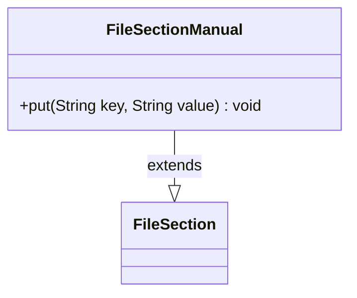

---
aliases:
  - FileSectionManual
tags:
  - java/class
  - module/forge-core
  - pkg/forge/util
fqn: forge.util.FileSectionManual
package: forge.util
module: forge-core
kind: Class
---

# FileSectionManual

**Package:** `forge.util` &nbsp; **Module:** `forge-core` &nbsp; **Kind:** Class



## Relationships
**Extends:**
- [[forge.util.FileSection|FileSection]]

## Source
`forge-core/src/main/java/forge/util/FileSectionManual.java`

```java
/*
 * Forge: Play Magic: the Gathering.
 * Copyright (C) 2011  Forge Team
 *
 * This program is free software: you can redistribute it and/or modify
 * it under the terms of the GNU General Public License as published by
 * the Free Software Foundation, either version 3 of the License, or
 * (at your option) any later version.
 * 
 * This program is distributed in the hope that it will be useful,
 * but WITHOUT ANY WARRANTY; without even the implied warranty of
 * MERCHANTABILITY or FITNESS FOR A PARTICULAR PURPOSE.  See the
 * GNU General Public License for more details.
 * 
 * You should have received a copy of the GNU General Public License
 * along with this program.  If not, see <http://www.gnu.org/licenses/>.
 */
package forge.util;

/**
 * TODO: Write javadoc for this type.
 * 
 */
public class FileSectionManual extends FileSection {

    /**
     * Put.
     *
     * @param key the key
     * @param value the value
     */
    public void put(final String key, final String value) {
        this.lines.put(key, value);
    }

}
```
