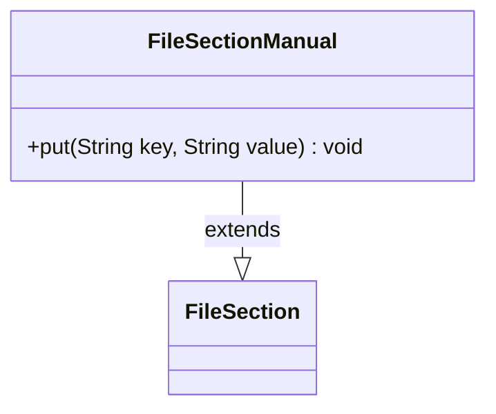

---
aliases:
  - FileSectionManual
tags:
  - java/class
  - module/forge-core
  - pkg/forge/util
fqn: forge.util.FileSectionManual
package: forge.util
module: forge-core
kind: Class
---

# FileSectionManual

**Package:** `forge.util` &nbsp; **Module:** `forge-core` &nbsp; **Kind:** Class



## Relationships
**Extends:**
- [[forge.util.FileSection|FileSection]]

## Design Description

FileSectionManual is a thin specialization of FileSection that exposes a manually populated key/value section rather than one parsed from a file. Its single responsibility is to provide a public `put(String, String)` method that writes directly into the inherited `lines` map, allowing callers to construct section contents programmatically.

By extending FileSection, it inherits all of the parent's lookup and type-conversion accessors while overriding nothing, so consumers can treat a hand-built instance identically to a file-loaded one. The design intent is convenience and reuse: rather than duplicating FileSection's parsing-and-retrieval machinery, it simply opens write access to the underlying line store, making it useful for tests or for assembling configuration sections in memory before they are read back through the standard FileSection interface.

## Source
`forge-core/src/main/java/forge/util/FileSectionManual.java`

```java
/*
 * Forge: Play Magic: the Gathering.
 * Copyright (C) 2011  Forge Team
 *
 * This program is free software: you can redistribute it and/or modify
 * it under the terms of the GNU General Public License as published by
 * the Free Software Foundation, either version 3 of the License, or
 * (at your option) any later version.
 * 
 * This program is distributed in the hope that it will be useful,
 * but WITHOUT ANY WARRANTY; without even the implied warranty of
 * MERCHANTABILITY or FITNESS FOR A PARTICULAR PURPOSE.  See the
 * GNU General Public License for more details.
 * 
 * You should have received a copy of the GNU General Public License
 * along with this program.  If not, see <http://www.gnu.org/licenses/>.
 */
package forge.util;

/**
 * TODO: Write javadoc for this type.
 * 
 */
public class FileSectionManual extends FileSection {

    /**
     * Put.
     *
     * @param key the key
     * @param value the value
     */
    public void put(final String key, final String value) {
        this.lines.put(key, value);
    }

}
```

## Python
`forge/util/FileSectionManual.py`

````python
package = None


class FileSectionManual(FileSection):

    def put(self, key: str, value: str) -> None:
        self.lines.put(key, value)
```

I need to output only Python source. Let me reconsider ΓÇö the `package` line was a mistake.
````
