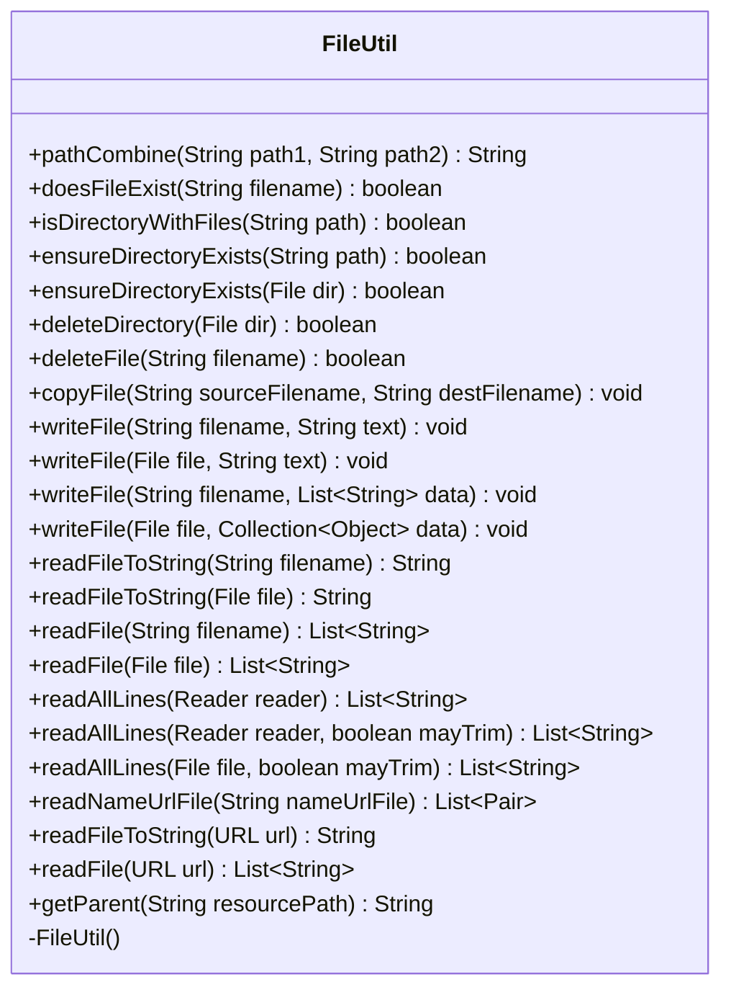

---
aliases:
  - FileUtil
tags:
  - java/class
  - module/forge-core
  - pkg/forge/util
fqn: forge.util.FileUtil
package: forge.util
module: forge-core
kind: Class
---

# FileUtil

**Package:** `forge.util`   **Module:** `forge-core`   **Kind:** Class



## Design Description

Forge's `FileUtil` is a final, non-instantiable utility class (its private constructor throws `AssertionError`) that centralizes common filesystem operations for the forge-core module. It exposes only static methods covering path manipulation (`pathCombine`, `getParent`), existence and directory checks, directory creation and recursive deletion, file copying, and a broad family of overloaded read/write helpers that work against `String` filenames, `File` objects, `Reader`s, and `URL`s.

As a stateless helper, it has no supertype beyond `Object` and implements no interfaces; instead it collaborates with sibling utilities — delegating line joining to `TextUtil` and bounding remote `URL` reads via `ThreadUtil.executeWithTimeout` (a 5-second cap). It leans on Apache Commons `StringUtils` and `Pair` (notably in `readNameUrlFile`, which parses name/URL pairs and synthesizes names from URLs when absent). Design intent is visible in its UTF-8-explicit reads, try-with-resources stream handling, and convenience overloads that funnel to a few core implementations, keeping file I/O consistent across the engine.

## Source
`forge-core/src/main/java/forge/util/FileUtil.java`

```java
/*
 * Forge: Play Magic: the Gathering.
 * Copyright (C) 2011  Forge Team
 *
 * This program is free software: you can redistribute it and/or modify
 * it under the terms of the GNU General Public License as published by
 * the Free Software Foundation, either version 3 of the License, or
 * (at your option) any later version.
 * 
 * This program is distributed in the hope that it will be useful,
 * but WITHOUT ANY WARRANTY; without even the implied warranty of
 * MERCHANTABILITY or FITNESS FOR A PARTICULAR PURPOSE.  See the
 * GNU General Public License for more details.
 * 
 * You should have received a copy of the GNU General Public License
 * along with this program.  If not, see <http://www.gnu.org/licenses/>.
 */
package forge.util;

import org.apache.commons.lang3.StringUtils;
import org.apache.commons.lang3.tuple.Pair;

import java.io.*;
import java.net.URL;
import java.nio.charset.StandardCharsets;
import java.nio.file.Files;
import java.util.ArrayList;
import java.util.Collection;
import java.util.List;
import java.util.concurrent.Callable;
import java.util.regex.Pattern;

/**
 * <p>
 * FileUtil class.
 * </p>
 * 
 * @author Forge
 * @version $Id$
 */
public final class FileUtil {

    private FileUtil() {
        throw new AssertionError();
    }
    
    /**
     * Takes two paths and combines them into a valid path string
     * for the current OS.
     * <p>
     * Similar to the Path.Combine() function in .Net.
     */
    public static String pathCombine(String path1, String path2) {
        File file1 = new File(path1);
        File file2 = new File(file1, path2);
        return file2.getPath();
    }      

    /**
     * <p>
     * doesFileExist.
     * </p>
     * 
     * @param filename
     *            a {@link java.lang.String} object.
     * @return a boolean.
     */
    public static boolean doesFileExist(final String filename) {
        final File f = new File(filename);
        return f.exists();
    }

    public static boolean isDirectoryWithFiles(final String path) {
        if (path == null) return false;
        final File f = new File(path);
        final String[] fileList = f.list();
        return fileList!=null && fileList.length > 0;
    }

    public static boolean ensureDirectoryExists(final String path) {
        return ensureDirectoryExists(new File(path));
    }
    public static boolean ensureDirectoryExists(final File dir) {
        return (dir.exists() && dir.isDirectory()) || dir.mkdirs();
    }

    public static boolean deleteDirectory(File dir) {
        if (dir.isDirectory()) {
            for (String filename : dir.list()) {
                if (!deleteDirectory(new File(dir, filename))) {
                    return false; 
                } 
            }
        }
        return dir.delete();
    }

    public static boolean deleteFile(String filename) {
        try {
            File file = new File(filename);
            return file.delete();
        }
        catch (Exception e) {
            e.printStackTrace();
            return false;
        }
    }

    public static void copyFile(String sourceFilename, String destFilename) {
        File source = new File(sourceFilename);
        if (!source.exists()) { return; } //if source doesn't exist, nothing to copy

        try (InputStream is = Files.newInputStream(source.toPath());
             OutputStream os = Files.newOutputStream(new File(destFilename).toPath())){
            byte[] buffer = new byte[1024];
            int length;
            while ((length = is.read(buffer)) > 0) {
                os.write(buffer, 0, length);
            }
        }
        catch (Exception e) {
            e.printStackTrace();
        }
    }

    public static void writeFile(String filename, String text) {
        FileUtil.writeFile(new File(filename), text);
    }

    public static void writeFile(File file, String text) {
        try (PrintWriter p = new PrintWriter(file)) {
            p.print(text);
        } catch (final Exception ex) {
            throw new RuntimeException("FileUtil : writeFile() error, problem writing file - " + file + " : " + ex);
        }
    }

    /**
     * <p>
     * writeFile.
     * </p>
     * 
     * @param filename
     *            a {@link java.lang.String} object.
     * @param data
     *            a {@link java.util.List} object.
     */
    public static void writeFile(String filename, List<String> data) {
        FileUtil.writeFile(new File(filename), data);
    }

    // writes each element of ArrayList on a separate line
    // this is used to write a file of Strings
    // this will create a new file if needed
    // if filename already exists, it is deleted
    /**
     * <p>
     * writeFile.
     * </p>
     * 
     * @param file
     *            a {@link java.io.File} object.
     * @param data
     *            a {@link java.util.List} object.
     */
    public static void writeFile(File file, Collection<?> data) {
        try (PrintWriter p = new PrintWriter(file)) {
            for (Object o : data) {
                p.println(o);
            }
        } catch (final Exception ex) {
            throw new RuntimeException("FileUtil : writeFile() error, problem writing file - " + file + " : " + ex);
        }
    } // writeAllDecks()

    public static String readFileToString(String filename) {
    	return readFileToString(new File(filename));
    }

    public static String readFileToString(File file) {
        return TextUtil.join(readFile(file), "\n");
    }

    public static List<String> readFile(final String filename) {
        return FileUtil.readFile(new File(filename));
    }

    // reads line by line and adds each line to the ArrayList
    // this will return blank lines as well
    // if filename not found, returns an empty ArrayList
    /**
     * <p>
     * readFile.
     * </p>
     * 
     * @param file
     *            a {@link java.io.File} object.
     * @return a {@link java.util.ArrayList} object.
     */
    public static List<String> readFile(final File file) {
        try {
            if ((file == null) || !file.exists()) {
                return new ArrayList<>();
            }
            return FileUtil.readAllLines(file, false);
        } catch (final Exception ex) {
            throw new RuntimeException("FileUtil : readFile() error, " + ex);
        }
    } // readFile()

    /**
     * Read all lines.
     *
     * @param reader the reader
     * @return the list
     */
    public static List<String> readAllLines(final Reader reader) {
        return FileUtil.readAllLines(reader, false);
    }

    /**
     * Reads all lines from given reader to a list of strings.
     *
     * @param reader is a reader (e.g. FileReader, InputStreamReader)
     * @param mayTrim defines whether to trim lines.
     * @return list of strings
     */
    public static List<String> readAllLines(final Reader reader, final boolean mayTrim) {
        final List<String> list = new ArrayList<>();
        try {
            final BufferedReader in = new BufferedReader(reader);
            String line;
            while ((line = in.readLine()) != null) {
                if (mayTrim) {
                    line = line.trim();
                }
                list.add(line);
            }
            in.close();
        } catch (final IOException ex) {
            throw new RuntimeException("FileUtil : readAllLines() error, " + ex);
        }
        return list;
    }
    /**
     * Reads all lines from given file to a list of strings.
     *
     * @param file is the File to read.
     * @param mayTrim defines whether to trim lines.
     * @return list of strings
     */
    public static List<String> readAllLines(final File file, final boolean mayTrim) {
        final List<String> list = new ArrayList<>();
        try {
            final BufferedReader in = new BufferedReader(
                    new InputStreamReader(Files.newInputStream(file.toPath()), StandardCharsets.UTF_8));
            String line;
            while ((line = in.readLine()) != null) {
                if (mayTrim) {
                    line = line.trim();
                }
                list.add(line);
            }
            in.close();
        } catch (final IOException ex) {
            throw new RuntimeException("FileUtil : readAllLines() error, " + ex);
        }
        return list;
    }

    // returns a list of <name, url> pairs.  if the name is not in the file, it is synthesized from the url
    public static List<Pair<String, String>> readNameUrlFile(String nameUrlFile) {
        Pattern lineSplitter = Pattern.compile(Pattern.quote(" "));
        Pattern replacer = Pattern.compile(Pattern.quote("%20"));

        List<Pair<String, String>> list = new ArrayList<>();

        for (String line : readFile(nameUrlFile)) {
            if (StringUtils.isBlank(line) || line.startsWith("#")) {
                continue;
            }
            
            String[] parts = lineSplitter.split(line, 2);
            if (2 == parts.length) {
                list.add(Pair.of(replacer.matcher(parts[0]).replaceAll(" "), parts[1]));
            } else {
                // figure out the filename from the URL
                Pattern pathSplitter = Pattern.compile(Pattern.quote("/"));
                String[] pathParts = pathSplitter.split(parts[0]);
                String last = pathParts[pathParts.length - 1];
                list.add(Pair.of(replacer.matcher(last).replaceAll(" "), parts[0]));
            }
        }

        return list;
    }

    public static String readFileToString(final URL url) {
        return TextUtil.join(readFile(url), "\n");
    }

    public static List<String> readFile(final URL url) {
        final List<String> lines = new ArrayList<>();
        ThreadUtil.executeWithTimeout((Callable<Void>) () -> {
            try (BufferedReader in = new BufferedReader(new InputStreamReader(url.openStream()))) {
                String line;
                while ((line = in.readLine()) != null) {
                    lines.add(line);
                }
            }
            return null;
        }, 5000); //abort reading file if it takes longer than 5 seconds
        return lines;
    }

    public static String getParent(final String resourcePath) {
        File f = new File(resourcePath);
        if (f.getParentFile().getName() != null)
            return f.getParentFile().getName();
        return "";
    }
}
```

## Python
`forge/util/FileUtil.py`

```python
from forge.util.TextUtil import TextUtil
from forge.util.ThreadUtil import ThreadUtil
from org.apache.commons.lang3.StringUtils import StringUtils
from org.apache.commons.lang3.tuple.Pair import Pair

import os
import shutil
import re
import urllib.request


class FileUtil:

    def __init__(self):
        raise AssertionError()

    # Takes two paths and combines them into a valid path string
    # for the current OS.
    # Similar to the Path.Combine() function in .Net.
    @staticmethod
    def pathCombine(path1, path2):
        return os.path.join(path1, path2)

    @staticmethod
    def doesFileExist(filename):
        return os.path.exists(filename)

    @staticmethod
    def isDirectoryWithFiles(path):
        if path is None:
            return False
        if not os.path.isdir(path):
            return False
        fileList = os.listdir(path)
        return fileList is not None and len(fileList) > 0

    @staticmethod
    def ensureDirectoryExists(path):
        if isinstance(path, str):
            return FileUtil.ensureDirectoryExists_File(path)
        return FileUtil.ensureDirectoryExists_File(path)

    @staticmethod
    def ensureDirectoryExists_File(dir):
        if os.path.exists(dir) and os.path.isdir(dir):
            return True
        try:
            os.makedirs(dir)
            return True
        except Exception:
            return False

    @staticmethod
    def deleteDirectory(dir):
        if os.path.isdir(dir):
            for filename in os.listdir(dir):
                if not FileUtil.deleteDirectory(os.path.join(dir, filename)):
                    return False
        try:
            if os.path.isdir(dir):
                os.rmdir(dir)
            else:
                os.remove(dir)
            return True
        except Exception:
            return False

    @staticmethod
    def deleteFile(filename):
        try:
            os.remove(filename)
            return True
        except Exception as e:
            import traceback
            traceback.print_exc()
            return False

    @staticmethod
    def copyFile(sourceFilename, destFilename):
        if not os.path.exists(sourceFilename):  # if source doesn't exist, nothing to copy
            return

        try:
            with open(sourceFilename, "rb") as is_, open(destFilename, "wb") as os_:
                while True:
                    buffer = is_.read(1024)
                    if not buffer:
                        break
                    os_.write(buffer)
        except Exception as e:
            import traceback
            traceback.print_exc()

    @staticmethod
    def writeFile(filename, data):
        # writeFile(String filename, String text) / writeFile(File file, String text)
        # writeFile(String filename, List<String> data) / writeFile(File file, Collection<?> data)
        if isinstance(data, str):
            try:
                with open(filename, "w") as p:
                    p.write(data)
            except Exception as ex:
                raise RuntimeError("FileUtil : writeFile() error, problem writing file - " + str(filename) + " : " + str(ex))
        else:
            try:
                with open(filename, "w") as p:
                    for o in data:
                        p.write(str(o) + "\n")
            except Exception as ex:
                raise RuntimeError("FileUtil : writeFile() error, problem writing file - " + str(filename) + " : " + str(ex))

    @staticmethod
    def readFileToString(file):
        # readFileToString(String filename) / readFileToString(File file) / readFileToString(URL url)
        if isinstance(file, URL):
            return TextUtil.join(FileUtil.readFile(file), "\n")
        return TextUtil.join(FileUtil.readFile(file), "\n")

    @staticmethod
    def readFile(file):
        # readFile(String filename) / readFile(File file) / readFile(URL url)
        if isinstance(file, URL):
            lines = []

            def task():
                with urllib.request.urlopen(file.openStream() if hasattr(file, "openStream") else file) as response:
                    in_ = response
                    for raw in in_:
                        line = raw.decode().rstrip("\n")
                        lines.append(line)
                return None

            ThreadUtil.executeWithTimeout(task, 5000)  # abort reading file if it takes longer than 5 seconds
            return lines

        try:
            if (file is None) or (not os.path.exists(file)):
                return []
            return FileUtil.readAllLines(file, False)
        except Exception as ex:
            raise RuntimeError("FileUtil : readFile() error, " + str(ex))

    @staticmethod
    def readAllLines(reader, mayTrim=False):
        # readAllLines(Reader reader) / readAllLines(Reader reader, boolean mayTrim)
        # readAllLines(File file, boolean mayTrim)
        list_ = []
        if isinstance(reader, str):
            # treated as a File path
            try:
                with open(reader, "r", encoding="utf-8") as in_:
                    for raw in in_:
                        line = raw.rstrip("\n")
                        if mayTrim:
                            line = line.strip()
                        list_.append(line)
            except IOError as ex:
                raise RuntimeError("FileUtil : readAllLines() error, " + str(ex))
            return list_
        else:
            try:
                in_ = reader
                for raw in in_:
                    line = raw.rstrip("\n") if isinstance(raw, str) else raw.decode().rstrip("\n")
                    if mayTrim:
                        line = line.strip()
                    list_.append(line)
                if hasattr(in_, "close"):
                    in_.close()
            except IOError as ex:
                raise RuntimeError("FileUtil : readAllLines() error, " + str(ex))
            return list_

    # returns a list of <name, url> pairs.  if the name is not in the file, it is synthesized from the url
    @staticmethod
    def readNameUrlFile(nameUrlFile):
        lineSplitter = re.compile(re.escape(" "))
        replacer = re.compile(re.escape("%20"))

        list_ = []

        for line in FileUtil.readFile(nameUrlFile):
            if StringUtils.isBlank(line) or line.startswith("#"):
                continue

            parts = lineSplitter.split(line, 1)
            if 2 == len(parts):
                list_.append(Pair.of(replacer.sub(" ", parts[0]), parts[1]))
            else:
                # figure out the filename from the URL
                pathSplitter = re.compile(re.escape("/"))
                pathParts = pathSplitter.split(parts[0])
                last = pathParts[len(pathParts) - 1]
                list_.append(Pair.of(replacer.sub(" ", last), parts[0]))

        return list_

    @staticmethod
    def getParent(resourcePath):
        f = resourcePath
        parent = os.path.dirname(os.path.abspath(f))
        name = os.path.basename(parent)
        if name is not None:
            return name
        return ""
```
