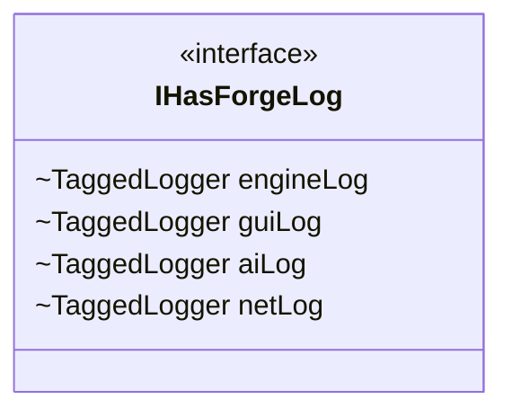

---
aliases:
  - IHasForgeLog
tags:
  - java/interface
  - module/forge-core
  - pkg/forge/util
fqn: forge.util.IHasForgeLog
package: forge.util
module: forge-core
kind: Interface
---

# IHasForgeLog

**Package:** `forge.util` &nbsp; **Module:** `forge-core` &nbsp; **Kind:** Interface



## Source
`forge-core/src/main/java/forge/util/IHasForgeLog.java`

```java
package forge.util;

import org.tinylog.Logger;
import org.tinylog.TaggedLogger;

/**
 * Marker interface for classes that perform heavy logging.
 * Provides shared logger fields so the tag string lives
 * in one place and implementing classes are self-documenting.
 */
public interface IHasForgeLog {
    TaggedLogger engineLog = Logger.tag("ENGINE");
    TaggedLogger guiLog = Logger.tag("GUI");
    TaggedLogger aiLog = Logger.tag("AI");
    TaggedLogger netLog = Logger.tag("NETWORK");
}
```
