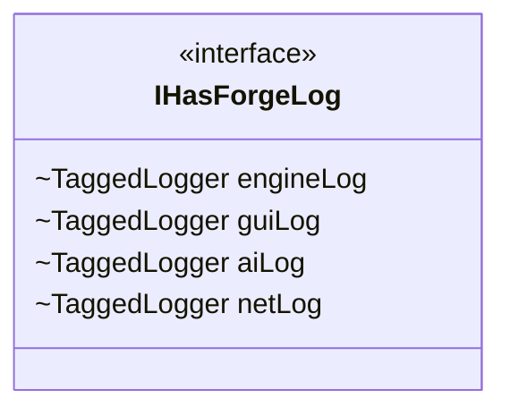

---
aliases:
  - IHasForgeLog
tags:
  - java/interface
  - module/forge-core
  - pkg/forge/util
fqn: forge.util.IHasForgeLog
package: forge.util
module: forge-core
kind: Interface
---

# IHasForgeLog

**Package:** `forge.util`   **Module:** `forge-core`   **Kind:** Interface



## Design Description

A marker interface for classes that perform heavy logging, `IHasForgeLog` centralizes Forge's logging tags in a single location. It declares four shared `TaggedLogger` constants—`engineLog`, `guiLog`, `aiLog`, and `netLog`—each bound to a fixed tag ("ENGINE", "GUI", "AI", "NETWORK") obtained from tinylog's `Logger.tag(...)`. Because interface fields are implicitly `public static final`, every implementing class inherits these loggers directly, eliminating duplicated tag strings and ensuring consistent categorization across the engine.

As a marker interface it defines no methods and imposes no behavioral contract; its sole intent is to provide ready-to-use, well-named logger references and to make a class's logging responsibility self-documenting simply by appearing in its `implements` clause.

## Source
`forge-core/src/main/java/forge/util/IHasForgeLog.java`

```java
package forge.util;

import org.tinylog.Logger;
import org.tinylog.TaggedLogger;

/**
 * Marker interface for classes that perform heavy logging.
 * Provides shared logger fields so the tag string lives
 * in one place and implementing classes are self-documenting.
 */
public interface IHasForgeLog {
    TaggedLogger engineLog = Logger.tag("ENGINE");
    TaggedLogger guiLog = Logger.tag("GUI");
    TaggedLogger aiLog = Logger.tag("AI");
    TaggedLogger netLog = Logger.tag("NETWORK");
}
```

## Python
`forge/util/IHasForgeLog.py`

```python
from org.tinylog.Logger import Logger
from org.tinylog.TaggedLogger import TaggedLogger


class IHasForgeLog:
    """
    Marker interface for classes that perform heavy logging.
    Provides shared logger fields so the tag string lives
    in one place and implementing classes are self-documenting.
    """
    engineLog: TaggedLogger = Logger.tag("ENGINE")
    guiLog: TaggedLogger = Logger.tag("GUI")
    aiLog: TaggedLogger = Logger.tag("AI")
    netLog: TaggedLogger = Logger.tag("NETWORK")
```
