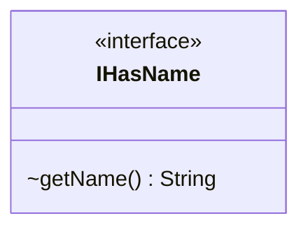

---
aliases:
  - IHasName
tags:
  - java/interface
  - module/forge-core
  - pkg/forge/util
fqn: forge.util.IHasName
package: forge.util
module: forge-core
kind: Interface
---

# IHasName

**Package:** `forge.util`   **Module:** `forge-core`   **Kind:** Interface



## Design Description

IHasName is a minimal contract in the `forge.util` package of the forge-core module, declaring a single `getName()` method that returns a String. Its sole responsibility is to mark any type that can expose a human-readable or identifying name, decoupling name-retrieval from any concrete implementation.

As a pure interface with no default behavior or state, it serves as a lightweight, widely-reusable abstraction that collaborating code can depend on instead of concrete classes—enabling generic handling of named entities throughout the engine. The deliberately narrow surface (one method, no inheritance) reflects an interface-segregation design intent: implementers commit only to providing a name, keeping the contract broadly applicable across unrelated domain types.

## Source
`forge-core/src/main/java/forge/util/IHasName.java`

```java
package forge.util;

/** 
 * TODO: Write javadoc for this type.
 *
 */
public interface IHasName {
    String getName();
}
```

## Python
`forge/util/IHasName.py`

```python
package = "forge.util"


class IHasName:
    def getName(self) -> str:
        raise NotImplementedError
```
