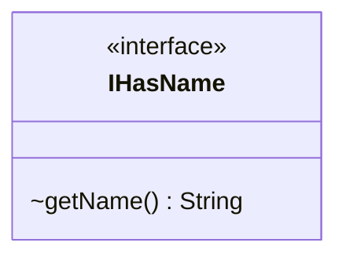

---
aliases:
  - IHasName
tags:
  - java/interface
  - module/forge-core
  - pkg/forge/util
fqn: forge.util.IHasName
package: forge.util
module: forge-core
kind: Interface
---

# IHasName

**Package:** `forge.util` &nbsp; **Module:** `forge-core` &nbsp; **Kind:** Interface



## Source
`forge-core/src/main/java/forge/util/IHasName.java`

```java
package forge.util;

/** 
 * TODO: Write javadoc for this type.
 *
 */
public interface IHasName {
    String getName();
}
```
