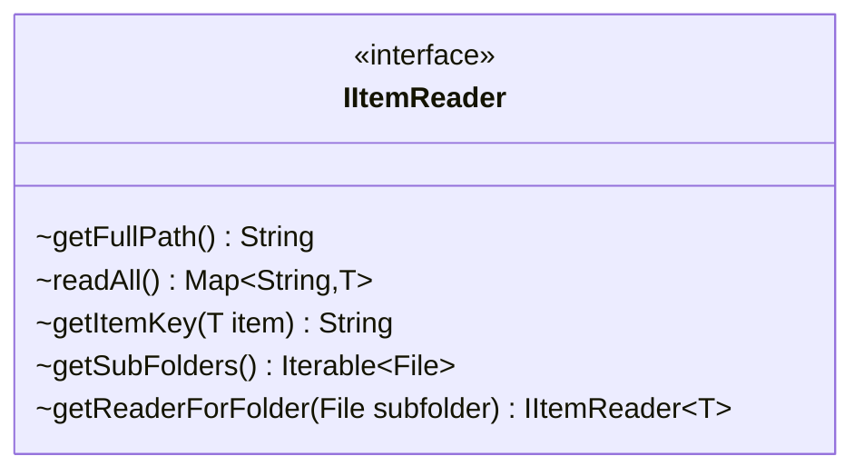

---
aliases:
  - IItemReader
tags:
  - java/interface
  - module/forge-core
  - pkg/forge/util
fqn: forge.util.IItemReader
package: forge.util
module: forge-core
kind: Interface
---

# IItemReader

**Package:** `forge.util` &nbsp; **Module:** `forge-core` &nbsp; **Kind:** Interface



## Design Description

The IItemReader interface defines a generic contract for reading collections of items of type T from a hierarchical storage layout, typically the filesystem. Implementations expose their backing location via getFullPath() and produce a keyed Map of items through readAll(), with getItemKey() supplying the canonical identity used to index each item. The getSubFolders() and getReaderForFolder() methods extend this abstraction to nested directory structures, letting a reader recursively yield child readers scoped to each subfolder.

Parameterized over T rather than tied to any concrete item type, the interface decouples item loading from item representation, allowing the same traversal and aggregation logic to serve different domain objects within forge-core. Returning IItemReader<T> from getReaderForFolder() makes the hierarchy uniformly composable, so callers can walk an arbitrarily deep folder tree without knowing how individual items are parsed or persisted.

## Source
`forge-core/src/main/java/forge/util/IItemReader.java`

```java
/*
 * Forge: Play Magic: the Gathering.
 * Copyright (C) 2011  Forge Team
 *
 * This program is free software: you can redistribute it and/or modify
 * it under the terms of the GNU General Public License as published by
 * the Free Software Foundation, either version 3 of the License, or
 * (at your option) any later version.
 * 
 * This program is distributed in the hope that it will be useful,
 * but WITHOUT ANY WARRANTY; without even the implied warranty of
 * MERCHANTABILITY or FITNESS FOR A PARTICULAR PURPOSE.  See the
 * GNU General Public License for more details.
 * 
 * You should have received a copy of the GNU General Public License
 * along with this program.  If not, see <http://www.gnu.org/licenses/>.
 */
package forge.util;

import java.io.File;
import java.util.Map;

/**
 * The Interface IItemReader.
 *
 * @param <T> the generic type
 */
public interface IItemReader<T> {
    String getFullPath();

    Map<String, T> readAll();

    String getItemKey(T item);
    
    Iterable<File> getSubFolders();
    
    IItemReader<T> getReaderForFolder(File subfolder);
}
```

## Python
`forge/util/IItemReader.py`

```python
from abc import ABC, abstractmethod
from pathlib import Path
from typing import Generic, Iterable, TypeVar

T = TypeVar("T")


class IItemReader(ABC, Generic[T]):
    @abstractmethod
    def getFullPath(self) -> str:
        ...

    @abstractmethod
    def readAll(self) -> dict[str, T]:
        ...

    @abstractmethod
    def getItemKey(self, item: T) -> str:
        ...

    @abstractmethod
    def getSubFolders(self) -> Iterable[Path]:
        ...

    @abstractmethod
    def getReaderForFolder(self, subfolder: Path) -> "IItemReader[T]":
        ...
```
