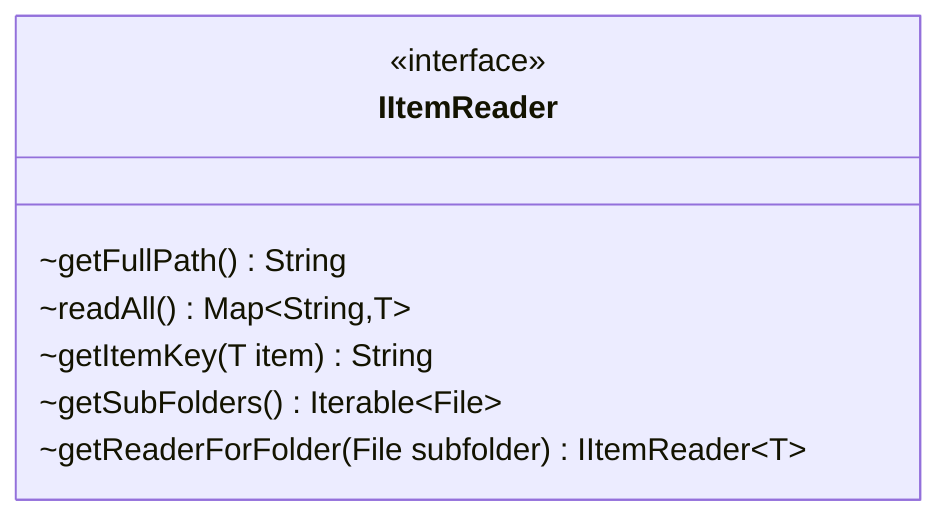

---
aliases:
  - IItemReader
tags:
  - java/interface
  - module/forge-core
  - pkg/forge/util
fqn: forge.util.IItemReader
package: forge.util
module: forge-core
kind: Interface
---

# IItemReader

**Package:** `forge.util` &nbsp; **Module:** `forge-core` &nbsp; **Kind:** Interface



## Source
`forge-core/src/main/java/forge/util/IItemReader.java`

```java
/*
 * Forge: Play Magic: the Gathering.
 * Copyright (C) 2011  Forge Team
 *
 * This program is free software: you can redistribute it and/or modify
 * it under the terms of the GNU General Public License as published by
 * the Free Software Foundation, either version 3 of the License, or
 * (at your option) any later version.
 * 
 * This program is distributed in the hope that it will be useful,
 * but WITHOUT ANY WARRANTY; without even the implied warranty of
 * MERCHANTABILITY or FITNESS FOR A PARTICULAR PURPOSE.  See the
 * GNU General Public License for more details.
 * 
 * You should have received a copy of the GNU General Public License
 * along with this program.  If not, see <http://www.gnu.org/licenses/>.
 */
package forge.util;

import java.io.File;
import java.util.Map;

/**
 * The Interface IItemReader.
 *
 * @param <T> the generic type
 */
public interface IItemReader<T> {
    String getFullPath();

    Map<String, T> readAll();

    String getItemKey(T item);
    
    Iterable<File> getSubFolders();
    
    IItemReader<T> getReaderForFolder(File subfolder);
}
```
