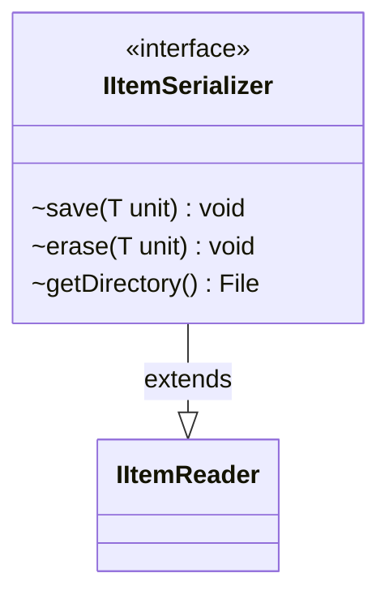

---
aliases:
  - IItemSerializer
tags:
  - java/interface
  - module/forge-core
  - pkg/forge/util
fqn: forge.util.IItemSerializer
package: forge.util
module: forge-core
kind: Interface
---

# IItemSerializer

**Package:** `forge.util`   **Module:** `forge-core`   **Kind:** Interface



## Relationships
**Extends:**
- [[forge.util.IItemReader|IItemReader]]

## Design Description

A serializer interface that adds persistence capabilities to the read-only contract it inherits from `IItemReader<T>`. By extending `IItemReader`, it composes retrieval with mutation, presenting a complete read-write storage abstraction for a generic item type `T`. Its three operations—`save` to persist a unit, `erase` to remove one, and `getDirectory` to expose the backing file location—frame the items as file-backed resources, reflecting an intent to abstract over on-disk storage rather than an arbitrary persistence medium. As an interface it decouples callers from any concrete serialization strategy, letting Forge swap storage implementations while keeping a uniform contract for saving and erasing items.

## Source
`forge-core/src/main/java/forge/util/IItemSerializer.java`

```java
/*
 * Forge: Play Magic: the Gathering.
 * Copyright (C) 2011  Forge Team
 *
 * This program is free software: you can redistribute it and/or modify
 * it under the terms of the GNU General Public License as published by
 * the Free Software Foundation, either version 3 of the License, or
 * (at your option) any later version.
 * 
 * This program is distributed in the hope that it will be useful,
 * but WITHOUT ANY WARRANTY; without even the implied warranty of
 * MERCHANTABILITY or FITNESS FOR A PARTICULAR PURPOSE.  See the
 * GNU General Public License for more details.
 * 
 * You should have received a copy of the GNU General Public License
 * along with this program.  If not, see <http://www.gnu.org/licenses/>.
 */
package forge.util;

import java.io.File;

/**
 * TODO: Write javadoc for this type.
 *
 * @param <T> the generic type
 */
public interface IItemSerializer<T> extends IItemReader<T> {

    /**
     * Save.
     *
     * @param unit the unit
     */
    void save(T unit);

    /**
     * Erase.
     *
     * @param unit the unit
     */
    void erase(T unit);


    File getDirectory();
}
```

## Python
`forge/util/IItemSerializer.py`

```python
from abc import abstractmethod
from typing import Generic, TypeVar
from pathlib import Path

from forge.util.IItemReader import IItemReader

T = TypeVar("T")


class IItemSerializer(IItemReader[T], Generic[T]):
    """TODO: Write javadoc for this type.

    :param T: the generic type
    """

    @abstractmethod
    def save(self, unit: T) -> None:
        """Save.

        :param unit: the unit
        """
        ...

    @abstractmethod
    def erase(self, unit: T) -> None:
        """Erase.

        :param unit: the unit
        """
        ...

    @abstractmethod
    def getDirectory(self) -> Path:
        ...
```
