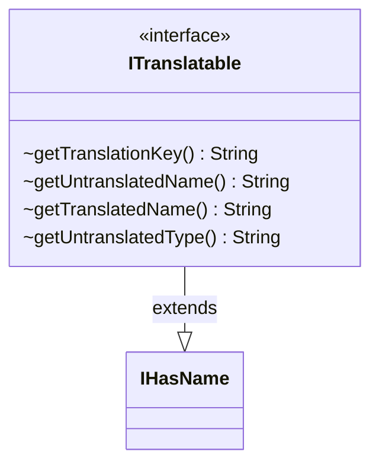

---
aliases:
  - ITranslatable
tags:
  - java/interface
  - module/forge-core
  - pkg/forge/util
fqn: forge.util.ITranslatable
package: forge.util
module: forge-core
kind: Interface
---

# ITranslatable

**Package:** `forge.util`   **Module:** `forge-core`   **Kind:** Interface



## Relationships
**Extends:**
- [[forge.util.IHasName|IHasName]]

## Design Description

ITranslatable is a marker-style interface that augments named game entities with localization support, declaring methods to obtain a translation key plus translated and untranslated forms of an object's name and type. By extending IHasName, it builds directly on the basic naming contract: every method is given a `default` implementation that simply falls back to `getName()` (or an empty string for the type), so the interface can be applied to existing named types without forcing any new code. The design intent is graceful degradation—implementers override only the methods relevant to localization, while the defaults guarantee a sensible, untranslated result whenever a translation key is missing.

## Source
`forge-core/src/main/java/forge/util/ITranslatable.java`

```java
package forge.util;

public interface ITranslatable extends IHasName {
    default String getTranslationKey() {
        return getName();
    }

    //Fallback methods - used if no translation is found for the given key.

    default String getUntranslatedName() {
        return getName();
    }
    default String getTranslatedName() {
        return getName();
    }

    default String getUntranslatedType() {
        return "";
    }
}
```

## Python
`forge/util/ITranslatable.py`

```python
from forge.util.IHasName import IHasName


class ITranslatable(IHasName):
    def getTranslationKey(self) -> str:
        return self.getName()

    # Fallback methods - used if no translation is found for the given key.

    def getUntranslatedName(self) -> str:
        return self.getName()

    def getTranslatedName(self) -> str:
        return self.getName()

    def getUntranslatedType(self) -> str:
        return ""
```
