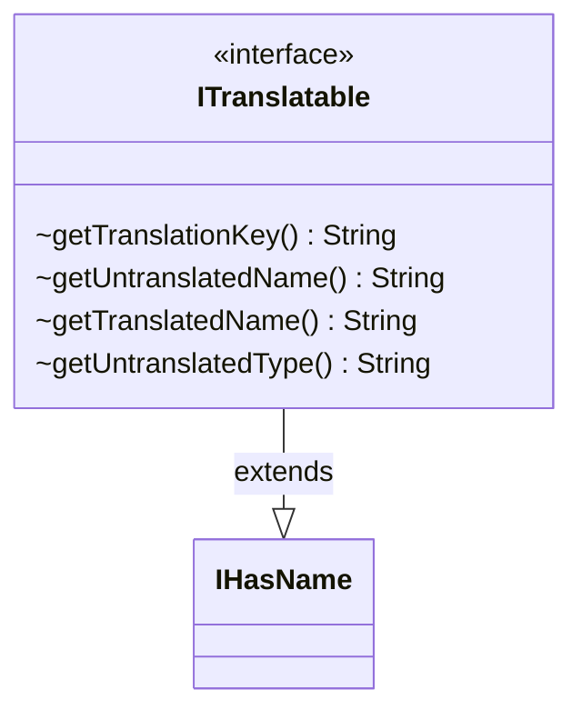

---
aliases:
  - ITranslatable
tags:
  - java/interface
  - module/forge-core
  - pkg/forge/util
fqn: forge.util.ITranslatable
package: forge.util
module: forge-core
kind: Interface
---

# ITranslatable

**Package:** `forge.util` &nbsp; **Module:** `forge-core` &nbsp; **Kind:** Interface



## Relationships
**Extends:**
- [[forge.util.IHasName|IHasName]]

## Source
`forge-core/src/main/java/forge/util/ITranslatable.java`

```java
package forge.util;

public interface ITranslatable extends IHasName {
    default String getTranslationKey() {
        return getName();
    }

    //Fallback methods - used if no translation is found for the given key.

    default String getUntranslatedName() {
        return getName();
    }
    default String getTranslatedName() {
        return getName();
    }

    default String getUntranslatedType() {
        return "";
    }
}
```
