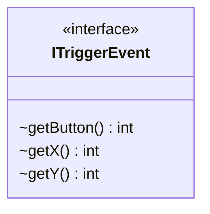

---
aliases:
  - ITriggerEvent
tags:
  - java/interface
  - module/forge-core
  - pkg/forge/util
fqn: forge.util.ITriggerEvent
package: forge.util
module: forge-core
kind: Interface
---

# ITriggerEvent

**Package:** `forge.util`   **Module:** `forge-core`   **Kind:** Interface



## Design Description

ITriggerEvent is a minimal abstraction in the `forge-core` module's `forge.util` package that captures the essential coordinates and button identity of a user-triggered input event—exposing only `getButton()`, `getX()`, and `getY()`. As an interface, it decouples Forge's game logic from any concrete UI or input toolkit: callers that need to know where and how a trigger originated can depend on this contract rather than a specific mouse-event or GUI-framework class. Its placement in the framework-agnostic core module reflects deliberate design intent—keeping platform- and renderer-specific event types out of the engine while still allowing positional, button-aware interactions to be passed through. Implementations supplied by each front-end adapt their native events to this lightweight, three-method shape.

## Source
`forge-core/src/main/java/forge/util/ITriggerEvent.java`

```java
package forge.util;

public interface ITriggerEvent {
    int getButton();
    int getX();
    int getY();
}
```

## Python
`forge/util/ITriggerEvent.py`

```python
from abc import ABC, abstractmethod


class ITriggerEvent(ABC):
    @abstractmethod
    def getButton(self) -> int:
        ...

    @abstractmethod
    def getX(self) -> int:
        ...

    @abstractmethod
    def getY(self) -> int:
        ...
```
