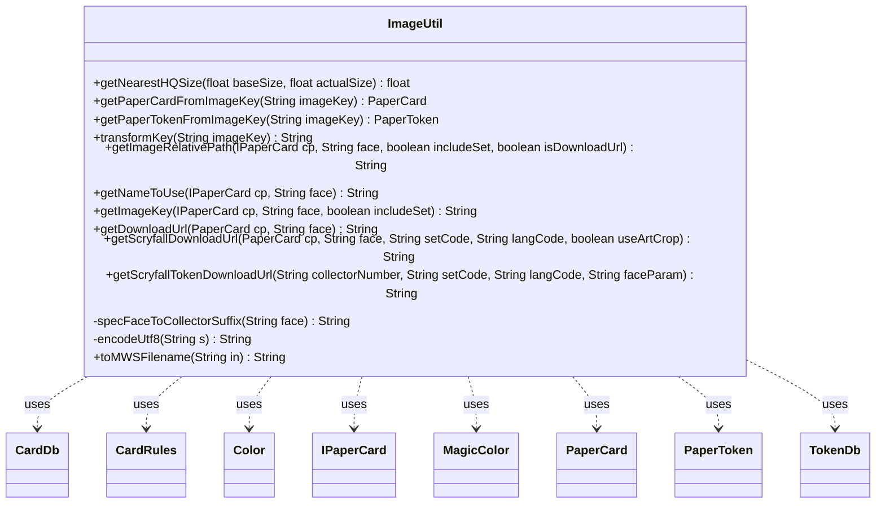

---
aliases:
  - ImageUtil
tags:
  - java/class
  - module/forge-core
  - pkg/forge/util
fqn: forge.util.ImageUtil
package: forge.util
module: forge-core
kind: Class
---

# ImageUtil

**Package:** `forge.util`   **Module:** `forge-core`   **Kind:** Class



## Relationships
**Uses:**
- [[forge.card.CardDb|CardDb]]
- [[forge.card.CardRules|CardRules]]
- [[forge.card.MagicColor|MagicColor]]
- [[forge.card.MagicColor.Color|Color]]
- [[forge.item.IPaperCard|IPaperCard]]
- [[forge.item.PaperCard|PaperCard]]
- [[forge.item.PaperToken|PaperToken]]
- [[forge.token.TokenDb|TokenDb]]

## Design Description

The ImageUtil class is a stateless utility in `forge.util` that centralizes the logic for constructing and resolving Magic card image identifiers and download URLs. Its static methods translate between in-memory card models and image-storage conventions: resolving `PaperCard` and `PaperToken` instances from prefixed image keys via `StaticData`'s `CardDb`/`TokenDb` registries, computing relative image paths and keys, and building Scryfall download URLs for both cards and tokens.

Collaborating loosely (all dependencies are usage-only) with `IPaperCard`, `PaperCard`, `CardRules`, and `MagicColor`, the class encapsulates the engine's many image-naming edge cases—double-faced and meld backs, split and specialize faces, art-index selection, MWS filename sanitization, and per-set Scryfall collector-number overrides. Its purely static, dependency-light design reflects an intent to serve as a shared helper across UI and download subsystems without holding state.

## Source
`forge-core/src/main/java/forge/util/ImageUtil.java`

```java
package forge.util;

import forge.ImageKeys;
import forge.StaticData;
import forge.card.CardDb;
import forge.card.CardEdition;
import forge.card.CardRules;
import forge.card.CardSplitType;
import forge.card.MagicColor;
import forge.item.IPaperCard;
import forge.item.PaperCard;
import java.util.regex.Pattern;
import forge.item.PaperToken;
import forge.token.TokenDb;
import org.apache.commons.lang3.StringUtils;

import java.net.URLEncoder;

public class ImageUtil {
    public static float getNearestHQSize(float baseSize, float actualSize) {
        //get nearest power of actualSize to baseSize so that the image renders good
        return (float)Math.round(actualSize) * (float)Math.pow(2, (double)Math.round(Math.log(baseSize / actualSize) / Math.log(2)));
    }

    public static PaperCard getPaperCardFromImageKey(final String imageKey) {
        String key;
        if (imageKey == null || imageKey.length() < 2) {
            return null;
        }
        if (imageKey.startsWith(ImageKeys.CARD_PREFIX))
            key = imageKey.substring(ImageKeys.CARD_PREFIX.length());
        else
            return null;
        if (key.isEmpty())
            return null;

        CardDb db = StaticData.instance().getCommonCards();
        PaperCard cp = null;
        //db shouldn't be null
        if (db != null) {
            cp = db.getCard(key);
            if (cp == null) {
                db = StaticData.instance().getVariantCards();
                if (db != null)
                    cp = db.getCard(key);
            }
        }
        if (cp == null)
            System.err.println("Can't find PaperCard from key: " + key);
        // return cp regardless if it's null
        return cp;
    }

    public static PaperToken getPaperTokenFromImageKey(final String imageKey) {
        String key;
        if (imageKey == null ||
            !imageKey.startsWith(ImageKeys.TOKEN_PREFIX)) {
            return null;
        }

        key = imageKey.substring(ImageKeys.TOKEN_PREFIX.length());
            
        if (key.isEmpty()) {
            return null;
        }

        TokenDb db = StaticData.instance().getAllTokens();
        if (db == null) {
            return null;
        }
        
        String[] split = key.split("\\|");
        if (!db.containsRule(split[0])) {
            return null;
        }
        
        PaperToken pt = switch (split.length) {
            case 1 -> db.getToken(split[0]);
            case 2, 3 -> db.getToken(split[0], split[1]);
            default -> db.getToken(split[0], split[1], Integer.parseInt(split[3]));
        };

        if (pt == null) {
            System.err.println("Can't find PaperToken from key: " + key);
        }
            
        return pt;
    }

    public static String transformKey(String imageKey) {
        String key;
        String edition= imageKey.substring(0, imageKey.indexOf("/"));
        String artIndex = imageKey.substring(imageKey.indexOf("/")+1, imageKey.indexOf(".")).replaceAll("[^0-9]", "");
        String name = artIndex.isEmpty() ? imageKey.substring(imageKey.indexOf("/")+1, imageKey.indexOf(".")) : imageKey.substring(imageKey.indexOf("/")+1, imageKey.indexOf(artIndex));
        key = name + "|" + edition;
        if (!artIndex.isEmpty())
            key += "|" + artIndex;
        return key;
    }

    public static String getImageRelativePath(IPaperCard cp, String face, boolean includeSet, boolean isDownloadUrl) {
        final String nameToUse = cp == null ? null : getNameToUse(cp, face);
        if (nameToUse == null) {
            return null;
        }
        StringBuilder s = new StringBuilder();

        CardRules card = cp.getRules();
        String edition = cp.getEdition().equals(CardEdition.UNKNOWN_CODE)
                ? CardEdition.UNKNOWN_SET_NAME
                : cp.getEdition();
        s.append(toMWSFilename(nameToUse));

        final int cntPictures;
        final boolean hasManyPictures;
        final CardDb db =  !card.isVariant() ? StaticData.instance().getCommonCards() : StaticData.instance().getVariantCards();
        if (includeSet) {
            cntPictures = db.getArtCount(card.getName(), edition, cp.getFunctionalVariant());
            hasManyPictures = cntPictures > 1;
        } else {
            cntPictures = 1;
            // raise the art index limit to the maximum of the sets this card was printed in
            int maxCntPictures = db.getMaxArtIndex(card.getName());
            hasManyPictures = maxCntPictures > 1;
        }

        int artIdx = cp.getArtIndex() - 1;
        if (hasManyPictures) {
            if (cntPictures <= artIdx) // prevent overflow
                artIdx = artIdx % cntPictures;
            s.append(artIdx + 1);
        }

        // for whatever reason, MWS-named plane cards don't have the ".full" infix
        if (!card.getType().isPlane() && !card.getType().isPhenomenon()) {
            s.append(".full");
        }

        String fname;
        if (isDownloadUrl) {
            s.append(".jpg");
            fname = s.toString().replaceAll("\\s", "%20");
        } else {
            fname = s.toString();
        }

        if (includeSet) {
            String editionAliased = isDownloadUrl ? StaticData.instance().getEditions().getCode2ByCode(edition) : ImageKeys.getSetFolder(edition);
            if (editionAliased.isEmpty()) //FIXME: Custom Cards Workaround
                editionAliased = edition;
            return TextUtil.concatNoSpace(editionAliased, "/", fname);
        } else {
            return fname;
        }
    }

    public static String getNameToUse(IPaperCard cp, String face) {
        final CardRules card = cp.getRules();
        if (face.equals("back")) {
            if (cp.hasBackFace())
                if (card.getOtherPart() != null) {
                    return card.getOtherPart().getName();
                } else if (!card.getMeldWith().isEmpty()) {
                    final CardDb db = StaticData.instance().getCommonCards();
                    return db.getRulesOrElseUnsupported(card.getMeldWith()).getOtherPart().getName();
                } else {
                    return null;
                }
            else
                return null;
        } else if (face.equals("white")) {
            if (card.getWSpecialize() != null) {
                return card.getWSpecialize().getName();
            }
        } else if (face.equals("blue")) {
            if (card.getUSpecialize() != null) {
                return card.getUSpecialize().getName();
            }
        } else if (face.equals("black")) {
            if (card.getBSpecialize() != null) {
                return card.getBSpecialize().getName();
            }
        } else if (face.equals("red")) {
            if (card.getRSpecialize() != null) {
                return card.getRSpecialize().getName();
            }
        } else if (face.equals("green")) {
            if (card.getGSpecialize() != null) {
                return card.getGSpecialize().getName();
            }
        } else if (CardSplitType.Split == cp.getRules().getSplitType()) {
            return card.getMainPart().getName() + card.getOtherPart().getName();
        } else if (cp.hasFlavorName()) {
            return cp.getDisplayName();
        } else if (!IPaperCard.NO_FUNCTIONAL_VARIANT.equals(cp.getFunctionalVariant())) {
            return cp.getName() + " " + cp.getFunctionalVariant();
        }
        return cp.getName();
    }

    public static String getImageKey(IPaperCard cp, String face, boolean includeSet) {
        return getImageRelativePath(cp, face, includeSet, false);
    }

    public static String getDownloadUrl(PaperCard cp, String face) {
        return getImageRelativePath(cp, face, true, true);
    }

    public static String getScryfallDownloadUrl(PaperCard cp, String face, String setCode, String langCode, boolean useArtCrop){
        final Pattern funnyCardCollectorNumberPattern = Pattern.compile("^F\\d+");
        String editionCode;
        if (setCode != null && !setCode.isEmpty())
            editionCode = setCode;
        else
            editionCode = cp.getEdition().toLowerCase();
        String cardCollectorNumber = cp.getCollectorNumber();
        // override old planechase sets from their modified id since scryfall move the planechase cards outside their original setcode
        if (cardCollectorNumber.startsWith("OHOP")) {
            editionCode = "ohop";
            cardCollectorNumber = cardCollectorNumber.substring("OHOP".length());
        } else if (cardCollectorNumber.startsWith("OPCA")) {
            editionCode = "opca";
            cardCollectorNumber = cardCollectorNumber.substring("OPCA".length());
        } else if (cardCollectorNumber.startsWith("OPC2")) {
            editionCode = "opc2";
            cardCollectorNumber = cardCollectorNumber.substring("OPC2".length());
        }
        
        if (funnyCardCollectorNumberPattern.matcher(cardCollectorNumber).matches()) {
            cardCollectorNumber = cardCollectorNumber.substring(1);
        }

        String versionParam = useArtCrop ? "art_crop" : "normal";
        String faceParam = "";

        if (cp.getRules().getSplitType() == CardSplitType.Meld) {
            if (face.equals("back")) {
                cardCollectorNumber = cp.getMeldBaseCard().getCollectorNumber().replaceAll("(\\d+)([sp]?)", "$1b$2");
            }

            faceParam = "&face=front";
        } else if (cp.getRules().getOtherPart() != null) {
            faceParam = (face.equals("back") && cp.getRules().getSplitType() != CardSplitType.Flip
                    ? "&face=back"
                    : "&face=front");
        } else if (cp.getRules().getSplitType() == CardSplitType.Specialize) {
            // Specialize faces have their own Scryfall entries with collector
            // number = base number + color letter (e.g. "2w", "2u", "2b", "2r", "2g")
            String colorSuffix = specFaceToCollectorSuffix(face);
            if (colorSuffix != null) {
                cardCollectorNumber += colorSuffix;
            }
        }

        if (cardCollectorNumber.endsWith("☇")) {
            faceParam = "&face=back";
            cardCollectorNumber = cardCollectorNumber.substring(0, cardCollectorNumber.length() - 1);
        }

        return String.format("%s/%s/%s?format=image&version=%s%s", editionCode, encodeUtf8(cardCollectorNumber),
                langCode, versionParam, faceParam);
    }

    public static String getScryfallTokenDownloadUrl(String collectorNumber, String setCode, String langCode, String faceParam) {
        String versionParam = "normal";
        if (!faceParam.isEmpty()) {
            faceParam = (faceParam.equals("back") ? "&face=back" : "&face=front");
        }
        if (collectorNumber.endsWith("☇")) {
            faceParam = "&face=back";
            collectorNumber = collectorNumber.substring(0, collectorNumber.length() - 1);
        }
        return String.format("%s/%s/%s?format=image&version=%s%s", setCode, encodeUtf8(collectorNumber),
                langCode, versionParam, faceParam);
    }

    private static String specFaceToCollectorSuffix(String face) {
        MagicColor.Color color = MagicColor.Color.fromName(face);
        if (color == null) return null;
        return color.getShortName().toLowerCase();
    }

    private static String encodeUtf8(String s) {
        try {
            return URLEncoder.encode(s, "UTF-8");
        } catch (Exception e) {
            // Unlikely, for the possibility that "UTF-8" is not supported.
            System.err.println("UTF-8 encoding not supported on this device.");
            return s;
        }
    }

    public static String toMWSFilename(String in) {
        in = StringUtils.stripAccents(in);
        final StringBuilder out = new StringBuilder();
        char c;
        for (int i = 0; i < in.length(); i++) {
            c = in.charAt(i);
            if ((c != '"') && (c != '/') && (c != ':') && (c != '?')) {
                out.append(c);
            }
        }
        return out.toString();
    }
}
```

## Python
`forge/util/ImageUtil.py`

```python
from forge.ImageKeys import ImageKeys
from forge.StaticData import StaticData
from forge.card.CardDb import CardDb
from forge.card.CardEdition import CardEdition
from forge.card.CardRules import CardRules
from forge.card.CardSplitType import CardSplitType
from forge.card.MagicColor import MagicColor
from forge.card.MagicColor.Color import Color
from forge.item.IPaperCard import IPaperCard
from forge.item.PaperCard import PaperCard
from forge.item.PaperToken import PaperToken
from forge.token.TokenDb import TokenDb
from forge.util.TextUtil import TextUtil

import math
import re
import sys
import unicodedata
from urllib.parse import quote_plus


class ImageUtil:
    @staticmethod
    def getNearestHQSize(baseSize: float, actualSize: float) -> float:
        # get nearest power of actualSize to baseSize so that the image renders good
        return float(round(actualSize)) * float(pow(2, round(math.log(baseSize / actualSize) / math.log(2))))

    @staticmethod
    def getPaperCardFromImageKey(imageKey: str) -> PaperCard:
        if imageKey is None or len(imageKey) < 2:
            return None
        if imageKey.startswith(ImageKeys.CARD_PREFIX):
            key = imageKey[len(ImageKeys.CARD_PREFIX):]
        else:
            return None
        if not key:
            return None

        db = StaticData.instance().getCommonCards()
        cp = None
        # db shouldn't be null
        if db is not None:
            cp = db.getCard(key)
            if cp is None:
                db = StaticData.instance().getVariantCards()
                if db is not None:
                    cp = db.getCard(key)
        if cp is None:
            sys.stderr.write("Can't find PaperCard from key: " + key + "\n")
        # return cp regardless if it's null
        return cp

    @staticmethod
    def getPaperTokenFromImageKey(imageKey: str) -> PaperToken:
        if imageKey is None or not imageKey.startswith(ImageKeys.TOKEN_PREFIX):
            return None

        key = imageKey[len(ImageKeys.TOKEN_PREFIX):]

        if not key:
            return None

        db = StaticData.instance().getAllTokens()
        if db is None:
            return None

        split = key.split("|")
        if not db.containsRule(split[0]):
            return None

        if len(split) == 1:
            pt = db.getToken(split[0])
        elif len(split) in (2, 3):
            pt = db.getToken(split[0], split[1])
        else:
            pt = db.getToken(split[0], split[1], int(split[3]))

        if pt is None:
            sys.stderr.write("Can't find PaperToken from key: " + key + "\n")

        return pt

    @staticmethod
    def transformKey(imageKey: str) -> str:
        edition = imageKey[0:imageKey.index("/")]
        artIndex = re.sub("[^0-9]", "", imageKey[imageKey.index("/") + 1:imageKey.index(".")])
        if artIndex == "":
            name = imageKey[imageKey.index("/") + 1:imageKey.index(".")]
        else:
            name = imageKey[imageKey.index("/") + 1:imageKey.index(artIndex)]
        key = name + "|" + edition
        if artIndex != "":
            key += "|" + artIndex
        return key

    @staticmethod
    def getImageRelativePath(cp: IPaperCard, face: str, includeSet: bool, isDownloadUrl: bool) -> str:
        nameToUse = None if cp is None else ImageUtil.getNameToUse(cp, face)
        if nameToUse is None:
            return None
        s = []

        card = cp.getRules()
        edition = CardEdition.UNKNOWN_SET_NAME if cp.getEdition() == CardEdition.UNKNOWN_CODE else cp.getEdition()
        s.append(ImageUtil.toMWSFilename(nameToUse))

        db = StaticData.instance().getCommonCards() if not card.isVariant() else StaticData.instance().getVariantCards()
        if includeSet:
            cntPictures = db.getArtCount(card.getName(), edition, cp.getFunctionalVariant())
            hasManyPictures = cntPictures > 1
        else:
            cntPictures = 1
            # raise the art index limit to the maximum of the sets this card was printed in
            maxCntPictures = db.getMaxArtIndex(card.getName())
            hasManyPictures = maxCntPictures > 1

        artIdx = cp.getArtIndex() - 1
        if hasManyPictures:
            if cntPictures <= artIdx:  # prevent overflow
                artIdx = artIdx % cntPictures
            s.append(str(artIdx + 1))

        # for whatever reason, MWS-named plane cards don't have the ".full" infix
        if not card.getType().isPlane() and not card.getType().isPhenomenon():
            s.append(".full")

        if isDownloadUrl:
            s.append(".jpg")
            fname = re.sub(r"\s", "%20", "".join(s))
        else:
            fname = "".join(s)

        if includeSet:
            editionAliased = StaticData.instance().getEditions().getCode2ByCode(edition) if isDownloadUrl else ImageKeys.getSetFolder(edition)
            if editionAliased == "":  # FIXME: Custom Cards Workaround
                editionAliased = edition
            return TextUtil.concatNoSpace(editionAliased, "/", fname)
        else:
            return fname

    @staticmethod
    def getNameToUse(cp: IPaperCard, face: str) -> str:
        card = cp.getRules()
        if face == "back":
            if cp.hasBackFace():
                if card.getOtherPart() is not None:
                    return card.getOtherPart().getName()
                elif card.getMeldWith():
                    db = StaticData.instance().getCommonCards()
                    return db.getRulesOrElseUnsupported(card.getMeldWith()).getOtherPart().getName()
                else:
                    return None
            else:
                return None
        elif face == "white":
            if card.getWSpecialize() is not None:
                return card.getWSpecialize().getName()
        elif face == "blue":
            if card.getUSpecialize() is not None:
                return card.getUSpecialize().getName()
        elif face == "black":
            if card.getBSpecialize() is not None:
                return card.getBSpecialize().getName()
        elif face == "red":
            if card.getRSpecialize() is not None:
                return card.getRSpecialize().getName()
        elif face == "green":
            if card.getGSpecialize() is not None:
                return card.getGSpecialize().getName()
        elif CardSplitType.Split == cp.getRules().getSplitType():
            return card.getMainPart().getName() + card.getOtherPart().getName()
        elif cp.hasFlavorName():
            return cp.getDisplayName()
        elif IPaperCard.NO_FUNCTIONAL_VARIANT != cp.getFunctionalVariant():
            return cp.getName() + " " + cp.getFunctionalVariant()
        return cp.getName()

    @staticmethod
    def getImageKey(cp: IPaperCard, face: str, includeSet: bool) -> str:
        return ImageUtil.getImageRelativePath(cp, face, includeSet, False)

    @staticmethod
    def getDownloadUrl(cp: PaperCard, face: str) -> str:
        return ImageUtil.getImageRelativePath(cp, face, True, True)

    @staticmethod
    def getScryfallDownloadUrl(cp: PaperCard, face: str, setCode: str, langCode: str, useArtCrop: bool) -> str:
        funnyCardCollectorNumberPattern = re.compile(r"^F\d+")
        if setCode is not None and setCode != "":
            editionCode = setCode
        else:
            editionCode = cp.getEdition().lower()
        cardCollectorNumber = cp.getCollectorNumber()
        # override old planechase sets from their modified id since scryfall move the planechase cards outside their original setcode
        if cardCollectorNumber.startswith("OHOP"):
            editionCode = "ohop"
            cardCollectorNumber = cardCollectorNumber[len("OHOP"):]
        elif cardCollectorNumber.startswith("OPCA"):
            editionCode = "opca"
            cardCollectorNumber = cardCollectorNumber[len("OPCA"):]
        elif cardCollectorNumber.startswith("OPC2"):
            editionCode = "opc2"
            cardCollectorNumber = cardCollectorNumber[len("OPC2"):]

        if funnyCardCollectorNumberPattern.match(cardCollectorNumber):
            cardCollectorNumber = cardCollectorNumber[1:]

        versionParam = "art_crop" if useArtCrop else "normal"
        faceParam = ""

        if cp.getRules().getSplitType() == CardSplitType.Meld:
            if face == "back":
                cardCollectorNumber = re.sub(r"(\d+)([sp]?)", r"\1b\2", cp.getMeldBaseCard().getCollectorNumber())
            faceParam = "&face=front"
        elif cp.getRules().getOtherPart() is not None:
            faceParam = ("&face=back" if (face == "back" and cp.getRules().getSplitType() != CardSplitType.Flip)
                         else "&face=front")
        elif cp.getRules().getSplitType() == CardSplitType.Specialize:
            # Specialize faces have their own Scryfall entries with collector
            # number = base number + color letter (e.g. "2w", "2u", "2b", "2r", "2g")
            colorSuffix = ImageUtil.specFaceToCollectorSuffix(face)
            if colorSuffix is not None:
                cardCollectorNumber += colorSuffix

        if cardCollectorNumber.endswith("???????"):
            faceParam = "&face=back"
            cardCollectorNumber = cardCollectorNumber[0:len(cardCollectorNumber) - 1]

        return "%s/%s/%s?format=image&version=%s%s" % (editionCode, ImageUtil.encodeUtf8(cardCollectorNumber),
                                                       langCode, versionParam, faceParam)

    @staticmethod
    def getScryfallTokenDownloadUrl(collectorNumber: str, setCode: str, langCode: str, faceParam: str) -> str:
        versionParam = "normal"
        if faceParam != "":
            faceParam = "&face=back" if faceParam == "back" else "&face=front"
        if collectorNumber.endswith("???????"):
            faceParam = "&face=back"
            collectorNumber = collectorNumber[0:len(collectorNumber) - 1]
        return "%s/%s/%s?format=image&version=%s%s" % (setCode, ImageUtil.encodeUtf8(collectorNumber),
                                                       langCode, versionParam, faceParam)

    @staticmethod
    def specFaceToCollectorSuffix(face: str) -> str:
        color = Color.fromName(face)
        if color is None:
            return None
        return color.getShortName().lower()

    @staticmethod
    def encodeUtf8(s: str) -> str:
        try:
            return quote_plus(s, encoding="UTF-8")
        except Exception:
            # Unlikely, for the possibility that "UTF-8" is not supported.
            sys.stderr.write("UTF-8 encoding not supported on this device.\n")
            return s

    @staticmethod
    def toMWSFilename(in_: str) -> str:
        in_ = "".join(c for c in unicodedata.normalize("NFKD", in_) if not unicodedata.combining(c))
        out = []
        for i in range(len(in_)):
            c = in_[i]
            if c != '"' and c != '/' and c != ':' and c != '?':
                out.append(c)
        return "".join(out)
```
