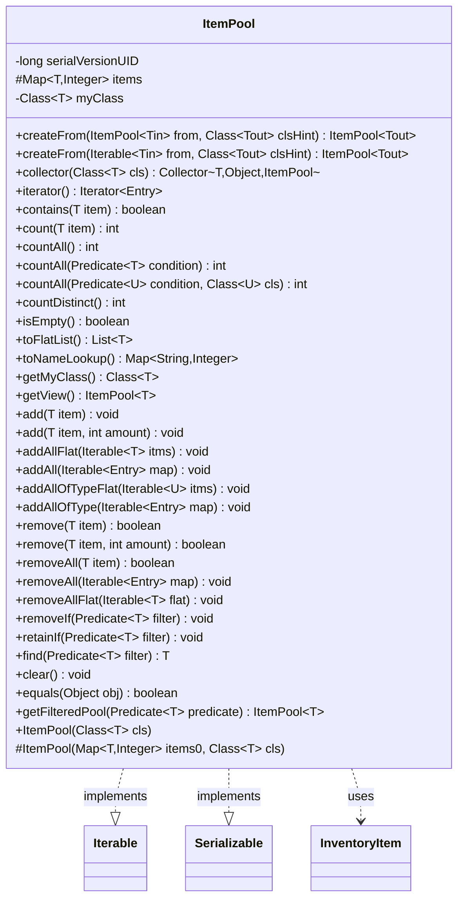

---
aliases:
  - ItemPool
tags:
  - java/class
  - module/forge-core
  - pkg/forge/util
fqn: forge.util.ItemPool
package: forge.util
module: forge-core
kind: Class
---

# ItemPool

**Package:** `forge.util` &nbsp; **Module:** `forge-core` &nbsp; **Kind:** Class



## Relationships
**Uses:**
- [[forge.item.InventoryItem|InventoryItem]]

## Design Description

ItemPool is a generic, serializable container that maps inventory items of type `T` (bounded to `InventoryItem`) to integer quantities, representing a collection of distinct items each with a count. It implements `Iterable<Entry<T, Integer>>` to expose its entries directly, and collaborates with `InventoryItem` as the type bound for its keys. Beyond basic add/remove/count operations, it offers quantity-aware bulk mutation, predicate-based querying and filtering, flat-list expansion, and name lookups.

Notable design intent includes a `ConcurrentHashMap` backing store for thread-safe access; a runtime-retained `Class<T>` token enabling instanceof-based, type-filtered operations (`addAllOfType`, `countAll(condition, cls)`) that work around generic type erasure; static `createFrom` factories and a stream `Collector` for ergonomic construction; and a `getView` method returning an unmodifiable-backed pool for safe read-only exposure.

## Source
`forge-core/src/main/java/forge/util/ItemPool.java`

```java
/*
 * Forge: Play Magic: the Gathering.
 * Copyright (C) 2011  Forge Team
 *
 * This program is free software: you can redistribute it and/or modify
 * it under the terms of the GNU General Public License as published by
 * the Free Software Foundation, either version 3 of the License, or
 * (at your option) any later version.
 * 
 * This program is distributed in the hope that it will be useful,
 * but WITHOUT ANY WARRANTY; without even the implied warranty of
 * MERCHANTABILITY or FITNESS FOR A PARTICULAR PURPOSE.  See the
 * GNU General Public License for more details.
 * 
 * You should have received a copy of the GNU General Public License
 * along with this program.  If not, see <http://www.gnu.org/licenses/>.
 */
package forge.util;

import com.google.common.collect.Maps;
import forge.item.InventoryItem;

import java.io.Serializable;
import java.util.*;
import java.util.Map.Entry;
import java.util.concurrent.ConcurrentHashMap;
import java.util.function.*;
import java.util.stream.Collector;

/**
 * <p>
 * ItemPool class.
 * </p>
 * Represents a list of items with amount of each
 * 
 * @param <T>
 *            an Object
 */
public class ItemPool<T extends InventoryItem> implements Iterable<Entry<T, Integer>>, Serializable {
    private static final long serialVersionUID = 6572047177527559797L;

    public ItemPool(final Class<T> cls) {
        this(new ConcurrentHashMap<>(), cls);
    }

    @SuppressWarnings("unchecked")
    public static <Tin extends InventoryItem, Tout extends InventoryItem> ItemPool<Tout> createFrom(final ItemPool<Tin> from, final Class<Tout> clsHint) {
        final ItemPool<Tout> result = new ItemPool<>(clsHint);
        if (from != null) {
            for (final Entry<Tin, Integer> e : from) {
                final Tin srcKey = e.getKey();
                if (clsHint.isInstance(srcKey)) {
                    result.add((Tout) srcKey, e.getValue());
                }
            }
        }
        return result;
    }

    @SuppressWarnings("unchecked")
    public static <Tin extends InventoryItem, Tout extends InventoryItem> ItemPool<Tout> createFrom(final Iterable<Tin> from, final Class<Tout> clsHint) {
        final ItemPool<Tout> result = new ItemPool<>(clsHint);
        if (from != null) {
            for (final Tin srcKey : from) {
                if (clsHint.isInstance(srcKey)) {
                    result.add((Tout) srcKey, 1);
                }
            }
        }
        return result;
    }

    public static <T extends InventoryItem> Collector<T, ?, ItemPool<T>> collector(Class<T> cls) {
        return new Collector<T, ItemPool<T>, ItemPool<T>>() {
            @Override
            public Supplier<ItemPool<T>> supplier() {
                return () -> new ItemPool<T>(cls);
            }

            @Override
            public BiConsumer<ItemPool<T>, T> accumulator() {
                return (pool, item) -> {
                    if (cls.isInstance(item)) pool.add(cls.cast(item), 1);
                };
            }

            @Override
            public BinaryOperator<ItemPool<T>> combiner() {
                return (first, second) -> {
                    first.addAll(second);
                    return first;
                };
            }

            @Override public Function<ItemPool<T>, ItemPool<T>> finisher() {
                return Function.identity();
            }
            @Override public Set<Characteristics> characteristics() {
                return EnumSet.of(Characteristics.IDENTITY_FINISH);
            }
        };
    }

    protected ItemPool(final Map<T, Integer> items0, final Class<T> cls) {
        if (items0 != null) {
            items = items0;
        }
        else {
            items = new ConcurrentHashMap<>();
        }
        myClass = cls;
    }

    // Data members
    protected final Map<T, Integer> items;

    private final Class<T> myClass; //class does not keep this in runtime by itself

    @Override
    public final Iterator<Entry<T, Integer>> iterator() {
        return items.entrySet().iterator();
    }

    public final boolean contains(final T item) {
        return items.containsKey(item);
    }

    public final int count(final T item) {
        if (item == null) {
            return 0;
        }
        final Integer boxed = items.get(item);
        return boxed == null ? 0 : boxed;
    }

    public final int countAll() {
        int count = 0;
        for (Entry<T, Integer> e : this) {
            count += e.getValue();
        }
        return count;
    }

    public int countAll(Predicate<T> condition){
        int count = 0;
        for (Integer v : Maps.filterKeys(this.items, condition::test).values())
            count += v;
        return count;

    }

    @SuppressWarnings("unchecked")
    public final <U extends InventoryItem> int countAll(Predicate<? super U> condition, Class<U> cls) {
        int count = 0;
        Map<T, Integer> matchingKeys = Maps.filterKeys(this.items, item -> cls.isInstance(item) && (condition.test((U)item)));
        for (Integer i : matchingKeys.values()) {
            count += i;
        }
        return count;
    }

    public final int countDistinct() {
        return items.size();
    }

    public final boolean isEmpty() {
        return items.isEmpty();
    }

    public final List<T> toFlatList() {
        final List<T> result = new ArrayList<>();
        for (final Entry<T, Integer> e : this) {
            for (int i = 0; i < e.getValue(); i++) {
                result.add(e.getKey());
            }
        }
        return result;
    }

    public Map<String, Integer> toNameLookup() {
        final Map<String, Integer> result = new HashMap<>();
        for (final Entry<T, Integer> e : this) {
            result.put(e.getKey().getName(), e.getValue());
        }
        return result;
    }

    public Class<T> getMyClass() {
        return myClass;
    }

    public ItemPool<T> getView() {
        return new ItemPool<>(Collections.unmodifiableMap(items), getMyClass());
    }

    public void add(final T item) {
        add(item, 1);
    }

    public void add(final T item, final int amount) {
        if (item == null || amount <= 0) { return; }

        items.merge(item, amount, Integer::sum);
    }

    public void addAllFlat(final Iterable<T> itms) {
        for (T item : itms) {
            add(item);
        }
    }

    public void addAll(final Iterable<Entry<T, Integer>> map) {
        for (Entry<T, Integer> e : map) {
            add(e.getKey(), e.getValue());
        }
    }

    @SuppressWarnings("unchecked")
    public <U extends InventoryItem> void addAllOfTypeFlat(final Iterable<U> itms) {
        for (U item : itms) {
            if (myClass.isInstance(item)) {
                add((T) item);
            }
        }
    }

    @SuppressWarnings("unchecked")
    public <U extends InventoryItem> void addAllOfType(final Iterable<Entry<U, Integer>> map) {
        for (Entry<U, Integer> e : map) {
            if (myClass.isInstance(e.getKey())) {
                add((T) e.getKey(), e.getValue());
            }
        }
    }

    public boolean remove(final T item) {
        return remove(item, 1);
    }

    public boolean remove(final T item, final int amount) {
        final int count = count(item);
        if (count == 0 || amount <= 0) {
            return false;
        }
        if (count <= amount) {
            items.remove(item);
        }
        else {
            items.put(item, count - amount);
        }
        return true;
    }

    public boolean removeAll(final T item) {
        return items.remove(item) != null;
    }

    public void removeAll(final Iterable<Entry<T, Integer>> map) {
        for (final Entry<T, Integer> e : map) {
            remove(e.getKey(), e.getValue());
        }
        // need not set out-of-sync: either remove did set, or nothing was removed
    }

    public void removeAllFlat(final Iterable<T> flat) {
        for (final T e : flat) {
            remove(e);
        }
        // need not set out-of-sync: either remove did set, or nothing was removed
    }

    public void removeIf(Predicate<T> filter) {
        items.keySet().removeIf(filter);
    }

    public void retainIf(Predicate<T> filter) {
        items.keySet().removeIf(filter.negate());
    }

    public T find(Predicate<T> filter) {
        return items.keySet().stream().filter(filter).findFirst().orElse(null);
    }

    public void clear() {
        items.clear();
    }

    @Override
    public boolean equals(final Object obj) {
        return (obj instanceof ItemPool ip) &&
                (this.items.equals(ip.items));
    }

    /**
     * Applies a predicate to this ItemPool's entries.
     *
     * @param predicate the Predicate to apply to this ItemPool
     * @return a new ItemPool made from this ItemPool with only the items that agree with the provided Predicate
     */
    public ItemPool<T> getFilteredPool(Predicate<T> predicate) {
        ItemPool<T> filteredPool = new ItemPool<>(myClass);
        for (T c : this.items.keySet()) {
            if (predicate.test(c))
                filteredPool.add(c, this.items.get(c));
        }
        return filteredPool;
    }
}
```

## Python
`forge/util/ItemPool.py`

```python
from forge.item.InventoryItem import InventoryItem

import typing
from collections import OrderedDict


class ItemPool(typing.Iterable, typing.Generic[typing.TypeVar('T', bound=InventoryItem)]):
    serialVersionUID = 6572047177527559797

    def __init__(self, *args):
        # ItemPool(cls)  or  ItemPool(items0, cls)
        if len(args) == 1:
            cls = args[0]
            self.items = {}
            self.myClass = cls
        else:
            items0, cls = args
            if items0 is not None:
                self.items = items0
            else:
                self.items = {}
            self.myClass = cls

    @staticmethod
    def createFrom(from_, clsHint):
        result = ItemPool(clsHint)
        if from_ is not None:
            # ItemPool is Iterable<Entry<Tin, Integer>>; an Iterable<Tin> yields plain items
            if isinstance(from_, ItemPool):
                for e in from_:
                    srcKey = e[0]
                    if isinstance(srcKey, clsHint):
                        result.add(srcKey, e[1])
            else:
                for srcKey in from_:
                    if isinstance(srcKey, clsHint):
                        result.add(srcKey, 1)
        return result

    @staticmethod
    def collector(cls):
        class _ItemPoolCollector:
            def supplier(self):
                return lambda: ItemPool(cls)

            def accumulator(self):
                def acc(pool, item):
                    if isinstance(item, cls):
                        pool.add(item, 1)
                return acc

            def combiner(self):
                def comb(first, second):
                    first.addAll(second)
                    return first
                return comb

            def finisher(self):
                return lambda x: x

            def characteristics(self):
                return {"IDENTITY_FINISH"}

        return _ItemPoolCollector()

    def __iter__(self):
        return iter(list(self.items.items()))

    def iterator(self):
        return iter(list(self.items.items()))

    def contains(self, item):
        return item in self.items

    def count(self, item):
        if item is None:
            return 0
        boxed = self.items.get(item)
        return 0 if boxed is None else boxed

    def countAll(self, condition=None, cls=None):
        if condition is None:
            count = 0
            for e in self:
                count += e[1]
            return count
        if cls is None:
            count = 0
            for item, v in self.items.items():
                if condition(item):
                    count += v
            return count
        count = 0
        for item, v in self.items.items():
            if isinstance(item, cls) and condition(item):
                count += v
        return count

    def countDistinct(self):
        return len(self.items)

    def isEmpty(self):
        return len(self.items) == 0

    def toFlatList(self):
        result = []
        for e in self:
            for i in range(e[1]):
                result.append(e[0])
        return result

    def toNameLookup(self):
        result = {}
        for e in self:
            result[e[0].getName()] = e[1]
        return result

    def getMyClass(self):
        return self.myClass

    def getView(self):
        return ItemPool(dict(self.items), self.getMyClass())

    def add(self, item, amount=1):
        if item is None or amount <= 0:
            return
        self.items[item] = self.items.get(item, 0) + amount

    def addAllFlat(self, itms):
        for item in itms:
            self.add(item)

    def addAll(self, map):
        for e in map:
            self.add(e[0], e[1])

    def addAllOfTypeFlat(self, itms):
        for item in itms:
            if isinstance(item, self.myClass):
                self.add(item)

    def addAllOfType(self, map):
        for e in map:
            if isinstance(e[0], self.myClass):
                self.add(e[0], e[1])

    def remove(self, item, amount=1):
        count = self.count(item)
        if count == 0 or amount <= 0:
            return False
        if count <= amount:
            del self.items[item]
        else:
            self.items[item] = count - amount
        return True

    def removeAll(self, arg):
        # removeAll(T item) -> boolean ; removeAll(Iterable<Entry<T,Integer>> map) -> void
        if isinstance(arg, InventoryItem):
            return self.items.pop(arg, None) is not None
        for e in arg:
            self.remove(e[0], e[1])

    def removeAllFlat(self, flat):
        for e in flat:
            self.remove(e)

    def removeIf(self, filter):
        for k in [k for k in list(self.items.keys()) if filter(k)]:
            del self.items[k]

    def retainIf(self, filter):
        for k in [k for k in list(self.items.keys()) if not filter(k)]:
            del self.items[k]

    def find(self, filter):
        for k in self.items.keys():
            if filter(k):
                return k
        return None

    def clear(self):
        self.items.clear()

    def __eq__(self, obj):
        return isinstance(obj, ItemPool) and self.items == obj.items

    def getFilteredPool(self, predicate):
        filteredPool = ItemPool(self.myClass)
        for c in self.items.keys():
            if predicate(c):
                filteredPool.add(c, self.items[c])
        return filteredPool
```
