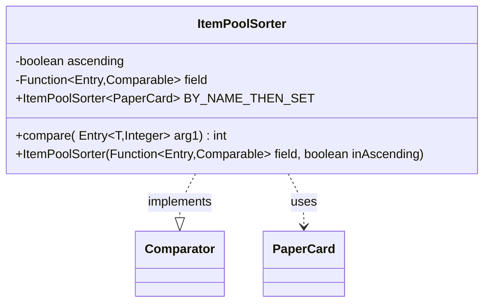

---
aliases:
  - ItemPoolSorter
tags:
  - java/class
  - module/forge-core
  - pkg/forge/util
fqn: forge.util.ItemPoolSorter
package: forge.util
module: forge-core
kind: Class
---

# ItemPoolSorter

**Package:** `forge.util`   **Module:** `forge-core`   **Kind:** Class



## Relationships
**Uses:**
- [[forge.item.PaperCard|PaperCard]]

## Design Description

ItemPoolSorter is a small, reusable `Comparator` implementation that orders item-pool entries—`Map.Entry<T, Integer>` pairs of an item and its quantity—by a configurable key. Rather than hard-coding sort logic, it accepts a `Function` that extracts a `Comparable` field from each entry plus an `ascending` flag, then delegates ordering to that field's natural comparison, inverting the result for descending order. Nulls are handled defensively, sorting absent values to one end.

The class is generic over the item type `T` and collaborates with `PaperCard` chiefly through its predefined `BY_NAME_THEN_SET` constant, a ready-made sorter keyed on the entry key. By combining a strategy function with a direction flag and exposing reusable static instances, it keeps item-pool sorting flexible and centralized while remaining decoupled from any specific UI or table layer.

## Source
`forge-core/src/main/java/forge/util/ItemPoolSorter.java`

```java
/*
 * Forge: Play Magic: the Gathering.
 * Copyright (C) 2011  Forge Team
 *
 * This program is free software: you can redistribute it and/or modify
 * it under the terms of the GNU General Public License as published by
 * the Free Software Foundation, either version 3 of the License, or
 * (at your option) any later version.
 * 
 * This program is distributed in the hope that it will be useful,
 * but WITHOUT ANY WARRANTY; without even the implied warranty of
 * MERCHANTABILITY or FITNESS FOR A PARTICULAR PURPOSE.  See the
 * GNU General Public License for more details.
 * 
 * You should have received a copy of the GNU General Public License
 * along with this program.  If not, see <http://www.gnu.org/licenses/>.
 */
package forge.util;

import forge.item.PaperCard;

import java.util.Comparator;
import java.util.Map.Entry;
import java.util.function.Function;


/**
 * <p>
 * TableSorter class.
 * </p>
 * 
 * @param <T>
 *            the generic type
 * @author Forge
 * @version $Id: TableSorter.java 21966 2013-06-05 06:58:32Z Max mtg $
 */
@SuppressWarnings("unchecked")
// Comparable needs <type>
public class ItemPoolSorter<T> implements Comparator<Entry<T, Integer>> {
    private final boolean ascending;
    private final Function<Entry<T, Integer>, Comparable<?>> field;

    /**
     * <p>
     * Constructor for TableSorter.
     * </p>
     * 
     * @param field
     *            the field
     * @param inAscending
     *            a boolean.
     */
    public ItemPoolSorter(final Function<Entry<T, Integer>, Comparable<?>> field, final boolean inAscending) {
        this.field = field;
        this.ascending = inAscending;
    }

    /** The Constant byNameThenSet. */
    public static final ItemPoolSorter<PaperCard> BY_NAME_THEN_SET = new ItemPoolSorter<>(Entry::getKey, true);

    /*
     * (non-Javadoc)
     * 
     * @see java.util.Comparator#compare(java.lang.Object, java.lang.Object)
     */
    @SuppressWarnings("rawtypes")
    @Override
    public final int compare(final Entry<T, Integer> arg0, final Entry<T, Integer> arg1) {
        final Comparable obj1 = this.field.apply(arg0);
        final Comparable obj2 = this.field.apply(arg1);
        if (obj1 == null) {
            return -1;
        }
        if (obj2 == null) {
            return 1;
        }
        //System.out.println(String.format("%s vs %s _______ %s vs %s", arg0, arg1, obj1, obj2));
        return this.ascending ? obj1.compareTo(obj2) : obj2.compareTo(obj1);
    }
}
```

## Python
`forge/util/ItemPoolSorter.py`

```python
from forge.item.PaperCard import PaperCard

from typing import Callable, Generic, TypeVar

T = TypeVar("T")


class ItemPoolSorter(Generic[T]):
    """
    TableSorter class.

    @param <T> the generic type
    @author Forge
    @version $Id: TableSorter.java 21966 2013-06-05 06:58:32Z Max mtg $
    """

    BY_NAME_THEN_SET: "ItemPoolSorter[PaperCard]" = None

    def __init__(self, field: Callable[[tuple], object], inAscending: bool):
        """
        Constructor for TableSorter.

        @param field the field
        @param inAscending a boolean.
        """
        self.field = field
        self.ascending = inAscending

    def compare(self, arg0: tuple, arg1: tuple) -> int:
        obj1 = self.field(arg0)
        obj2 = self.field(arg1)
        if obj1 is None:
            return -1
        if obj2 is None:
            return 1
        # System.out.println(String.format("%s vs %s _______ %s vs %s", arg0, arg1, obj1, obj2));
        if self.ascending:
            return (obj1 > obj2) - (obj1 < obj2)
        return (obj2 > obj1) - (obj2 < obj1)


# The Constant byNameThenSet.
ItemPoolSorter.BY_NAME_THEN_SET = ItemPoolSorter(lambda entry: entry[0], True)
```
