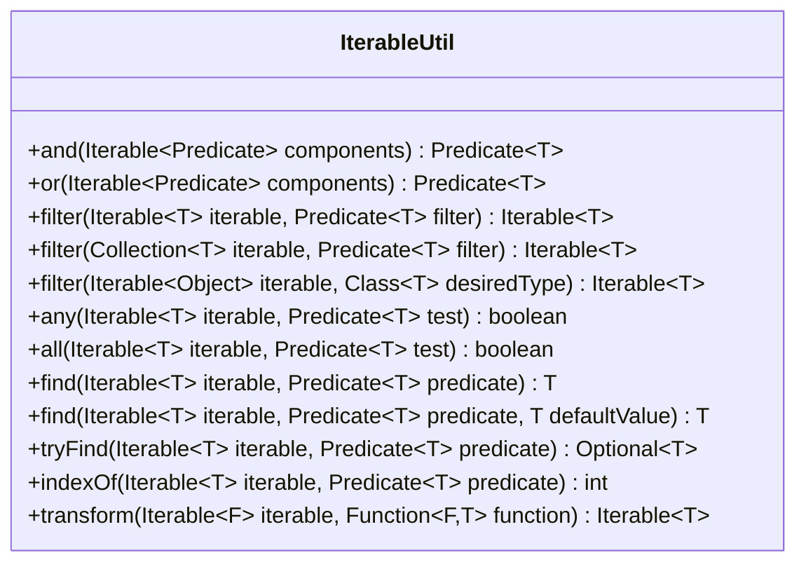

---
aliases:
  - IterableUtil
tags:
  - java/class
  - module/forge-core
  - pkg/forge/util
fqn: forge.util.IterableUtil
package: forge.util
module: forge-core
kind: Class
---

# IterableUtil

**Package:** `forge.util` &nbsp; **Module:** `forge-core` &nbsp; **Kind:** Class



## Source
`forge-core/src/main/java/forge/util/IterableUtil.java`

```java
package forge.util;

import java.util.Collection;
import java.util.List;
import java.util.Optional;
import java.util.function.Function;
import java.util.function.Predicate;
import java.util.stream.StreamSupport;

/**
 * Provides helper methods for Iterables and Predicates similar
 * to the Guava library, but supporting Java 8's implementation
 * of Predicates instead.
 */
public class IterableUtil {

    /**
     * Merges a collection of predicates into a single predicate,
     * which requires the subject to match each of the component predicates.
     */
    public static <T> Predicate<T> and(Iterable<? extends Predicate<? super T>> components) {
        if(components instanceof List && ((List<?>) components).size() == 1)
            return ((List<? extends Predicate<? super T>>) components).get(0)::test;
        return x -> all(components, i -> i.test(x));
    }

    /**
     * Merges a collection of predicates into a single predicate,
     * which requires the subject to match at least one of the component predicates.
     */
    public static <T> Predicate<T> or(Iterable<? extends Predicate<? super T>> components) {
        if(components instanceof List && ((List<?>) components).size() == 1)
            return ((List<? extends Predicate<? super T>>) components).get(0)::test;
        return x -> any(components, i -> i.test(x));
    }

    public static <T> Iterable<T> filter(Iterable<T> iterable, Predicate<? super T> filter) {
        return () -> StreamSupport.stream(iterable.spliterator(), false).filter(filter).iterator();
    }

    public static <T> Iterable<T> filter(Collection<T> iterable, Predicate<? super T> filter) {
        return () -> iterable.stream().filter(filter).iterator();
    }

    public static <T> Iterable<T> filter(final Iterable<?> iterable, final Class<T> desiredType) {
        return () -> StreamSupport.stream(iterable.spliterator(), false)
                .filter(desiredType::isInstance)
                .map(desiredType::cast)
                .iterator();
    }

    public static <T> boolean any(Iterable<T> iterable, Predicate<? super T> test) {
        return StreamSupport.stream(iterable.spliterator(), false).anyMatch(test);
    }

    public static <T> boolean all(Iterable<T> iterable, Predicate<? super T> test) {
        return StreamSupport.stream(iterable.spliterator(), false).allMatch(test);
    }

    @SuppressWarnings("OptionalGetWithoutIsPresent")
    public static <T> T find(Iterable<T> iterable, Predicate<? super T> predicate) {
        return StreamSupport.stream(iterable.spliterator(), false).filter(predicate).findFirst().get();
    }

    public static <T> T find(Iterable<T> iterable, Predicate<? super T> predicate, T defaultValue) {
        return StreamSupport.stream(iterable.spliterator(), false).filter(predicate).findFirst().orElse(defaultValue);
    }

    public static <T> Optional<T> tryFind(Iterable<T> iterable, Predicate<? super T> predicate) {
        return StreamSupport.stream(iterable.spliterator(), false).filter(predicate).findFirst();
    }

    public static <T> int indexOf(Iterable<T> iterable, Predicate<? super T> predicate) {
        int index = 0;
        for(T i : iterable) {
            if(predicate.test(i))
                return index;
            index++;
        }
        return -1;
    }

    public static <F, T> Iterable<T> transform(final Iterable<F> iterable, final Function<? super F, T> function) {
        //Should probably also be ? extends T in the function type
        return () -> StreamSupport.stream(iterable.spliterator(), false).map(function).iterator();
    }
}
```
