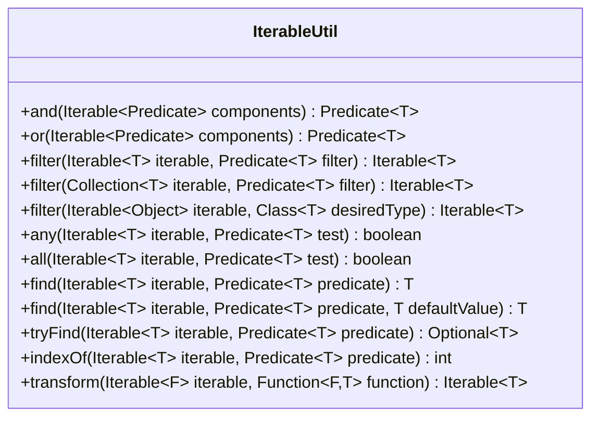

---
aliases:
  - IterableUtil
tags:
  - java/class
  - module/forge-core
  - pkg/forge/util
fqn: forge.util.IterableUtil
package: forge.util
module: forge-core
kind: Class
---

# IterableUtil

**Package:** `forge.util` &nbsp; **Module:** `forge-core` &nbsp; **Kind:** Class



## Design Description

IterableUtil is a stateless utility class providing static helper methods for working with `Iterable`s and `Predicate`s, deliberately mirroring Google Guava's `Iterables`/`Predicates` API while relying on Java 8's `java.util.function.Predicate` and `Function` rather than Guava's own functional types. It offers predicate composition (`and`, `or`), lazy `filter` and `transform` views, search operations (`find`, `tryFind`, `indexOf`, `any`, `all`), and type-based filtering. Most methods collaborate with the standard library by adapting `spliterator()` into a `Stream` via `StreamSupport`, returning lazily-evaluated `Iterable` lambdas so traversal is deferred until iteration. The `and`/`or` methods short-circuit a single-element `List` to its sole predicate, and bounded wildcards (`? super T`) throughout maximize caller flexibility. As a final, instance-free helper, it centralizes functional iteration idioms for reuse across the forge-core module.

## Source
`forge-core/src/main/java/forge/util/IterableUtil.java`

```java
package forge.util;

import java.util.Collection;
import java.util.List;
import java.util.Optional;
import java.util.function.Function;
import java.util.function.Predicate;
import java.util.stream.StreamSupport;

/**
 * Provides helper methods for Iterables and Predicates similar
 * to the Guava library, but supporting Java 8's implementation
 * of Predicates instead.
 */
public class IterableUtil {

    /**
     * Merges a collection of predicates into a single predicate,
     * which requires the subject to match each of the component predicates.
     */
    public static <T> Predicate<T> and(Iterable<? extends Predicate<? super T>> components) {
        if(components instanceof List && ((List<?>) components).size() == 1)
            return ((List<? extends Predicate<? super T>>) components).get(0)::test;
        return x -> all(components, i -> i.test(x));
    }

    /**
     * Merges a collection of predicates into a single predicate,
     * which requires the subject to match at least one of the component predicates.
     */
    public static <T> Predicate<T> or(Iterable<? extends Predicate<? super T>> components) {
        if(components instanceof List && ((List<?>) components).size() == 1)
            return ((List<? extends Predicate<? super T>>) components).get(0)::test;
        return x -> any(components, i -> i.test(x));
    }

    public static <T> Iterable<T> filter(Iterable<T> iterable, Predicate<? super T> filter) {
        return () -> StreamSupport.stream(iterable.spliterator(), false).filter(filter).iterator();
    }

    public static <T> Iterable<T> filter(Collection<T> iterable, Predicate<? super T> filter) {
        return () -> iterable.stream().filter(filter).iterator();
    }

    public static <T> Iterable<T> filter(final Iterable<?> iterable, final Class<T> desiredType) {
        return () -> StreamSupport.stream(iterable.spliterator(), false)
                .filter(desiredType::isInstance)
                .map(desiredType::cast)
                .iterator();
    }

    public static <T> boolean any(Iterable<T> iterable, Predicate<? super T> test) {
        return StreamSupport.stream(iterable.spliterator(), false).anyMatch(test);
    }

    public static <T> boolean all(Iterable<T> iterable, Predicate<? super T> test) {
        return StreamSupport.stream(iterable.spliterator(), false).allMatch(test);
    }

    @SuppressWarnings("OptionalGetWithoutIsPresent")
    public static <T> T find(Iterable<T> iterable, Predicate<? super T> predicate) {
        return StreamSupport.stream(iterable.spliterator(), false).filter(predicate).findFirst().get();
    }

    public static <T> T find(Iterable<T> iterable, Predicate<? super T> predicate, T defaultValue) {
        return StreamSupport.stream(iterable.spliterator(), false).filter(predicate).findFirst().orElse(defaultValue);
    }

    public static <T> Optional<T> tryFind(Iterable<T> iterable, Predicate<? super T> predicate) {
        return StreamSupport.stream(iterable.spliterator(), false).filter(predicate).findFirst();
    }

    public static <T> int indexOf(Iterable<T> iterable, Predicate<? super T> predicate) {
        int index = 0;
        for(T i : iterable) {
            if(predicate.test(i))
                return index;
            index++;
        }
        return -1;
    }

    public static <F, T> Iterable<T> transform(final Iterable<F> iterable, final Function<? super F, T> function) {
        //Should probably also be ? extends T in the function type
        return () -> StreamSupport.stream(iterable.spliterator(), false).map(function).iterator();
    }
}
```

## Python
`forge/util/IterableUtil.py`

```python
from typing import Callable, Iterable, List, Optional, Type, TypeVar

T = TypeVar("T")
F = TypeVar("F")


class IterableUtil:
    """
    Provides helper methods for Iterables and Predicates similar
    to the Guava library, but supporting Java 8's implementation
    of Predicates instead.
    """

    @staticmethod
    def and_(components: Iterable[Callable[[T], bool]]) -> Callable[[T], bool]:
        """
        Merges a collection of predicates into a single predicate,
        which requires the subject to match each of the component predicates.
        """
        if isinstance(components, list) and len(components) == 1:
            return components[0]
        return lambda x: IterableUtil.all(components, lambda i: i(x))

    @staticmethod
    def or_(components: Iterable[Callable[[T], bool]]) -> Callable[[T], bool]:
        """
        Merges a collection of predicates into a single predicate,
        which requires the subject to match at least one of the component predicates.
        """
        if isinstance(components, list) and len(components) == 1:
            return components[0]
        return lambda x: IterableUtil.any(components, lambda i: i(x))

    @staticmethod
    def filter(iterable: Iterable[T], filter: Callable[[T], bool]) -> Iterable[T]:
        return (x for x in iterable if filter(x))

    @staticmethod
    def filter_by_type(iterable: Iterable[object], desiredType: Type[T]) -> Iterable[T]:
        return (x for x in iterable if isinstance(x, desiredType))

    @staticmethod
    def any(iterable: Iterable[T], test: Callable[[T], bool]) -> bool:
        return any(test(x) for x in iterable)

    @staticmethod
    def all(iterable: Iterable[T], test: Callable[[T], bool]) -> bool:
        return all(test(x) for x in iterable)

    @staticmethod
    def find(iterable: Iterable[T], predicate: Callable[[T], bool], defaultValue=...):
        for i in iterable:
            if predicate(i):
                return i
        if defaultValue is ...:
            raise StopIteration()
        return defaultValue

    @staticmethod
    def tryFind(iterable: Iterable[T], predicate: Callable[[T], bool]) -> Optional[T]:
        for i in iterable:
            if predicate(i):
                return i
        return None

    @staticmethod
    def indexOf(iterable: Iterable[T], predicate: Callable[[T], bool]) -> int:
        index = 0
        for i in iterable:
            if predicate(i):
                return index
            index += 1
        return -1

    @staticmethod
    def transform(iterable: Iterable[F], function: Callable[[F], T]) -> Iterable[T]:
        # Should probably also be ? extends T in the function type
        return (function(x) for x in iterable)
```
