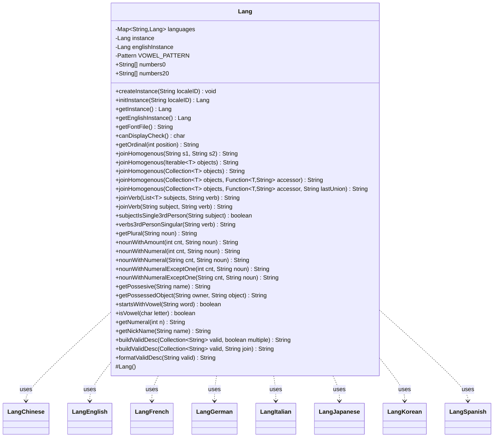

---
aliases:
  - Lang
tags:
  - java/class
  - module/forge-core
  - pkg/forge/util
fqn: forge.util.Lang
package: forge.util
module: forge-core
kind: Class
---

# Lang

**Package:** `forge.util`   **Module:** `forge-core`   **Kind:** Class



## Relationships
**Uses:**
- [[forge.util.lang.LangChinese|LangChinese]]
- [[forge.util.lang.LangEnglish|LangEnglish]]
- [[forge.util.lang.LangFrench|LangFrench]]
- [[forge.util.lang.LangGerman|LangGerman]]
- [[forge.util.lang.LangItalian|LangItalian]]
- [[forge.util.lang.LangJapanese|LangJapanese]]
- [[forge.util.lang.LangKorean|LangKorean]]
- [[forge.util.lang.LangSpanish|LangSpanish]]

## Design Description

The `Lang` class is an abstract static utility library in `forge-core` that centralizes natural-language formatting for the engine's textual output—pluralization, numeral spelling, ordinals, possessives, subject/verb agreement, and human-readable joining of collections. It doubles as a locale registry: a synchronized map caches one concrete subclass per language, and the factory methods (`createInstance`/`initInstance`) dispatch on a locale ID to instantiate the appropriate implementation while exposing a global current-locale instance alongside a permanent English one for internal use.

As an abstract base, `Lang` defines the localization contract—`getOrdinal`, `getPossesive`, and `getPossessedObject` are deferred to its eight concrete subtypes (`LangEnglish`, `LangGerman`, `LangFrench`, and the rest), with `LangEnglish` serving as the default fallback. English-specific rules and stateless string helpers remain as static methods, reflecting a design that keeps simple grammar logic shared while delegating locale-dependent behavior to subclasses. It collaborates with `CardType` and `StringUtils` to lower-case common card-type terms when building target descriptions.

## Source
`forge-core/src/main/java/forge/util/Lang.java`

```java
package forge.util;

import com.google.common.collect.Iterables;
import com.google.common.collect.Lists;
import com.google.common.collect.Maps;

import forge.card.CardType;
import forge.util.lang.*;
import org.apache.commons.lang3.StringUtils;

import java.util.Collection;
import java.util.Collections;
import java.util.List;
import java.util.Map;
import java.util.function.Function;
import java.util.regex.Pattern;
import java.util.stream.Collectors;

/**
 * Static library containing language-related utility methods.
 */
public abstract class Lang {

    private static Map<String, Lang> languages = Collections.synchronizedMap(Maps.newHashMap());

    private static Lang instance;
    private static Lang englishInstance;

    public static void createInstance(String localeID) {
        instance = initInstance(localeID);

        // Create english instance for internal usage
        englishInstance = initInstance("en-US");
    }

    public static Lang initInstance(String localeID) {
        return languages.computeIfAbsent(localeID, k -> switch (k.split("-")[0]) {
            case "de" -> new LangGerman();
            case "es" -> new LangSpanish();
            case "it" -> new LangItalian();
            case "zh" -> new LangChinese();
            case "ja" -> new LangJapanese();
            case "ko" -> new LangKorean();
            case "fr" -> new LangFrench();
            default -> new LangEnglish();
        });
    }

    public static Lang getInstance() {
        return instance;
    }

    public static Lang getEnglishInstance() {
        return englishInstance;
    }

    protected Lang() {
    }

    public String getFontFile() {
        return null;
    }

    public char canDisplayCheck() {
        return ' ';
    }

    /**
     * Return the ordinal suffix (2 characters) for the textual representation
     * of a numbers, eg. "st" for 1 ("first") and "th" for 4 ("fourth").
     * 
     * @param position
     *                 the number to get the ordinal suffix for.
     * @return a string containing two characters.
     */
    public abstract String getOrdinal(final int position);

    public static String joinHomogenous(final String s1, final String s2) {
        final boolean has1 = StringUtils.isNotBlank(s1);
        final boolean has2 = StringUtils.isNotBlank(s2);
        return has1 ? (has2 ? s1 + " and " + s2 : s1) : (has2 ? s2 : "");
    }

    public static <T> String joinHomogenous(final Iterable<T> objects) {
        return joinHomogenous(Lists.newArrayList(objects));
    }

    public static <T> String joinHomogenous(final Collection<T> objects) {
        return joinHomogenous(objects, null, "and");
    }

    public static <T> String joinHomogenous(final Collection<T> objects, final Function<T, String> accessor) {
        return joinHomogenous(objects, accessor, "and");
    }

    public static <T> String joinHomogenous(final Collection<T> objects, final Function<T, String> accessor,
            final String lastUnion) {
        int remaining = objects.size();
        final StringBuilder sb = new StringBuilder();
        for (final T obj : objects) {
            remaining--;
            if (accessor != null) {
                sb.append(accessor.apply(obj));
            } else {
                sb.append(obj);
            }
            if (remaining > 1) {
                sb.append(", ");
            } else if (remaining == 1) {
                sb.append(" ").append(lastUnion).append(" ");
            }
        }
        return sb.toString();
    }

    public static <T> String joinVerb(final List<T> subjects, final String verb) {
        return subjects.size() > 1 || !subjectIsSingle3rdPerson(Iterables.getFirst(subjects, "it").toString()) ? verb
                : verbs3rdPersonSingular(verb);
    }

    public static String joinVerb(final String subject, final String verb) {
        return !Lang.subjectIsSingle3rdPerson(subject) ? verb : verbs3rdPersonSingular(verb);
    }

    public static boolean subjectIsSingle3rdPerson(final String subject) {
        // Will be most simple
        return !"You".equalsIgnoreCase(subject);
    }

    public static String verbs3rdPersonSingular(final String verb) {
        // English is simple - just add (s) for multiple objects.
        return verb + "s";
    }

    public static String getPlural(final String noun) {
        return noun + (noun.endsWith("s") && !noun.endsWith("ds") || noun.endsWith("x") || noun.endsWith("ch") ? "es"
                : noun.endsWith("ds") ? "" : "s");
    }

    public static String nounWithAmount(final int cnt, final String noun) {
        final String countedForm = cnt == 1 ? noun : getPlural(noun);
        final String strCount;
        if (cnt == 1) {
            strCount = startsWithVowel(noun) ? "an " : "a ";
        } else {
            strCount = cnt + " ";
        }
        return strCount + countedForm;
    }

    public static String nounWithNumeral(final int cnt, final String noun) {
        final String countedForm = cnt == 1 ? noun : getPlural(noun);
        return getNumeral(cnt) + " " + countedForm;
    }

    public static String nounWithNumeral(final String cnt, final String noun) {
        if (StringUtils.isNumeric(cnt)) {
            return nounWithNumeral(Integer.parseInt(cnt), noun);
        } else {
            // for X
            return cnt + " " + getPlural(noun);
        }
    }

    public static String nounWithNumeralExceptOne(final int cnt, final String noun) {
        final String countedForm = cnt == 1 ? noun : getPlural(noun);
        final String desc = cnt == 1 ? (Lang.startsWithVowel(countedForm) ? "an" : "a") : getNumeral(cnt);
        return desc + " " + countedForm;
    }

    public static String nounWithNumeralExceptOne(final String cnt, final String noun) {
        if (StringUtils.isNumeric(cnt)) {
            return nounWithNumeralExceptOne(Integer.parseInt(cnt), noun);
        } else {
            // for X
            return cnt + " " + getPlural(noun);
        }
    }

    public abstract String getPossesive(final String name);

    public abstract String getPossessedObject(final String owner, final String object);

    public static boolean startsWithVowel(final String word) {
        return isVowel(word.trim().charAt(0));
    }

    private static final Pattern VOWEL_PATTERN = Pattern.compile("[aeiou]", Pattern.CASE_INSENSITIVE);

    public static boolean isVowel(final char letter) {
        return VOWEL_PATTERN.matcher(String.valueOf(letter)).find();
    }

    public final static String[] numbers0 = new String[] {
            "zero", "one", "two", "three", "four", "five", "six", "seven", "eight", "nine",
            "ten", "eleven", "twelve", "thirteen", "fourteen", "fifteen", "sixteen", "seventeen", "eighteen",
            "nineteen" };
    public final static String[] numbers20 = new String[] { "twenty", "thirty", "forty", "fifty", "sixty", "seventy",
            "eighty", "ninety" };

    public static String getNumeral(int n) {
        final String prefix = n < 0 ? "minus " : "";
        n = Math.abs(n);
        if (n >= 0 && n < 20) {
            return prefix + numbers0[n];
        }
        if (n < 100) {
            final int n1 = n % 10;
            final String ones = n1 == 0 ? "" : numbers0[n1];
            return prefix + numbers20[(n / 10) - 2] + " " + ones;
        }
        return Integer.toString(n);
    }

    public String getNickName(final String name) {
        if (name.contains(",")) {
            return name.split(",")[0];
        }
        if (name.contains(":")) {
            return name.split(":")[0];
        }
        return name.split(" ")[0];
    }

    public String buildValidDesc(Collection<String> valid, boolean multiple) {
        return buildValidDesc(valid, multiple ? "and/or" : "or");
    }
    public String buildValidDesc(Collection<String> valid, String join) {
        return joinHomogenous(valid.stream().map(s -> formatValidDesc(s)).collect(Collectors.toList()), null, join);
    }

    public String formatValidDesc(String valid) {
        List<String> commonStuff = List.of(
                //list of common one word non-core type ValidTgts that should be lowercase in the target prompt
                "Player", "Opponent", "Card", "Spell", "Permanent"
        );
        if (commonStuff.contains(valid) || CardType.isACardType(valid)) {
            valid = valid.toLowerCase();
        }
        return valid;
    }
}
```

## Python
`forge/util/Lang.py`

```python
package = "forge.util"

from abc import ABC, abstractmethod
import re
from typing import Callable, Collection, Iterable, List, Optional, TypeVar

from forge.card.CardType import CardType
from forge.util.lang.LangChinese import LangChinese
from forge.util.lang.LangEnglish import LangEnglish
from forge.util.lang.LangFrench import LangFrench
from forge.util.lang.LangGerman import LangGerman
from forge.util.lang.LangItalian import LangItalian
from forge.util.lang.LangJapanese import LangJapanese
from forge.util.lang.LangKorean import LangKorean
from forge.util.lang.LangSpanish import LangSpanish

T = TypeVar("T")


class Lang(ABC):
    """
    Static library containing language-related utility methods.
    """

    languages: dict[str, "Lang"] = {}

    instance: Optional["Lang"] = None
    englishInstance: Optional["Lang"] = None

    @staticmethod
    def createInstance(localeID: str) -> None:
        Lang.instance = Lang.initInstance(localeID)

        # Create english instance for internal usage
        Lang.englishInstance = Lang.initInstance("en-US")

    @staticmethod
    def initInstance(localeID: str) -> "Lang":
        if localeID not in Lang.languages:
            key = localeID.split("-")[0]
            if key == "de":
                value = LangGerman()
            elif key == "es":
                value = LangSpanish()
            elif key == "it":
                value = LangItalian()
            elif key == "zh":
                value = LangChinese()
            elif key == "ja":
                value = LangJapanese()
            elif key == "ko":
                value = LangKorean()
            elif key == "fr":
                value = LangFrench()
            else:
                value = LangEnglish()
            Lang.languages[localeID] = value
        return Lang.languages[localeID]

    @staticmethod
    def getInstance() -> "Lang":
        return Lang.instance

    @staticmethod
    def getEnglishInstance() -> "Lang":
        return Lang.englishInstance

    def __init__(self):
        pass

    def getFontFile(self) -> str:
        return None

    def canDisplayCheck(self) -> str:
        return ' '

    @abstractmethod
    def getOrdinal(self, position: int) -> str:
        """
        Return the ordinal suffix (2 characters) for the textual representation
        of a numbers, eg. "st" for 1 ("first") and "th" for 4 ("fourth").

        :param position: the number to get the ordinal suffix for.
        :return: a string containing two characters.
        """
        ...

    @staticmethod
    def joinHomogenous(*args) -> str:
        # joinHomogenous(String s1, String s2)
        if (len(args) == 2 and isinstance(args[0], str)
                and (args[1] is None or isinstance(args[1], str))):
            s1, s2 = args
            has1 = s1 is not None and s1.strip() != ""
            has2 = s2 is not None and s2.strip() != ""
            return (s1 + " and " + s2 if has2 else s1) if has1 else (s2 if has2 else "")

        # joinHomogenous(Iterable<T> objects)
        if len(args) == 1 and not isinstance(args[0], (list, tuple)):
            objects = args[0]
            return Lang.joinHomogenous(list(objects))

        # joinHomogenous(Collection<T> objects)
        if len(args) == 1:
            return Lang.joinHomogenous(args[0], None, "and")

        # joinHomogenous(Collection<T> objects, Function<T,String> accessor)
        if len(args) == 2:
            return Lang.joinHomogenous(args[0], args[1], "and")

        # joinHomogenous(Collection<T> objects, Function<T,String> accessor, String lastUnion)
        objects, accessor, lastUnion = args
        remaining = len(objects)
        sb = []
        for obj in objects:
            remaining -= 1
            if accessor is not None:
                sb.append(accessor(obj))
            else:
                sb.append(str(obj))
            if remaining > 1:
                sb.append(", ")
            elif remaining == 1:
                sb.append(" " + lastUnion + " ")
        return "".join(sb)

    @staticmethod
    def joinVerb(subjects, verb: str) -> str:
        # joinVerb(String subject, String verb)
        if isinstance(subjects, str):
            subject = subjects
            return verb if not Lang.subjectIsSingle3rdPerson(subject) else Lang.verbs3rdPersonSingular(verb)
        # joinVerb(List<T> subjects, String verb)
        first = subjects[0] if len(subjects) > 0 else "it"
        return verb if (len(subjects) > 1 or not Lang.subjectIsSingle3rdPerson(str(first))) \
            else Lang.verbs3rdPersonSingular(verb)

    @staticmethod
    def subjectIsSingle3rdPerson(subject: str) -> bool:
        # Will be most simple
        return not (subject is not None and subject.lower() == "you".lower())

    @staticmethod
    def verbs3rdPersonSingular(verb: str) -> str:
        # English is simple - just add (s) for multiple objects.
        return verb + "s"

    @staticmethod
    def getPlural(noun: str) -> str:
        if (noun.endswith("s") and not noun.endswith("ds")) or noun.endswith("x") or noun.endswith("ch"):
            suffix = "es"
        elif noun.endswith("ds"):
            suffix = ""
        else:
            suffix = "s"
        return noun + suffix

    @staticmethod
    def nounWithAmount(cnt: int, noun: str) -> str:
        countedForm = noun if cnt == 1 else Lang.getPlural(noun)
        if cnt == 1:
            strCount = "an " if Lang.startsWithVowel(noun) else "a "
        else:
            strCount = str(cnt) + " "
        return strCount + countedForm

    @staticmethod
    def nounWithNumeral(cnt, noun: str) -> str:
        if isinstance(cnt, str):
            if cnt.isdigit():
                return Lang.nounWithNumeral(int(cnt), noun)
            else:
                # for X
                return cnt + " " + Lang.getPlural(noun)
        countedForm = noun if cnt == 1 else Lang.getPlural(noun)
        return Lang.getNumeral(cnt) + " " + countedForm

    @staticmethod
    def nounWithNumeralExceptOne(cnt, noun: str) -> str:
        if isinstance(cnt, str):
            if cnt.isdigit():
                return Lang.nounWithNumeralExceptOne(int(cnt), noun)
            else:
                # for X
                return cnt + " " + Lang.getPlural(noun)
        countedForm = noun if cnt == 1 else Lang.getPlural(noun)
        if cnt == 1:
            desc = "an" if Lang.startsWithVowel(countedForm) else "a"
        else:
            desc = Lang.getNumeral(cnt)
        return desc + " " + countedForm

    @abstractmethod
    def getPossesive(self, name: str) -> str:
        ...

    @abstractmethod
    def getPossessedObject(self, owner: str, object: str) -> str:
        ...

    @staticmethod
    def startsWithVowel(word: str) -> bool:
        return Lang.isVowel(word.strip()[0])

    VOWEL_PATTERN = re.compile("[aeiou]", re.IGNORECASE)

    @staticmethod
    def isVowel(letter: str) -> bool:
        return Lang.VOWEL_PATTERN.search(str(letter)) is not None

    numbers0 = [
        "zero", "one", "two", "three", "four", "five", "six", "seven", "eight", "nine",
        "ten", "eleven", "twelve", "thirteen", "fourteen", "fifteen", "sixteen", "seventeen", "eighteen",
        "nineteen"]
    numbers20 = ["twenty", "thirty", "forty", "fifty", "sixty", "seventy",
                 "eighty", "ninety"]

    @staticmethod
    def getNumeral(n: int) -> str:
        prefix = "minus " if n < 0 else ""
        n = abs(n)
        if 0 <= n < 20:
            return prefix + Lang.numbers0[n]
        if n < 100:
            n1 = n % 10
            ones = "" if n1 == 0 else Lang.numbers0[n1]
            return prefix + Lang.numbers20[(n // 10) - 2] + " " + ones
        return str(n)

    def getNickName(self, name: str) -> str:
        if "," in name:
            return name.split(",")[0]
        if ":" in name:
            return name.split(":")[0]
        return name.split(" ")[0]

    def buildValidDesc(self, valid: Collection[str], multiple) -> str:
        # buildValidDesc(Collection<String> valid, boolean multiple)
        if isinstance(multiple, bool):
            return self.buildValidDesc(valid, "and/or" if multiple else "or")
        # buildValidDesc(Collection<String> valid, String join)
        join = multiple
        return Lang.joinHomogenous([self.formatValidDesc(s) for s in valid], None, join)

    def formatValidDesc(self, valid: str) -> str:
        commonStuff = [
            # list of common one word non-core type ValidTgts that should be lowercase in the target prompt
            "Player", "Opponent", "Card", "Spell", "Permanent"
        ]
        if valid in commonStuff or CardType.isACardType(valid):
            valid = valid.lower()
        return valid
```
