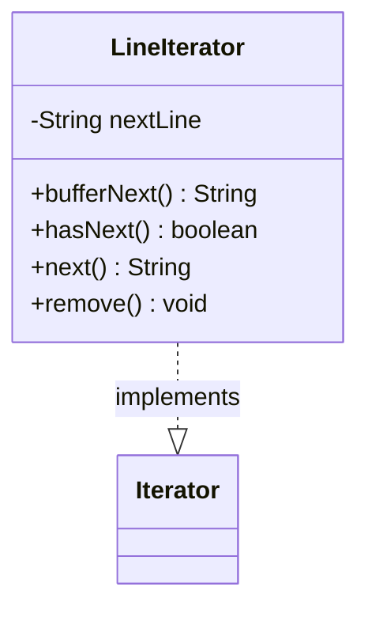

---
aliases:
  - LineIterator
tags:
  - java/class
  - module/forge-core
  - pkg/forge/util
fqn: forge.util.LineReader.LineIterator
package: forge.util
module: forge-core
kind: Class
---

# LineIterator

**Package:** `forge.util` &nbsp; **Module:** `forge-core` &nbsp; **Kind:** Class



## Source
`forge-core/src/main/java/forge/util/LineReader.java` — declaration excerpt

```java
    private class LineIterator implements Iterator<String> {
        private String nextLine;

        public String bufferNext() {
            try {
                return this.nextLine = LineReader.this.reader.readLine();
            } catch (final IOException e) {
                throw new IllegalStateException("I/O error while reading stream.", e);
            }
        }

        @Override
        public boolean hasNext() {
            final boolean hasNext = (this.nextLine != null) || (this.bufferNext() != null);

            if (!hasNext) {
                try {
                    LineReader.this.reader.close();
                } catch (final IOException e) {
                    throw new IllegalStateException("I/O error when closing stream.", e);
                }
            }

            return hasNext;
        }

        @Override
        public String next() {
            if (!this.hasNext()) {
                throw new NoSuchElementException();
            }

            final String result = this.nextLine;
            this.nextLine = null;
            return result;
        }

        @Override
        public void remove() {
            throw new UnsupportedOperationException();
        }
    }
```
