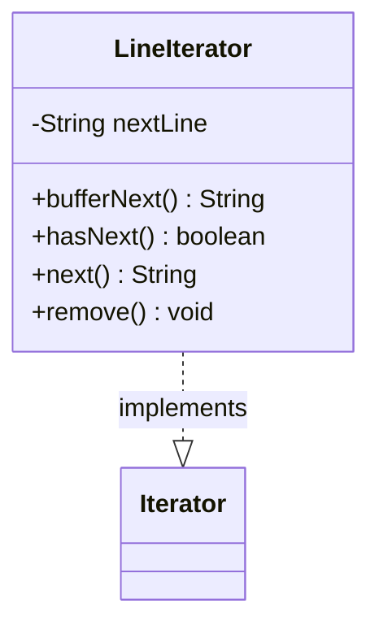

---
aliases:
  - LineIterator
tags:
  - java/class
  - module/forge-core
  - pkg/forge/util
fqn: forge.util.LineReader.LineIterator
package: forge.util
module: forge-core
kind: Class
---

# LineIterator

**Package:** `forge.util`   **Module:** `forge-core`   **Kind:** Class



## Design Description

The LineIterator is a private inner class of LineReader that adapts a buffered character stream to Java's `Iterator<String>` contract, yielding the stream's contents one line at a time. It implements `Iterator<String>`, collaborating with the enclosing LineReader's underlying `reader` to fetch lines on demand and to convert any `IOException` into an unchecked `IllegalStateException`.

Its design centers on lazy, single-line lookahead: `bufferNext()` reads and caches the next line, while `hasNext()` buffers on demand and—critically—closes the stream automatically once exhausted, freeing the caller from explicit resource management. The `next()` method enforces the iterator protocol by throwing `NoSuchElementException` when no line remains, and `remove()` is deliberately unsupported, reflecting the read-only, forward-only nature of stream iteration.

## Source
`forge-core/src/main/java/forge/util/LineReader.java` — declaration excerpt

```java
    private class LineIterator implements Iterator<String> {
        private String nextLine;

        public String bufferNext() {
            try {
                return this.nextLine = LineReader.this.reader.readLine();
            } catch (final IOException e) {
                throw new IllegalStateException("I/O error while reading stream.", e);
            }
        }

        @Override
        public boolean hasNext() {
            final boolean hasNext = (this.nextLine != null) || (this.bufferNext() != null);

            if (!hasNext) {
                try {
                    LineReader.this.reader.close();
                } catch (final IOException e) {
                    throw new IllegalStateException("I/O error when closing stream.", e);
                }
            }

            return hasNext;
        }

        @Override
        public String next() {
            if (!this.hasNext()) {
                throw new NoSuchElementException();
            }

            final String result = this.nextLine;
            this.nextLine = null;
            return result;
        }

        @Override
        public void remove() {
            throw new UnsupportedOperationException();
        }
    }
```

## Python
`forge/util/LineReader/LineIterator.py`

```python
from forge.util.LineReader.LineReader import LineReader


class LineIterator:
    def __init__(self, outer: LineReader):
        self.outer = outer
        self.nextLine: str = None

    def bufferNext(self) -> str:
        try:
            self.nextLine = self.outer.reader.readLine()
            return self.nextLine
        except IOError as e:
            raise RuntimeError("I/O error while reading stream.") from e

    def hasNext(self) -> bool:
        hasNext = (self.nextLine is not None) or (self.bufferNext() is not None)

        if not hasNext:
            try:
                self.outer.reader.close()
            except IOError as e:
                raise RuntimeError("I/O error when closing stream.") from e

        return hasNext

    def next(self) -> str:
        if not self.hasNext():
            raise StopIteration()

        result = self.nextLine
        self.nextLine = None
        return result

    def remove(self) -> None:
        raise NotImplementedError()

    def __iter__(self):
        return self

    def __next__(self) -> str:
        return self.next()
```
