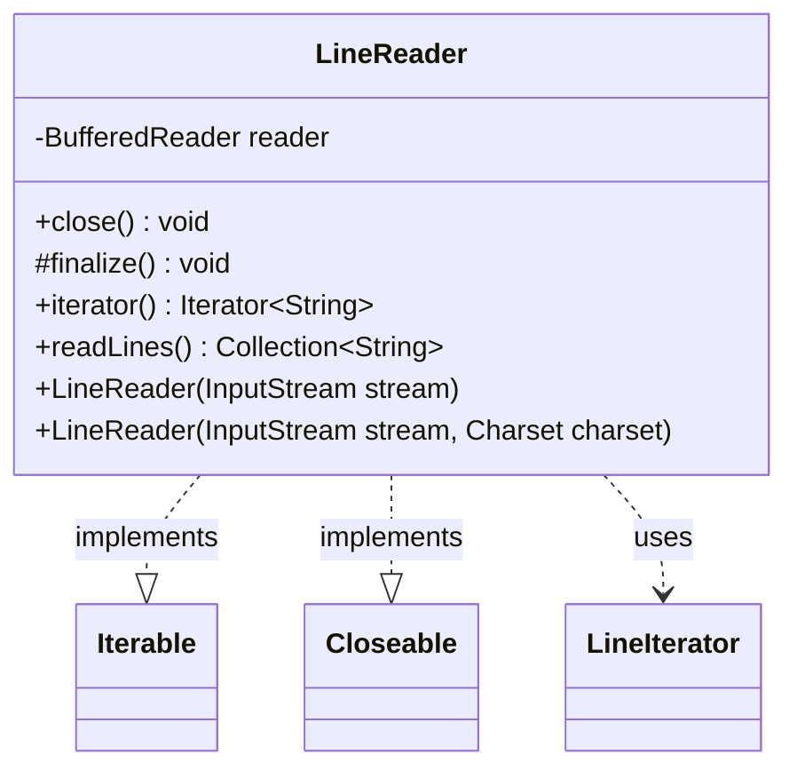

---
aliases:
  - LineReader
tags:
  - java/class
  - module/forge-core
  - pkg/forge/util
fqn: forge.util.LineReader
package: forge.util
module: forge-core
kind: Class
---

# LineReader

**Package:** `forge.util` &nbsp; **Module:** `forge-core` &nbsp; **Kind:** Class



## Relationships
**Uses:**
- [[forge.util.LineReader.LineIterator|LineIterator]]

## Design Description

LineReader adapts a byte-oriented `InputStream` into an iterable sequence of text lines, wrapping it in a `BufferedReader` (with an optional `Charset`) and exposing the lines either lazily through an iterator or eagerly via `readLines()`. By implementing `Iterable<String>` it integrates directly with the enhanced for-loop, and by implementing `Closeable` it participates in standard resource-management idioms.

Its central design intent is convenience and automatic cleanup: the private inner `LineIterator` reads one line at a time through `BufferedReader.readLine()` and closes the underlying stream as soon as `hasNext()` reaches end-of-input, so a completed for-loop needs no manual close. Checked `IOException`s are rethrown as unchecked `IllegalStateException`s to keep the iterator contract clean, `remove()` is unsupported, and `finalize()` offers a last-resort close. The class explicitly disclaims thread safety, favoring a simple single-threaded streaming reader.

## Source
`forge-core/src/main/java/forge/util/LineReader.java`

```java
/*
 * Forge: Play Magic: the Gathering.
 * Copyright (C) 2011  Forge Team
 *
 * This program is free software: you can redistribute it and/or modify
 * it under the terms of the GNU General Public License as published by
 * the Free Software Foundation, either version 3 of the License, or
 * (at your option) any later version.
 * 
 * This program is distributed in the hope that it will be useful,
 * but WITHOUT ANY WARRANTY; without even the implied warranty of
 * MERCHANTABILITY or FITNESS FOR A PARTICULAR PURPOSE.  See the
 * GNU General Public License for more details.
 * 
 * You should have received a copy of the GNU General Public License
 * along with this program.  If not, see <http://www.gnu.org/licenses/>.
 */
package forge.util;

/** 
 * TODO: Write javadoc for this type.
 *
 */

import java.io.*;
import java.nio.charset.Charset;
import java.util.ArrayList;
import java.util.Collection;
import java.util.Iterator;
import java.util.NoSuchElementException;

/**
 * Represents the lines found in an {@link InputStream}. The lines are read one
 * at a time using {@link BufferedReader#readLine()} and may be streamed through
 * an iterator or returned all at once.
 * 
 * <p>
 * This class does not handle any concurrency issues.
 * 
 * <p>
 * The stream is closed automatically when the for loop is done :)
 * 
 * <pre>
 * {@code
 * for(String line : new LineReader(stream))
 *      // ...
 * }
 * </pre>
 * 
 * <p>
 * An {@link IllegalStateException} will be thrown if any {@link IOException}s
 * occur when reading or closing the stream.
 * 
 * @author Torleif Berger
 * http://creativecommons.org/licenses/by/3.0/
 * @see http://www.geekality.net/?p=1614
 */
public class LineReader implements Iterable<String>, Closeable {
    private final BufferedReader reader;

    /**
     * Instantiates a new line reader.
     *
     * @param stream the stream
     */
    public LineReader(final InputStream stream) {
        this(stream, null);
    }

    /**
     * Instantiates a new line reader.
     *
     * @param stream the stream
     * @param charset the charset
     */
    public LineReader(final InputStream stream, final Charset charset) {
        this.reader = new BufferedReader(new InputStreamReader(stream, charset));
    }

    /**
     * Closes the underlying stream.
     *
     * @throws IOException Signals that an I/O exception has occurred.
     */
    @Override
    public void close() throws IOException {
        this.reader.close();
    }

    /**
     * Makes sure the underlying stream is closed.
     *
     * @throws Throwable the throwable
     */
    @Override
    protected void finalize() throws Throwable {
        this.close();
    }

    /**
     * Returns an iterator over the lines remaining to be read.
     * 
     * <p>
     * The underlying stream is closed automatically once
     *
     * @return This iterator.
     * {@link Iterator#hasNext()} returns false. This means that the stream
     * should be closed after using a for loop.
     */
    @Override
    public Iterator<String> iterator() {
        return new LineIterator();
    }

    /**
     * Returns all lines remaining to be read and closes the stream.
     * 
     * @return The lines read from the stream.
     */
    public Collection<String> readLines() {
        final Collection<String> lines = new ArrayList<>();
        for (final String line : this) {
            lines.add(line);
        }
        return lines;
    }

    private class LineIterator implements Iterator<String> {
        private String nextLine;

        public String bufferNext() {
            try {
                return this.nextLine = LineReader.this.reader.readLine();
            } catch (final IOException e) {
                throw new IllegalStateException("I/O error while reading stream.", e);
            }
        }

        @Override
        public boolean hasNext() {
            final boolean hasNext = (this.nextLine != null) || (this.bufferNext() != null);

            if (!hasNext) {
                try {
                    LineReader.this.reader.close();
                } catch (final IOException e) {
                    throw new IllegalStateException("I/O error when closing stream.", e);
                }
            }

            return hasNext;
        }

        @Override
        public String next() {
            if (!this.hasNext()) {
                throw new NoSuchElementException();
            }

            final String result = this.nextLine;
            this.nextLine = null;
            return result;
        }

        @Override
        public void remove() {
            throw new UnsupportedOperationException();
        }
    }
}
```

## Python
`forge/util/LineReader.py`

```python
from forge.util.LineReader.LineIterator import LineIterator
import io


class LineReader:
    """
    Represents the lines found in an InputStream. The lines are read one
    at a time using BufferedReader.readLine() and may be streamed through
    an iterator or returned all at once.

    This class does not handle any concurrency issues.

    The stream is closed automatically when the for loop is done :)

        for line in LineReader(stream):
            # ...

    An IllegalStateException will be thrown if any IOExceptions occur when
    reading or closing the stream.

    @author Torleif Berger
    http://creativecommons.org/licenses/by/3.0/
    @see http://www.geekality.net/?p=1614
    """

    def __init__(self, stream, charset=None):
        """
        Instantiates a new line reader.

        :param stream: the stream
        :param charset: the charset
        """
        encoding = charset if charset is not None else None
        self.reader = io.TextIOWrapper(stream, encoding=encoding)

    def close(self):
        """
        Closes the underlying stream.
        """
        self.reader.close()

    def __del__(self):
        """
        Makes sure the underlying stream is closed.
        """
        try:
            self.close()
        except Exception:
            pass

    def iterator(self):
        """
        Returns an iterator over the lines remaining to be read.

        The underlying stream is closed automatically once hasNext() returns
        false. This means that the stream should be closed after using a for
        loop.

        :return: This iterator.
        """
        return LineReader.LineIterator(self)

    def __iter__(self):
        return self.iterator()

    def readLines(self):
        """
        Returns all lines remaining to be read and closes the stream.

        :return: The lines read from the stream.
        """
        lines = []
        for line in self:
            lines.append(line)
        return lines

    class LineIterator:
        def __init__(self, outer):
            self._outer = outer
            self.nextLine = None

        def bufferNext(self):
            try:
                line = self._outer.reader.readline()
                self.nextLine = line if line != "" else None
                return self.nextLine
            except IOError as e:
                raise IllegalStateException("I/O error while reading stream.", e)

        def hasNext(self):
            hasNext = (self.nextLine is not None) or (self.bufferNext() is not None)

            if not hasNext:
                try:
                    self._outer.reader.close()
                except IOError as e:
                    raise IllegalStateException("I/O error when closing stream.", e)

            return hasNext

        def __next__(self):
            if not self.hasNext():
                raise StopIteration()

            result = self.nextLine
            self.nextLine = None
            return result

        def __iter__(self):
            return self

        def next(self):
            if not self.hasNext():
                raise NoSuchElementException()

            result = self.nextLine
            self.nextLine = None
            return result

        def remove(self):
            raise UnsupportedOperationException()
```
