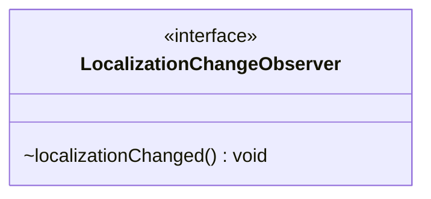

---
aliases:
  - LocalizationChangeObserver
tags:
  - java/interface
  - module/forge-core
  - pkg/forge/util
fqn: forge.util.LocalizationChangeObserver
package: forge.util
module: forge-core
kind: Interface
---

# LocalizationChangeObserver

**Package:** `forge.util`   **Module:** `forge-core`   **Kind:** Interface



## Design Description

LocalizationChangeObserver defines the observer contract in a localization notification mechanism within the `forge.util` package of the forge-core module. As a minimal single-method interface, it declares only `localizationChanged()`, which implementers use to react when the application's active language or locale changes. The interface lets UI components and other locale-sensitive types register for and respond to runtime language switches without coupling to the source of the change. Its deliberately narrow design—a single void callback with no parameters—keeps the contract lightweight and broadly implementable, following the Observer pattern so localized content can be refreshed on demand whenever a localization change is broadcast.

## Source
`forge-core/src/main/java/forge/util/LocalizationChangeObserver.java`

```java
package forge.util;

public interface LocalizationChangeObserver {
	void localizationChanged();
}
```

## Python
`forge/util/LocalizationChangeObserver.py`

```python
package forge.util

class LocalizationChangeObserver:
    def localizationChanged(self) -> None:
        ...
```
