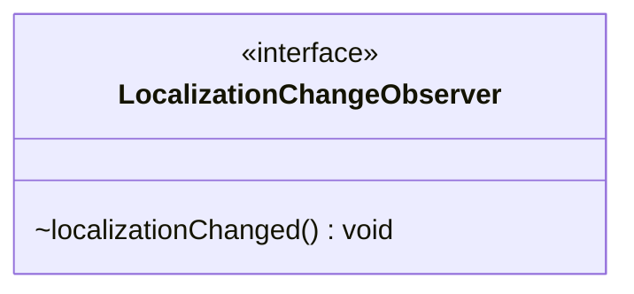

---
aliases:
  - LocalizationChangeObserver
tags:
  - java/interface
  - module/forge-core
  - pkg/forge/util
fqn: forge.util.LocalizationChangeObserver
package: forge.util
module: forge-core
kind: Interface
---

# LocalizationChangeObserver

**Package:** `forge.util` &nbsp; **Module:** `forge-core` &nbsp; **Kind:** Interface



## Source
`forge-core/src/main/java/forge/util/LocalizationChangeObserver.java`

```java
package forge.util;

public interface LocalizationChangeObserver {
	void localizationChanged();
}
```
