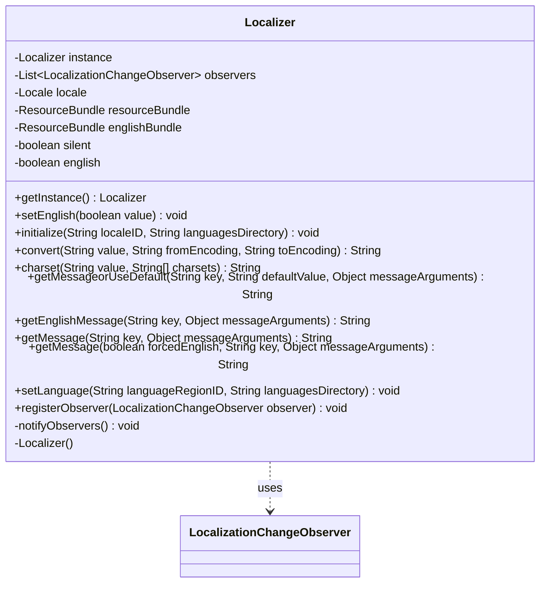

---
aliases:
  - Localizer
tags:
  - java/class
  - module/forge-core
  - pkg/forge/util
fqn: forge.util.Localizer
package: forge.util
module: forge-core
kind: Class
---

# Localizer

**Package:** `forge.util` &nbsp; **Module:** `forge-core` &nbsp; **Kind:** Class



## Relationships
**Uses:**
- [[forge.util.LocalizationChangeObserver|LocalizationChangeObserver]]

## Design Description

Localizer is a thread-safe singleton that centralizes runtime internationalization for the forge-core module, resolving localized message keys into formatted, character-encoding-correct strings. It loads per-language `ResourceBundle`s from an external languages directory via a `URLClassLoader`, always keeping an English bundle as a fallback so missing translations degrade gracefully rather than crashing dependent GUI code. Beyond simple lookup, it performs `MessageFormat` argument substitution and reconciles charset mismatches (ISO-8859-1 vs. UTF-8) between bundle text and supplied arguments to support non-English characters.

As a collaborator it depends on `LocalizationChangeObserver`, maintaining a list of registered observers and notifying them whenever the active locale changes through `setLanguage`, implementing an observer pattern so UI components can refresh on language switches. Notable design intent includes a `silent` flag to suppress error noise during optional lookups and forced-English overrides for callers needing canonical text.

## Source
`forge-core/src/main/java/forge/util/Localizer.java`

```java
package forge.util;

import java.io.File;
import java.io.UnsupportedEncodingException;
import java.net.MalformedURLException;
import java.net.URL;
import java.net.URLClassLoader;
import java.nio.charset.Charset;
import java.nio.charset.StandardCharsets;
import java.text.MessageFormat;
import java.util.*;

public class Localizer {

    private static Localizer instance;

    private List<LocalizationChangeObserver> observers = new ArrayList<>();

    private Locale locale;
    private ResourceBundle resourceBundle;
    private ResourceBundle englishBundle;
    private boolean silent = false;
    private boolean english = false;

    public static Localizer getInstance() {
        if (instance == null) {
            synchronized (Localizer.class) {
                instance = new Localizer();
            }
        }
        return instance;
    }

    public void setEnglish(boolean value) {
        english = value;
    }

    private Localizer() {
    }

    public void initialize(String localeID, String languagesDirectory) {
        setLanguage(localeID, languagesDirectory);
    }

    public String convert(String value, String fromEncoding, String toEncoding) throws UnsupportedEncodingException {
        return new String(value.getBytes(fromEncoding), toEncoding);
    }

    public String charset(String value, String charsets[]) {
        String probe = StandardCharsets.UTF_8.name();
        for(String c : charsets) {
            Charset charset = Charset.forName(c);
            if(charset != null) {
                try {
                    if (value.equals(convert(convert(value, charset.name(), probe), probe, charset.name()))) {
                        return c;
                    }
                } catch(UnsupportedEncodingException ignored) {}
            }
        }
        return StandardCharsets.UTF_8.name();
    }

    public String getMessageorUseDefault(final String key, final String defaultValue, final Object... messageArguments) {
        try {
            silent = true;
            String value = getMessage(key, messageArguments);
            if (value.contains("INVALID PROPERTY:"))
                return defaultValue;
            return value;
        } catch (Exception e) {
            return defaultValue;
        }
    }
    public String getEnglishMessage(final String key, final Object... messageArguments) {
        return getMessage(true, key, messageArguments);
    }
    //FIXME: localizer should return default value from english locale or it will crash some GUI element like the NewGameMenu->NewGameScreen Popup when returned null...
    public String getMessage(final String key, final Object... messageArguments) {
        return getMessage(false, key, messageArguments);
    }
    public String getMessage(boolean forcedEnglish, final String key, final Object... messageArguments) {
        MessageFormat formatter = null;

        try {
            //formatter = new MessageFormat(resourceBundle.getString(key.toLowerCase()), locale);
            formatter = new MessageFormat(english || forcedEnglish ? englishBundle.getString(key) : resourceBundle.getString(key), english || forcedEnglish ? Locale.ENGLISH : locale);
        } catch (final IllegalArgumentException | MissingResourceException e) {
            if (!silent)
                e.printStackTrace();
        }

        if (formatter == null) {
            if (!silent) {
                System.err.println("INVALID PROPERTY: '" + key + "' -- Translation missing from " + locale);
            }

            if (english || forcedEnglish) {
                return "INVALID PROPERTY: '" + key + "' -- Translation missing from English?";
            }
            try {
                formatter = new MessageFormat(englishBundle.getString(key), Locale.ENGLISH);
                forcedEnglish = true;
            } catch (final IllegalArgumentException | MissingResourceException e) {
                if (!silent) {
                    e.printStackTrace();
                }
                return "INVALID PROPERTY: '" + key + "' -- Translation missing from English locale?";
            }
        }

        silent = false;

        formatter.setLocale(english || forcedEnglish ? Locale.ENGLISH : locale);

        String formattedMessage = "CHAR ENCODING ERROR";
        final String[] charsets = { "ISO-8859-1", "UTF-8" };
        //Support non-English-standard characters
        String detectedCharset = charset(english || forcedEnglish ? englishBundle.getString(key) : resourceBundle.getString(key), charsets);

        final int argLength = messageArguments.length;
        Object[] syncEncodingMessageArguments = new Object[argLength];
        //when messageArguments encoding not equal resourceBundle.getString(key),convert to equal
        //avoid convert to a have two encoding content formattedMessage string.
        for (int i = 0; i < argLength; i++) {
            String objCharset = charset(messageArguments[i].toString(), charsets);
            try {
                syncEncodingMessageArguments[i] = convert(messageArguments[i].toString(), objCharset, detectedCharset);
            } catch (UnsupportedEncodingException ignored) {
                System.err.println("Cannot Convert '" + messageArguments[i].toString() + "' from '" + objCharset + "' To '" + detectedCharset + "'");
                return "encoding '" + key + "' translate string failure";
            }
        }

        try {
            formattedMessage = new String(formatter.format(syncEncodingMessageArguments).getBytes(detectedCharset), StandardCharsets.UTF_8);
        } catch(UnsupportedEncodingException ignored) {}

        return formattedMessage;
    }

    public void setLanguage(final String languageRegionID, final String languagesDirectory) {
        String[] splitLocale = languageRegionID.split("-");

        Locale oldLocale = locale;
        locale = new Locale(splitLocale[0], splitLocale[1]);

        //Don't reload the language if nothing changed
        if (oldLocale == null || !oldLocale.equals(locale)) {
            File file = new File(languagesDirectory);
            URL[] urls = null;

            try {
                urls = new URL[] { file.toURI().toURL() };
            } catch (MalformedURLException e) {
                e.printStackTrace();
            }

            ClassLoader loader = new URLClassLoader(urls);

            try {
                resourceBundle = ResourceBundle.getBundle(languageRegionID, new Locale(splitLocale[0], splitLocale[1]), loader);
                englishBundle = ResourceBundle.getBundle("en-US", new Locale("en", "US"), loader);
            } catch (NullPointerException | MissingResourceException e) {
                //If the language can't be loaded, default to US English
                resourceBundle = ResourceBundle.getBundle("en-US", new Locale("en_US"), loader);
                e.printStackTrace();
            }

            System.out.println("Language '" + resourceBundle.getBaseBundleName() + "' loaded successfully.");

            notifyObservers();
        }
    }

    public void registerObserver(LocalizationChangeObserver observer) {
        observers.add(observer);
    }

    private void notifyObservers() {
        for (LocalizationChangeObserver observer : observers) {
            observer.localizationChanged();
        }
    }

}
```

## Python
`forge/util/Localizer.py`

```python
from forge.util.LocalizationChangeObserver import LocalizationChangeObserver

import threading
from java.io import UnsupportedEncodingException, File
from java.net import MalformedURLException, URL, URLClassLoader
from java.nio.charset import Charset, StandardCharsets
from java.text import MessageFormat
from java.util import Locale, ResourceBundle, MissingResourceException


class Localizer:

    instance = None
    _lock = threading.Lock()

    def __init__(self):
        self.observers = []
        self.locale = None
        self.resourceBundle = None
        self.englishBundle = None
        self.silent = False
        self.english = False

    @staticmethod
    def getInstance():
        if Localizer.instance is None:
            with Localizer._lock:
                Localizer.instance = Localizer()
        return Localizer.instance

    def setEnglish(self, value):
        self.english = value

    def initialize(self, localeID, languagesDirectory):
        self.setLanguage(localeID, languagesDirectory)

    def convert(self, value, fromEncoding, toEncoding):
        return str(value.getBytes(fromEncoding), toEncoding)

    def charset(self, value, charsets):
        probe = StandardCharsets.UTF_8.name()
        for c in charsets:
            charset = Charset.forName(c)
            if charset is not None:
                try:
                    if value == self.convert(self.convert(value, charset.name(), probe), probe, charset.name()):
                        return c
                except UnsupportedEncodingException:
                    pass
        return StandardCharsets.UTF_8.name()

    def getMessageorUseDefault(self, key, defaultValue, *messageArguments):
        try:
            self.silent = True
            value = self.getMessage(key, *messageArguments)
            if "INVALID PROPERTY:" in value:
                return defaultValue
            return value
        except Exception:
            return defaultValue

    def getEnglishMessage(self, key, *messageArguments):
        return self.getMessage(True, key, *messageArguments)

    # FIXME: localizer should return default value from english locale or it will crash some GUI element like the NewGameMenu->NewGameScreen Popup when returned null...
    def getMessage(self, *args):
        if args and isinstance(args[0], bool):
            forcedEnglish = args[0]
            key = args[1]
            messageArguments = args[2:]
        else:
            forcedEnglish = False
            key = args[0]
            messageArguments = args[1:]
        return self._getMessage(forcedEnglish, key, messageArguments)

    def _getMessage(self, forcedEnglish, key, messageArguments):
        formatter = None

        try:
            # formatter = new MessageFormat(resourceBundle.getString(key.toLowerCase()), locale);
            formatter = MessageFormat(
                self.englishBundle.getString(key) if (self.english or forcedEnglish) else self.resourceBundle.getString(key),
                Locale.ENGLISH if (self.english or forcedEnglish) else self.locale)
        except (IllegalArgumentException, MissingResourceException) as e:
            if not self.silent:
                e.printStackTrace()

        if formatter is None:
            if not self.silent:
                print("INVALID PROPERTY: '" + key + "' -- Translation missing from " + str(self.locale), file=sys.stderr)

            if self.english or forcedEnglish:
                return "INVALID PROPERTY: '" + key + "' -- Translation missing from English?"
            try:
                formatter = MessageFormat(self.englishBundle.getString(key), Locale.ENGLISH)
                forcedEnglish = True
            except (IllegalArgumentException, MissingResourceException) as e:
                if not self.silent:
                    e.printStackTrace()
                return "INVALID PROPERTY: '" + key + "' -- Translation missing from English locale?"

        self.silent = False

        formatter.setLocale(Locale.ENGLISH if (self.english or forcedEnglish) else self.locale)

        formattedMessage = "CHAR ENCODING ERROR"
        charsets = ["ISO-8859-1", "UTF-8"]
        # Support non-English-standard characters
        detectedCharset = self.charset(
            self.englishBundle.getString(key) if (self.english or forcedEnglish) else self.resourceBundle.getString(key),
            charsets)

        argLength = len(messageArguments)
        syncEncodingMessageArguments = [None] * argLength
        # when messageArguments encoding not equal resourceBundle.getString(key),convert to equal
        # avoid convert to a have two encoding content formattedMessage string.
        for i in range(argLength):
            objCharset = self.charset(str(messageArguments[i]), charsets)
            try:
                syncEncodingMessageArguments[i] = self.convert(str(messageArguments[i]), objCharset, detectedCharset)
            except UnsupportedEncodingException:
                print("Cannot Convert '" + str(messageArguments[i]) + "' from '" + objCharset + "' To '" + detectedCharset + "'", file=sys.stderr)
                return "encoding '" + key + "' translate string failure"

        try:
            formattedMessage = str(formatter.format(syncEncodingMessageArguments).getBytes(detectedCharset), StandardCharsets.UTF_8)
        except UnsupportedEncodingException:
            pass

        return formattedMessage

    def setLanguage(self, languageRegionID, languagesDirectory):
        splitLocale = languageRegionID.split("-")

        oldLocale = self.locale
        self.locale = Locale(splitLocale[0], splitLocale[1])

        # Don't reload the language if nothing changed
        if oldLocale is None or not oldLocale.equals(self.locale):
            file = File(languagesDirectory)
            urls = None

            try:
                urls = [file.toURI().toURL()]
            except MalformedURLException as e:
                e.printStackTrace()

            loader = URLClassLoader(urls)

            try:
                self.resourceBundle = ResourceBundle.getBundle(languageRegionID, Locale(splitLocale[0], splitLocale[1]), loader)
                self.englishBundle = ResourceBundle.getBundle("en-US", Locale("en", "US"), loader)
            except (NullPointerException, MissingResourceException) as e:
                # If the language can't be loaded, default to US English
                self.resourceBundle = ResourceBundle.getBundle("en-US", Locale("en_US"), loader)
                e.printStackTrace()

            print("Language '" + self.resourceBundle.getBaseBundleName() + "' loaded successfully.")

            self.notifyObservers()

    def registerObserver(self, observer):
        self.observers.append(observer)

    def notifyObservers(self):
        for observer in self.observers:
            observer.localizationChanged()
```
