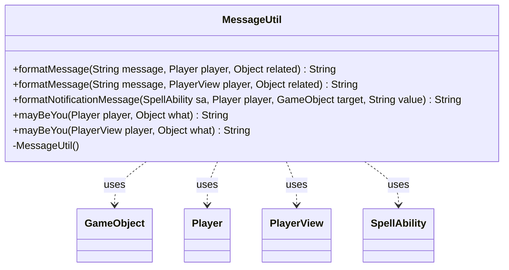

---
aliases:
  - MessageUtil
tags:
  - java/class
  - module/forge-game
  - pkg/forge/util
fqn: forge.util.MessageUtil
package: forge.util
module: forge-game
kind: Class
---

# MessageUtil

**Package:** `forge.util` &nbsp; **Module:** `forge-game` &nbsp; **Kind:** Class



## Relationships
**Uses:**
- [[forge.game.GameObject|GameObject]]
- [[forge.game.player.Player|Player]]
- [[forge.game.player.PlayerView|PlayerView]]
- [[forge.game.spellability.SpellAbility|SpellAbility]]

## Design Description

MessageUtil is a stateless utility class in `forge.util` that centralizes the formatting of user-facing messages for the game engine. Its private constructor signals a pure static helper that is never instantiated. The overloaded `formatMessage` methods substitute `{player}` and `{player's}` tokens against a `Player` or its UI-facing `PlayerView` counterpart, while `mayBeYou` renders a participant as the localized "you" when it matches the active player and otherwise falls back to its `toString`. The richer `formatNotificationMessage` inspects a `SpellAbility`'s API and parameters to build context-appropriate, localized descriptions of choices, flips, rolls, and votes involving a target `GameObject`. By delegating to `Localizer`, `Lang`, and `TextUtil`, the class concentrates all message-presentation and localization concerns in one place, keeping that logic out of the core game and controller types it merely reads from.

## Source
`forge-game/src/main/java/forge/util/MessageUtil.java`

```java
package forge.util;

import org.apache.commons.lang3.StringUtils;

import forge.game.GameObject;
import forge.game.player.Player;
import forge.game.player.PlayerView;
import forge.game.spellability.SpellAbility;


public class MessageUtil {
    private MessageUtil() { }

    public static String formatMessage(String message, Player player, Object related) {
        if (related instanceof Player && message.contains("{player")) {
            String noun = mayBeYou(player, related);
            message = TextUtil.fastReplace(TextUtil.fastReplace(message, "{player}", noun),"{player's}", Lang.getInstance().getPossesive(noun));
        }
        return message;
    }

    public static String formatMessage(String message, PlayerView player, Object related) {
        if (related instanceof PlayerView && message.contains("{player")) {
            String noun = mayBeYou(player, related);
            message = TextUtil.fastReplace(TextUtil.fastReplace(message, "{player}", noun),"{player's}", Lang.getInstance().getPossesive(noun));
        }
        return message;
    }

    // These are not much related to PlayerController
    public static  String formatNotificationMessage(SpellAbility sa, Player player, GameObject target, String value) {
        if (sa == null || sa.getApi() == null || sa.getHostCard() == null) {
            return String.valueOf(value);
        }
        String choser = StringUtils.capitalize(mayBeYou(player, target));
        switch(sa.getApi()) {
            case ChoosePlayer:
            case ChooseDirection:
            case Clash:
            case DigMultiple:
            case Seek:
                return value;
            case ChooseColor:
            case Mana:
                return sa.hasParam("Random")
                        ? Localizer.getInstance().getMessage("lblRandomColorChosen", value)
                        : Localizer.getInstance().getMessage("lblPlayerPickedChosen", choser, value);
            case ChooseNumber:
                if (sa.hasParam("Secretly")) {
                    return value;
                }
                return sa.hasParam("Random")
                        ? Localizer.getInstance().getMessage("lblPlayerRandomChosenNumberIs",
                            mayBeYou(player, target), value)
                        : Localizer.getInstance().getMessage("lblPlayerChoosesNumberIs",
                            mayBeYou(player, target), value);
            case ChooseType:
                return sa.hasParam("AtRandom")
                        ? Localizer.getInstance().getMessage("lblRandomTypeChosen", value)
                        : Localizer.getInstance().getMessage("lblPlayerPickedChosen", choser, value);
            case FlipCoin:
                String flipper = StringUtils.capitalize(mayBeYou(player, target));
                return sa.hasParam("NoCall")
                        ? Localizer.getInstance().getMessage("lblPlayerFlipComesUpValue", Lang.getInstance().getPossesive(flipper), value)
                        : Localizer.getInstance().getMessage("lblPlayerActionFlip", flipper, Lang.joinVerb(flipper, value));
            case GenericChoice:
                if ((sa.hasParam("Secretly")) || 
                    (sa.hasParam("ShowChoice") && sa.getParam("ShowChoice").equals("Description"))) {
                    return value;
                }
            case Protection:
                return Localizer.getInstance().getMessage("lblPlayerChooseValue", choser, value);
            case RollDice:
            case RollPlanarDice:
            case PutCounter:// For Clay Golem cost text
                return value;
            case Vote:
                if (sa.hasParam("Secretly")) {
                    return value;
                } else {
                    String chooser = StringUtils.capitalize(mayBeYou(player, target));
                    return Localizer.getInstance().getMessage("lblPlayerVoteValue", chooser, value);
                }
            default:
                String tgt = mayBeYou(player, target);
                if (tgt.equals("(null)")) {
                    return Localizer.getInstance().getMessage("lblCardEffectValueIs", sa.getHostCard().getTranslatedName(), value);
                } else {
                    return Localizer.getInstance().getMessage("lblCardEffectToTargetValueIs", sa.getHostCard().getTranslatedName(), tgt, value);
                }
        }
    }

    public static String mayBeYou(Player player, Object what) {
        return what == null ? "(null)" : what == player ? Localizer.getInstance().getMessage("lblYou") : what.toString();
    }
    public static String mayBeYou(PlayerView player, Object what) {
        return what == null ? "(null)" : what == player ? Localizer.getInstance().getMessage("lblYou") : what.toString();
    }
}
```

## Python
`forge/util/MessageUtil.py`

```python
from forge.game.GameObject import GameObject
from forge.game.player.Player import Player
from forge.game.player.PlayerView import PlayerView
from forge.game.spellability.SpellAbility import SpellAbility
from forge.game.ability.ApiType import ApiType
from forge.util.TextUtil import TextUtil
from forge.util.Lang import Lang
from forge.util.Localizer import Localizer


def _capitalize(s):
    # Equivalent of org.apache.commons.lang3.StringUtils.capitalize:
    # uppercase the first character, leave the remainder unchanged.
    if s is None or len(s) == 0:
        return s
    return s[0].upper() + s[1:]


class MessageUtil:
    def __init__(self):
        pass

    @staticmethod
    def formatMessage(message, player, related):
        if isinstance(related, Player) and "{player" in message:
            noun = MessageUtil.mayBeYou(player, related)
            message = TextUtil.fastReplace(TextUtil.fastReplace(message, "{player}", noun), "{player's}", Lang.getInstance().getPossesive(noun))
        return message

    @staticmethod
    def formatMessage(message, player, related):
        if isinstance(related, PlayerView) and "{player" in message:
            noun = MessageUtil.mayBeYou(player, related)
            message = TextUtil.fastReplace(TextUtil.fastReplace(message, "{player}", noun), "{player's}", Lang.getInstance().getPossesive(noun))
        return message

    # These are not much related to PlayerController
    @staticmethod
    def formatNotificationMessage(sa, player, target, value):
        if sa is None or sa.getApi() is None or sa.getHostCard() is None:
            return str(value)
        choser = _capitalize(MessageUtil.mayBeYou(player, target))
        api = sa.getApi()
        if api in (ApiType.ChoosePlayer, ApiType.ChooseDirection, ApiType.Clash, ApiType.DigMultiple, ApiType.Seek):
            return value
        if api in (ApiType.ChooseColor, ApiType.Mana):
            return (Localizer.getInstance().getMessage("lblRandomColorChosen", value)
                    if sa.hasParam("Random")
                    else Localizer.getInstance().getMessage("lblPlayerPickedChosen", choser, value))
        if api == ApiType.ChooseNumber:
            if sa.hasParam("Secretly"):
                return value
            return (Localizer.getInstance().getMessage("lblPlayerRandomChosenNumberIs",
                        MessageUtil.mayBeYou(player, target), value)
                    if sa.hasParam("Random")
                    else Localizer.getInstance().getMessage("lblPlayerChoosesNumberIs",
                        MessageUtil.mayBeYou(player, target), value))
        if api == ApiType.ChooseType:
            return (Localizer.getInstance().getMessage("lblRandomTypeChosen", value)
                    if sa.hasParam("AtRandom")
                    else Localizer.getInstance().getMessage("lblPlayerPickedChosen", choser, value))
        if api == ApiType.FlipCoin:
            flipper = _capitalize(MessageUtil.mayBeYou(player, target))
            return (Localizer.getInstance().getMessage("lblPlayerFlipComesUpValue", Lang.getInstance().getPossesive(flipper), value)
                    if sa.hasParam("NoCall")
                    else Localizer.getInstance().getMessage("lblPlayerActionFlip", flipper, Lang.joinVerb(flipper, value)))
        if api == ApiType.GenericChoice:
            if (sa.hasParam("Secretly")) or \
               (sa.hasParam("ShowChoice") and sa.getParam("ShowChoice") == "Description"):
                return value
            # fall through to Protection
        if api in (ApiType.GenericChoice, ApiType.Protection):
            return Localizer.getInstance().getMessage("lblPlayerChooseValue", choser, value)
        if api in (ApiType.RollDice, ApiType.RollPlanarDice, ApiType.PutCounter):  # For Clay Golem cost text
            return value
        if api == ApiType.Vote:
            if sa.hasParam("Secretly"):
                return value
            else:
                chooser = _capitalize(MessageUtil.mayBeYou(player, target))
                return Localizer.getInstance().getMessage("lblPlayerVoteValue", chooser, value)
        tgt = MessageUtil.mayBeYou(player, target)
        if tgt == "(null)":
            return Localizer.getInstance().getMessage("lblCardEffectValueIs", sa.getHostCard().getTranslatedName(), value)
        else:
            return Localizer.getInstance().getMessage("lblCardEffectToTargetValueIs", sa.getHostCard().getTranslatedName(), tgt, value)

    @staticmethod
    def mayBeYou(player, what):
        return "(null)" if what is None else (Localizer.getInstance().getMessage("lblYou") if what is player else str(what))

    @staticmethod
    def mayBeYou(player, what):
        return "(null)" if what is None else (Localizer.getInstance().getMessage("lblYou") if what is player else str(what))
```
