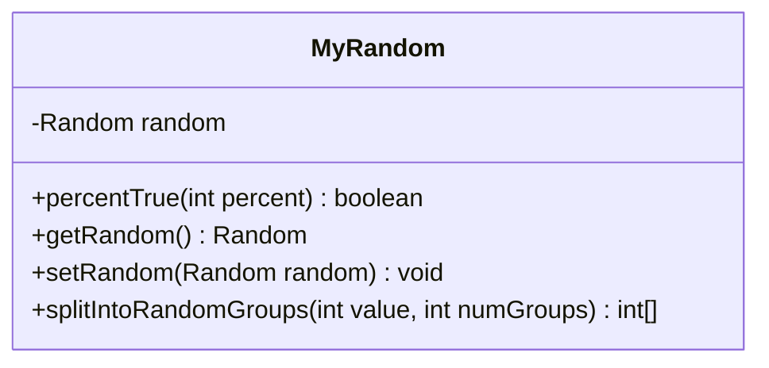

---
aliases:
  - MyRandom
tags:
  - java/class
  - module/forge-core
  - pkg/forge/util
fqn: forge.util.MyRandom
package: forge.util
module: forge-core
kind: Class
---

# MyRandom

**Package:** `forge.util` &nbsp; **Module:** `forge-core` &nbsp; **Kind:** Class



## Design Description

MyRandom is a static utility wrapper that centralizes pseudo-random number generation for the Forge engine, defaulting to a cryptographically strong `SecureRandom` held in a single shared static field. It exposes convenience operations atop the underlying `java.util.Random`: `percentTrue` for probability-weighted boolean rolls, and `splitIntoRandomGroups` for distributing a count across buckets by repeated sampling. As a standalone class with no supertype, it collaborates only with the JDK's `Random`/`SecureRandom`, which it accesses exclusively through static methods so all callers draw from one consistent source. The mutable `setRandom` accessor is the key design intent: it lets tests or simulations inject a deterministic, seeded `Random`, making otherwise random game behavior reproducible.

## Source
`forge-core/src/main/java/forge/util/MyRandom.java`

```java
/*
 * Forge: Play Magic: the Gathering.
 * Copyright (C) 2011  Forge Team
 *
 * This program is free software: you can redistribute it and/or modify
 * it under the terms of the GNU General Public License as published by
 * the Free Software Foundation, either version 3 of the License, or
 * (at your option) any later version.
 * 
 * This program is distributed in the hope that it will be useful,
 * but WITHOUT ANY WARRANTY; without even the implied warranty of
 * MERCHANTABILITY or FITNESS FOR A PARTICULAR PURPOSE.  See the
 * GNU General Public License for more details.
 * 
 * You should have received a copy of the GNU General Public License
 * along with this program.  If not, see <http://www.gnu.org/licenses/>.
 */
package forge.util;

import java.security.SecureRandom;
import java.util.Random;

/**
 * <p>
 * MyRandom class.<br>
 * Preferably all Random numbers should be retrieved using this wrapper class
 * </p>
 * 
 * @author Forge
 * @version $Id$
 */
public class MyRandom {
    /** Constant <code>random</code>. */
    private static Random random = new SecureRandom();

    /**
     * <p>
     * percentTrue.<br>
     * If percent is like 30, then 30% of the time it will be true.
     * </p>
     * 
     * @param percent an int.
     * @return a boolean.
     */
    public static boolean percentTrue(final int percent) {
        return percent > MyRandom.getRandom().nextInt(100);
    }

    /**
     * Gets the random.
     * 
     * @return the random
     */
    public static Random getRandom() {
        return MyRandom.random;
    }

    /**
     * Sets the random provider. Used for deterministic simulation.
     * @param random the random
     */
    public static void setRandom(Random random) {
        MyRandom.random = random;
    }

    public static int[] splitIntoRandomGroups(final int value, final int numGroups) {
        int[] groups = new int[numGroups];
        
        for (int i = 0; i < value; i++) {
            groups[random.nextInt(numGroups)]++;
        }

        return groups;
    }
}
```

## Python
`forge/util/MyRandom.py`

```python
from forge.util.MyRandom import MyRandom
import secrets


class MyRandom:
    random = secrets.SystemRandom()

    @staticmethod
    def percentTrue(percent: int) -> bool:
        return percent > MyRandom.getRandom().randrange(100)

    @staticmethod
    def getRandom():
        return MyRandom.random

    @staticmethod
    def setRandom(random) -> None:
        MyRandom.random = random

    @staticmethod
    def splitIntoRandomGroups(value: int, numGroups: int) -> list[int]:
        groups = [0] * numGroups

        for i in range(value):
            groups[MyRandom.random.randrange(numGroups)] += 1

        return groups
```
