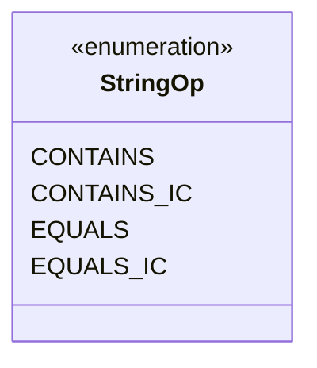

---
aliases:
  - StringOp
tags:
  - java/enum
  - module/forge-core
  - pkg/forge/util
fqn: forge.util.PredicateString.StringOp
package: forge.util
module: forge-core
kind: Enum
---

# StringOp

**Package:** `forge.util` &nbsp; **Module:** `forge-core` &nbsp; **Kind:** Enum



## Source
`forge-core/src/main/java/forge/util/PredicateString.java` — declaration excerpt

```java
    /** Possible operators for string operands. */
    public enum StringOp {
        /** The CONTAINS. */
        CONTAINS,
        /** The CONTAINS ignore case. */
        CONTAINS_IC,
        /** The EQUALS. */
        EQUALS,
        /** The EQUALS. */
        EQUALS_IC
    }
```
