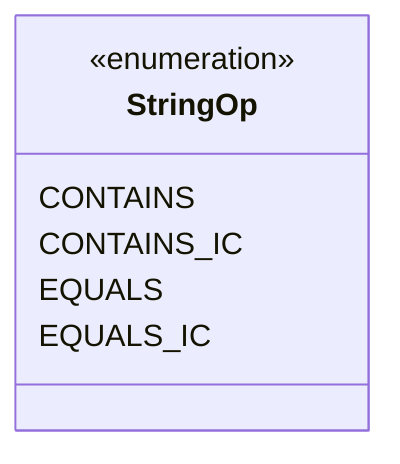

---
aliases:
  - StringOp
tags:
  - java/enum
  - module/forge-core
  - pkg/forge/util
fqn: forge.util.PredicateString.StringOp
package: forge.util
module: forge-core
kind: Enum
---

# StringOp

**Package:** `forge.util`   **Module:** `forge-core`   **Kind:** Enum



## Design Description

StringOp is a nested enumeration within `PredicateString`, defined in the `forge.util` package of the forge-core module. It enumerates the comparison operators available for matching string operands: `CONTAINS` and `EQUALS`, each with an additional case-insensitive variant (`CONTAINS_IC`, `EQUALS_IC`). As a pure enum with no fields or methods, it serves as a type-safe selector that parameterizes the behavior of its enclosing `PredicateString` predicate, letting callers specify how a candidate string should be tested against a reference value. The paired exact/ignore-case constants reflect a deliberate design choice to keep case sensitivity an explicit, discrete part of the operator rather than a separate flag, simplifying predicate construction and dispatch.

## Source
`forge-core/src/main/java/forge/util/PredicateString.java` — declaration excerpt

```java
    /** Possible operators for string operands. */
    public enum StringOp {
        /** The CONTAINS. */
        CONTAINS,
        /** The CONTAINS ignore case. */
        CONTAINS_IC,
        /** The EQUALS. */
        EQUALS,
        /** The EQUALS. */
        EQUALS_IC
    }
```

## Python
`forge/util/PredicateString/StringOp.py`

```python
from enum import Enum, auto


class StringOp(Enum):
    """Possible operators for string operands."""

    CONTAINS = auto()
    CONTAINS_IC = auto()
    EQUALS = auto()
    EQUALS_IC = auto()
```
