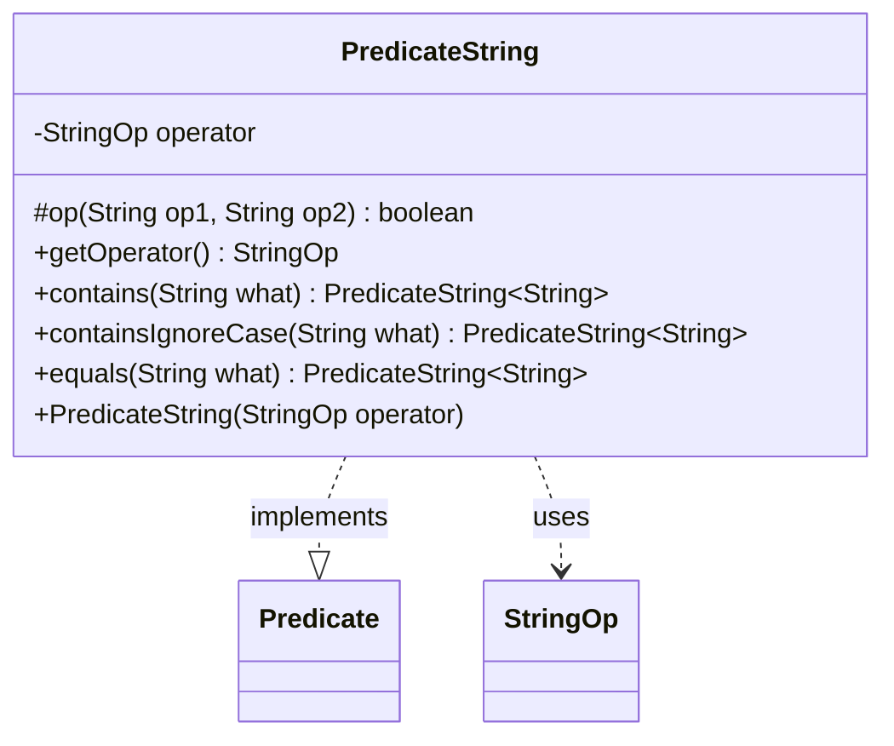

---
aliases:
  - PredicateString
tags:
  - java/class
  - module/forge-core
  - pkg/forge/util
fqn: forge.util.PredicateString
package: forge.util
module: forge-core
kind: Class
---

# PredicateString

**Package:** `forge.util` &nbsp; **Module:** `forge-core` &nbsp; **Kind:** Class



## Relationships
**Uses:**
- [[forge.util.PredicateString.StringOp|StringOp]]

## Design Description

`PredicateString<T>` is an abstract base class in `forge.util` that adapts string-matching logic to the standard `java.util.function.Predicate<T>` contract, letting string comparisons participate in any predicate-based filtering pipeline. Each instance holds an immutable `StringOp` operator (its nested enum: CONTAINS, CONTAINS_IC, EQUALS, EQUALS_IC), and the protected `op` helper dispatches on that operator, delegating to Apache Commons `StringUtils` for the contains/ignore-case cases. Rather than exposing public constructors, it offers static factory methods (`contains`, `containsIgnoreCase`, `equals`) that return anonymous subclasses implementing `test`, binding the comparison target at creation time. This design centralizes the comparison semantics in one place while keeping concrete predicates lightweight and closed over their operand, encouraging reusable, composable string filters across the engine.

## Source
`forge-core/src/main/java/forge/util/PredicateString.java`

```java
/*
 * Forge: Play Magic: the Gathering.
 * Copyright (C) 2011  MaxMtg
 *
 * This program is free software: you can redistribute it and/or modify
 * it under the terms of the GNU General Public License as published by
 * the Free Software Foundation, either version 3 of the License, or
 * (at your option) any later version.
 * 
 * This program is distributed in the hope that it will be useful,
 * but WITHOUT ANY WARRANTY; without even the implied warranty of
 * MERCHANTABILITY or FITNESS FOR A PARTICULAR PURPOSE.  See the
 * GNU General Public License for more details.
 * 
 * You should have received a copy of the GNU General Public License
 * along with this program.  If not, see <http://www.gnu.org/licenses/>.
 */
package forge.util;

import org.apache.commons.lang3.StringUtils;

import java.util.function.Predicate;

/**
 * Special predicate class to perform string operations.
 * 
 * @param <T>
 *            the generic type
 */
public abstract class PredicateString<T> implements Predicate<T> {
    /** Possible operators for string operands. */
    public enum StringOp {
        /** The CONTAINS. */
        CONTAINS,
        /** The CONTAINS ignore case. */
        CONTAINS_IC,
        /** The EQUALS. */
        EQUALS,
        /** The EQUALS. */
        EQUALS_IC
    }

    /** The operator. */
    private final StringOp operator;

    /**
     * Op.
     * 
     * @param op1
     *            the op1
     * @param op2
     *            the op2
     * @return true, if successful
     */
    protected final boolean op(final String op1, final String op2) {
        switch (this.getOperator()) {
        case CONTAINS_IC:
            return StringUtils.containsIgnoreCase(op1, op2);
        case CONTAINS:
            return StringUtils.contains(op1, op2);
        case EQUALS:
            return op1.equals(op2);
        case EQUALS_IC:
            return op1.equalsIgnoreCase(op2);
        default:
            return false;
        }
    }

    /**
     * Instantiates a new predicate string.
     * 
     * @param operator
     *            the operator
     */
    public PredicateString(final StringOp operator) {
        this.operator = operator;
    }

    /**
     * @return the operator
     */
    public StringOp getOperator() {
        return operator;
    }

    public static PredicateString<String> contains(final String what) {
        return new PredicateString<String>(StringOp.CONTAINS) {
            @Override
            public boolean test(String subject) {
                return op(subject, what);
            }
        };
    }
    public static PredicateString<String> containsIgnoreCase(final String what) {
        return new PredicateString<String>(StringOp.CONTAINS_IC) {
            @Override
            public boolean test(String subject) {
                return op(subject, what);
            }
        };
    }
    public static PredicateString<String> equals(final String what) {
        return new PredicateString<String>(StringOp.EQUALS) {
            @Override
            public boolean test(String subject) {
                return op(subject, what);
            }
        };
    }

}
```

## Python
`forge/util/PredicateString.py`

```python
from forge.util.PredicateString.StringOp import StringOp

from abc import ABC, abstractmethod
import typing

T = typing.TypeVar("T")


class PredicateString(ABC, typing.Generic[T]):
    """Special predicate class to perform string operations.

    @param <T> the generic type
    """

    def __init__(self, operator: StringOp):
        self.operator = operator

    @abstractmethod
    def test(self, subject: T) -> bool:
        ...

    def op(self, op1: str, op2: str) -> bool:
        operator = self.getOperator()
        if operator == StringOp.CONTAINS_IC:
            return StringUtils.containsIgnoreCase(op1, op2)
        elif operator == StringOp.CONTAINS:
            return StringUtils.contains(op1, op2)
        elif operator == StringOp.EQUALS:
            return op1 == op2
        elif operator == StringOp.EQUALS_IC:
            return op1.lower() == op2.lower()
        else:
            return False

    def getOperator(self) -> StringOp:
        return self.operator

    @staticmethod
    def contains(what: str) -> "PredicateString[str]":
        class _Contains(PredicateString):
            def test(self, subject: str) -> bool:
                return self.op(subject, what)
        return _Contains(StringOp.CONTAINS)

    @staticmethod
    def containsIgnoreCase(what: str) -> "PredicateString[str]":
        class _ContainsIgnoreCase(PredicateString):
            def test(self, subject: str) -> bool:
                return self.op(subject, what)
        return _ContainsIgnoreCase(StringOp.CONTAINS_IC)

    @staticmethod
    def equals(what: str) -> "PredicateString[str]":
        class _Equals(PredicateString):
            def test(self, subject: str) -> bool:
                return self.op(subject, what)
        return _Equals(StringOp.EQUALS)
```
