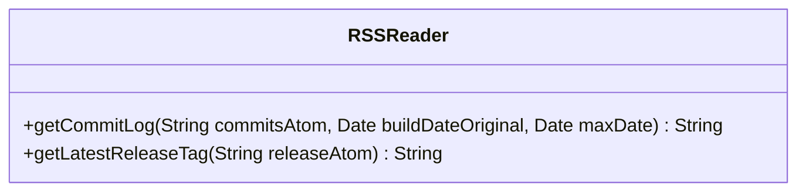

---
aliases:
  - RSSReader
tags:
  - java/class
  - module/forge-core
  - pkg/forge/util
fqn: forge.util.RSSReader
package: forge.util
module: forge-core
kind: Class
---

# RSSReader

**Package:** `forge.util` &nbsp; **Module:** `forge-core` &nbsp; **Kind:** Class



## Design Description

RSSReader is a stateless utility in `forge.util` (module forge-core) that fetches and parses Atom/RSS feeds from GitHub, exposing two static methods. `getCommitLog` reads a commits feed and builds a human-readable changelog, filtering out merge commits and entries outside the supplied build/max date window while capping the output at roughly fifteen items. `getLatestReleaseTag` reads a releases feed and extracts the newest release tag from the first item's link. It collaborates with `TextUtil` for date formatting and XML sanitization, the apptastic `RssReader`/`Item` types for feed parsing, and Apache Commons `StringEscapeUtils` for unescaping titles. Having no instance state or supertype, it is a purely functional helper; the design intent is defensive, swallowing all exceptions and returning empty strings so feed or network failures degrade gracefully rather than disrupting callers presenting update information.

## Source
`forge-core/src/main/java/forge/util/RSSReader.java`

```java
package forge.util;

import com.apptasticsoftware.rssreader.Item;
import com.apptasticsoftware.rssreader.RssReader;
import org.apache.commons.text.StringEscapeUtils;

import java.io.InputStream;
import java.net.URL;
import java.text.SimpleDateFormat;
import java.time.ZonedDateTime;
import java.util.Date;
import java.util.List;
import java.util.stream.Collectors;

public class RSSReader {
    public static String getCommitLog(String commitsAtom, Date buildDateOriginal, Date maxDate) {
        String message = "";
        SimpleDateFormat simpleDate = TextUtil.getSimpleDate();
        try {
            RssReader reader = new RssReader();
            URL url = new URL(commitsAtom);
            InputStream inputStream = url.openStream();
            List<Item> items = reader.read(inputStream).collect(Collectors.toList());
            StringBuilder logs = new StringBuilder();
            int c = 0;
            for (Item i : items) {
                if (i.getTitle().isEmpty())
                    continue;
                String title = TextUtil.stripNonValidXMLCharacters(i.getTitle().get());
                if (title.contains("Merge"))
                    continue;
                ZonedDateTime zonedDateTime = i.getPubDateZonedDateTime().isPresent() ? i.getPubDateZonedDateTime().get() : null;
                if (zonedDateTime == null)
                    continue;
                Date feedDate = Date.from(zonedDateTime.toInstant());
                if (buildDateOriginal != null && feedDate.before(buildDateOriginal))
                    continue;
                if (maxDate != null && feedDate.after(maxDate))
                    continue;
                logs.append(simpleDate.format(feedDate)).append(" | ").append(StringEscapeUtils.unescapeXml(title).replace("\n", "").replace("        ", "")).append("\n\n");
                if (c >= 15)
                    break;
                c++;
            }
            if (logs.length() > 0)
                message += ("\n\nLatest Changes:\n\n" + logs);
            inputStream.close();
        } catch (Exception e) {
            e.printStackTrace();
        }
        return message;
    }
    public static String getLatestReleaseTag(String releaseAtom) {
        String tag = "";
        try {
            RssReader reader = new RssReader();
            URL url = new URL(releaseAtom);
            InputStream inputStream = url.openStream();
            List<Item> items = reader.read(inputStream).collect(Collectors.toList());
            for (Item i : items) {
                if (i.getLink().isPresent()) {
                    try {
                        String val = i.getLink().get();
                        tag = val.substring(val.lastIndexOf("forge"));
                        break;
                    } catch (Exception e) {
                        e.printStackTrace();
                    }
                }
            }
            inputStream.close();
        } catch (Exception e) {
            e.printStackTrace();
        }
        return tag;
    }
}
```

## Python
`forge/util/RSSReader.py`

```python
from com.apptasticsoftware.rssreader.Item import Item
from com.apptasticsoftware.rssreader.RssReader import RssReader
from org.apache.commons.text.StringEscapeUtils import StringEscapeUtils

from forge.util.TextUtil import TextUtil

import traceback
from datetime import datetime
from urllib.request import urlopen


class RSSReader:
    @staticmethod
    def getCommitLog(commitsAtom: str, buildDateOriginal, maxDate) -> str:
        message = ""
        simpleDate = TextUtil.getSimpleDate()
        try:
            reader = RssReader()
            inputStream = urlopen(commitsAtom)
            items = list(reader.read(inputStream))
            logs = []
            c = 0
            for i in items:
                if i.getTitle().isEmpty():
                    continue
                title = TextUtil.stripNonValidXMLCharacters(i.getTitle().get())
                if "Merge" in title:
                    continue
                zonedDateTime = i.getPubDateZonedDateTime().get() if i.getPubDateZonedDateTime().isPresent() else None
                if zonedDateTime is None:
                    continue
                feedDate = Date.from_(zonedDateTime.toInstant())
                if buildDateOriginal is not None and feedDate.before(buildDateOriginal):
                    continue
                if maxDate is not None and feedDate.after(maxDate):
                    continue
                logs.append(simpleDate.format(feedDate) + " | " + StringEscapeUtils.unescapeXml(title).replace("\n", "").replace("        ", "") + "\n\n")
                if c >= 15:
                    break
                c += 1
            if len(logs) > 0:
                message += ("\n\nLatest Changes:\n\n" + "".join(logs))
            inputStream.close()
        except Exception as e:
            traceback.print_exc()
        return message

    @staticmethod
    def getLatestReleaseTag(releaseAtom: str) -> str:
        tag = ""
        try:
            reader = RssReader()
            inputStream = urlopen(releaseAtom)
            items = list(reader.read(inputStream))
            for i in items:
                if i.getLink().isPresent():
                    try:
                        val = i.getLink().get()
                        tag = val[val.rfind("forge"):]
                        break
                    except Exception as e:
                        traceback.print_exc()
            inputStream.close()
        except Exception as e:
            traceback.print_exc()
        return tag
```
