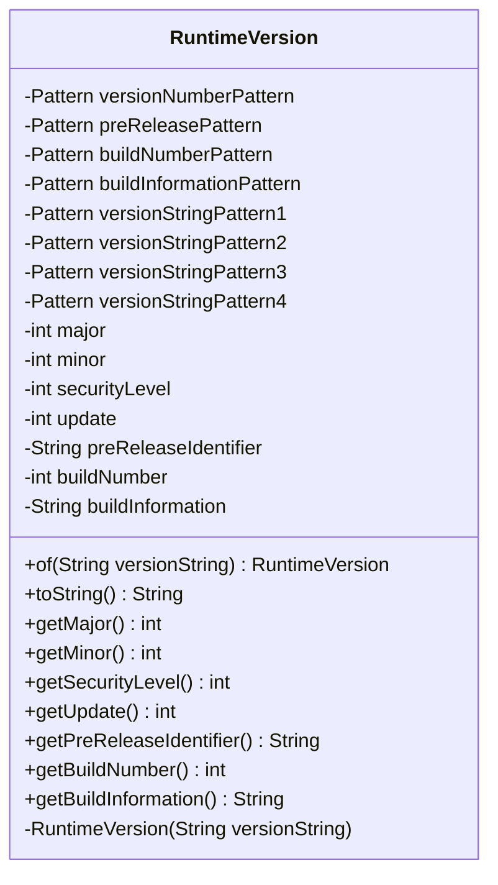

---
aliases:
  - RuntimeVersion
tags:
  - java/class
  - module/forge-core
  - pkg/forge/util
fqn: forge.util.RuntimeVersion
package: forge.util
module: forge-core
kind: Class
---

# RuntimeVersion

**Package:** `forge.util`   **Module:** `forge-core`   **Kind:** Class



## Design Description

RuntimeVersion is a final, immutable value class in `forge.util` that parses a Java-style runtime version string into its constituent components—major, minor, security level, update, optional pre-release identifier, build number, and build information. Construction is restricted to the private constructor and exposed through the static `of` factory method, which validates the input against a layered set of precompiled regular expressions and rejects malformed strings with an `IllegalArgumentException`. The patterns are composed hierarchically, with smaller fragments (version number, pre-release, build number, build information) assembled into four alternative full-string forms tried in order of specificity. Collaborating only with `java.util.regex` and the standard library, it depends on no other Forge types and serves purely as a self-contained parser and read-only accessor, exposing each parsed field through dedicated getters while `toString` reconstructs a normalized version representation.

## Source
`forge-core/src/main/java/forge/util/RuntimeVersion.java`

```java
package forge.util;

import java.util.regex.Matcher;
import java.util.regex.Pattern;

public final class RuntimeVersion {

	private static Pattern versionNumberPattern = Pattern.compile("([1-9][0-9]*((\\.0)*\\.[0-9]*)*(_[0-9]+)?)");
	private static Pattern preReleasePattern = Pattern.compile("([a-zA-Z0-9]+)");
	private static Pattern buildNumberPattern = Pattern.compile("(0|[1-9][0-9]*)");
	private static Pattern buildInformationPattern = Pattern.compile("([-a-zA-Z0-9.]+)");

	private static Pattern versionStringPattern1 = Pattern.compile(versionNumberPattern + "(-" + preReleasePattern + ")?\\+" + buildNumberPattern + "(-" + buildInformationPattern + ")?");
	private static Pattern versionStringPattern2 = Pattern.compile(versionNumberPattern + "-" + preReleasePattern + "(-" + buildInformationPattern + ")?");
	private static Pattern versionStringPattern3 = Pattern.compile(versionNumberPattern + "(\\+?-" + buildInformationPattern + ")?");
	private static Pattern versionStringPattern4 = Pattern.compile(versionNumberPattern + "(-" + preReleasePattern + ")?");

	private int major;
	private int minor;
	private int securityLevel;
	private int update;

	private String preReleaseIdentifier;
	private int buildNumber;
	private String buildInformation;

	private RuntimeVersion(final String versionString) {

		Matcher matcher = versionNumberPattern.matcher(versionString);

		if (!matcher.find()) {
			throw new IllegalArgumentException("Improperly formatted version string provided: " + versionString);
		}

		String[] versionNumbers = matcher.group().split("[._]");

		if (versionNumbers.length >= 1) {
			major = Integer.parseInt(versionNumbers[0]);
		}

		if (versionNumbers.length >= 2) {
			minor = Integer.parseInt(versionNumbers[1]);
		}

		if (versionNumbers.length >= 3) {
			securityLevel = Integer.parseInt(versionNumbers[2]);
		}

		if (versionNumbers.length >= 4) {
			update = Integer.parseInt(versionNumbers[3]);
		}

		if (versionStringPattern1.matcher(versionString).find()) {

			Matcher infoMatcher = preReleasePattern.matcher(versionString);
			if (infoMatcher.find()) {
				preReleaseIdentifier = infoMatcher.group();
			}

			infoMatcher = buildNumberPattern.matcher(versionString);
			infoMatcher.find();
			buildNumber = Integer.parseInt(infoMatcher.group());

			infoMatcher = buildInformationPattern.matcher(versionString);
			if (infoMatcher.find()) {
				buildInformation = infoMatcher.group();
			}

		} else if (versionStringPattern2.matcher(versionString).find()) {

			Matcher infoMatcher = preReleasePattern.matcher(versionString);
			infoMatcher.find();
			preReleaseIdentifier = infoMatcher.group();

			infoMatcher = buildInformationPattern.matcher(versionString);
			if (infoMatcher.find()) {
				buildInformation = infoMatcher.group();
			}

		} else if (versionStringPattern3.matcher(versionString).find()) {

			Matcher infoMatcher = buildInformationPattern.matcher(versionString);
			if (infoMatcher.find()) {
				buildInformation = infoMatcher.group();
			}

		} else if (versionStringPattern4.matcher(versionString).find()) {

			Matcher infoMatcher = preReleasePattern.matcher(versionString);
			if (infoMatcher.find()) {
				preReleaseIdentifier = infoMatcher.group();
			}

		} else {
			throw new IllegalArgumentException("Improperly formatted version string provided: " + versionString);
		}

	}

	public static RuntimeVersion of(final String versionString) {
		return new RuntimeVersion(versionString);
	}

	@Override
	public String toString() {
		return "1." + minor + "." + securityLevel + "_" + update;
	}

	public int getMajor() {
		return major;
	}

	public int getMinor() {
		return minor;
	}

	public int getSecurityLevel() {
		return securityLevel;
	}

	public int getUpdate() {
		return update;
	}

	public String getPreReleaseIdentifier() {
		return preReleaseIdentifier;
	}

	public int getBuildNumber() {
		return buildNumber;
	}

	public String getBuildInformation() {
		return buildInformation;
	}

}
```

## Python
`forge/util/RuntimeVersion.py`

```python
package forge.util corresponds to module forge/util/RuntimeVersion.py.

import re


class RuntimeVersion:

    versionNumberPattern = re.compile(r"([1-9][0-9]*((\.0)*\.[0-9]*)*(_[0-9]+)?)")
    preReleasePattern = re.compile(r"([a-zA-Z0-9]+)")
    buildNumberPattern = re.compile(r"(0|[1-9][0-9]*)")
    buildInformationPattern = re.compile(r"([-a-zA-Z0-9.]+)")

    versionStringPattern1 = re.compile(versionNumberPattern.pattern + "(-" + preReleasePattern.pattern + r")?\+" + buildNumberPattern.pattern + "(-" + buildInformationPattern.pattern + ")?")
    versionStringPattern2 = re.compile(versionNumberPattern.pattern + "-" + preReleasePattern.pattern + "(-" + buildInformationPattern.pattern + ")?")
    versionStringPattern3 = re.compile(versionNumberPattern.pattern + r"(\+?-" + buildInformationPattern.pattern + ")?")
    versionStringPattern4 = re.compile(versionNumberPattern.pattern + "(-" + preReleasePattern.pattern + ")?")

    def __init__(self, versionString: str):

        self.major = 0
        self.minor = 0
        self.securityLevel = 0
        self.update = 0
        self.preReleaseIdentifier = None
        self.buildNumber = 0
        self.buildInformation = None

        matcher = RuntimeVersion.versionNumberPattern.search(versionString)

        if not matcher:
            raise ValueError("Improperly formatted version string provided: " + versionString)

        versionNumbers = re.split(r"[._]", matcher.group())

        if len(versionNumbers) >= 1:
            self.major = int(versionNumbers[0])

        if len(versionNumbers) >= 2:
            self.minor = int(versionNumbers[1])

        if len(versionNumbers) >= 3:
            self.securityLevel = int(versionNumbers[2])

        if len(versionNumbers) >= 4:
            self.update = int(versionNumbers[3])

        if RuntimeVersion.versionStringPattern1.search(versionString):

            infoMatcher = RuntimeVersion.preReleasePattern.search(versionString)
            if infoMatcher:
                self.preReleaseIdentifier = infoMatcher.group()

            infoMatcher = RuntimeVersion.buildNumberPattern.search(versionString)
            self.buildNumber = int(infoMatcher.group())

            infoMatcher = RuntimeVersion.buildInformationPattern.search(versionString)
            if infoMatcher:
                self.buildInformation = infoMatcher.group()

        elif RuntimeVersion.versionStringPattern2.search(versionString):

            infoMatcher = RuntimeVersion.preReleasePattern.search(versionString)
            self.preReleaseIdentifier = infoMatcher.group()

            infoMatcher = RuntimeVersion.buildInformationPattern.search(versionString)
            if infoMatcher:
                self.buildInformation = infoMatcher.group()

        elif RuntimeVersion.versionStringPattern3.search(versionString):

            infoMatcher = RuntimeVersion.buildInformationPattern.search(versionString)
            if infoMatcher:
                self.buildInformation = infoMatcher.group()

        elif RuntimeVersion.versionStringPattern4.search(versionString):

            infoMatcher = RuntimeVersion.preReleasePattern.search(versionString)
            if infoMatcher:
                self.preReleaseIdentifier = infoMatcher.group()

        else:
            raise ValueError("Improperly formatted version string provided: " + versionString)

    @staticmethod
    def of(versionString: str) -> "RuntimeVersion":
        return RuntimeVersion(versionString)

    def __str__(self) -> str:
        return "1." + str(self.minor) + "." + str(self.securityLevel) + "_" + str(self.update)

    def getMajor(self) -> int:
        return self.major

    def getMinor(self) -> int:
        return self.minor

    def getSecurityLevel(self) -> int:
        return self.securityLevel

    def getUpdate(self) -> int:
        return self.update

    def getPreReleaseIdentifier(self) -> str:
        return self.preReleaseIdentifier

    def getBuildNumber(self) -> int:
        return self.buildNumber

    def getBuildInformation(self) -> str:
        return self.buildInformation
```
