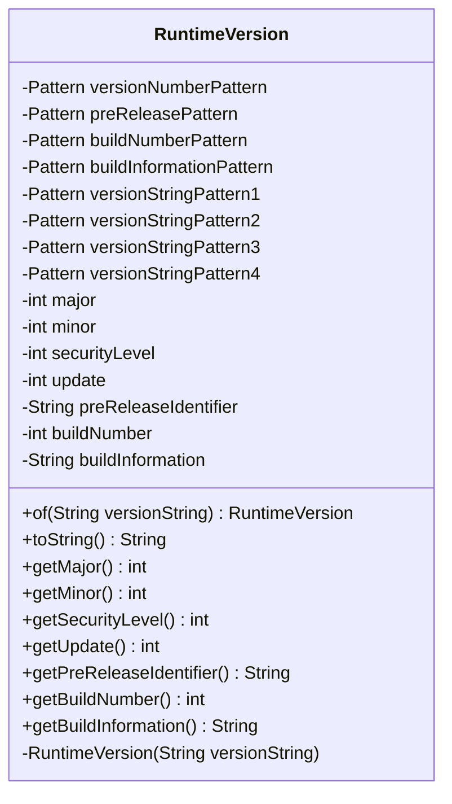

---
aliases:
  - RuntimeVersion
tags:
  - java/class
  - module/forge-core
  - pkg/forge/util
fqn: forge.util.RuntimeVersion
package: forge.util
module: forge-core
kind: Class
---

# RuntimeVersion

**Package:** `forge.util` &nbsp; **Module:** `forge-core` &nbsp; **Kind:** Class



## Source
`forge-core/src/main/java/forge/util/RuntimeVersion.java`

```java
package forge.util;

import java.util.regex.Matcher;
import java.util.regex.Pattern;

public final class RuntimeVersion {

	private static Pattern versionNumberPattern = Pattern.compile("([1-9][0-9]*((\\.0)*\\.[0-9]*)*(_[0-9]+)?)");
	private static Pattern preReleasePattern = Pattern.compile("([a-zA-Z0-9]+)");
	private static Pattern buildNumberPattern = Pattern.compile("(0|[1-9][0-9]*)");
	private static Pattern buildInformationPattern = Pattern.compile("([-a-zA-Z0-9.]+)");

	private static Pattern versionStringPattern1 = Pattern.compile(versionNumberPattern + "(-" + preReleasePattern + ")?\\+" + buildNumberPattern + "(-" + buildInformationPattern + ")?");
	private static Pattern versionStringPattern2 = Pattern.compile(versionNumberPattern + "-" + preReleasePattern + "(-" + buildInformationPattern + ")?");
	private static Pattern versionStringPattern3 = Pattern.compile(versionNumberPattern + "(\\+?-" + buildInformationPattern + ")?");
	private static Pattern versionStringPattern4 = Pattern.compile(versionNumberPattern + "(-" + preReleasePattern + ")?");

	private int major;
	private int minor;
	private int securityLevel;
	private int update;

	private String preReleaseIdentifier;
	private int buildNumber;
	private String buildInformation;

	private RuntimeVersion(final String versionString) {

		Matcher matcher = versionNumberPattern.matcher(versionString);

		if (!matcher.find()) {
			throw new IllegalArgumentException("Improperly formatted version string provided: " + versionString);
		}

		String[] versionNumbers = matcher.group().split("[._]");

		if (versionNumbers.length >= 1) {
			major = Integer.parseInt(versionNumbers[0]);
		}

		if (versionNumbers.length >= 2) {
			minor = Integer.parseInt(versionNumbers[1]);
		}

		if (versionNumbers.length >= 3) {
			securityLevel = Integer.parseInt(versionNumbers[2]);
		}

		if (versionNumbers.length >= 4) {
			update = Integer.parseInt(versionNumbers[3]);
		}

		if (versionStringPattern1.matcher(versionString).find()) {

			Matcher infoMatcher = preReleasePattern.matcher(versionString);
			if (infoMatcher.find()) {
				preReleaseIdentifier = infoMatcher.group();
			}

			infoMatcher = buildNumberPattern.matcher(versionString);
			infoMatcher.find();
			buildNumber = Integer.parseInt(infoMatcher.group());

			infoMatcher = buildInformationPattern.matcher(versionString);
			if (infoMatcher.find()) {
				buildInformation = infoMatcher.group();
			}

		} else if (versionStringPattern2.matcher(versionString).find()) {

			Matcher infoMatcher = preReleasePattern.matcher(versionString);
			infoMatcher.find();
			preReleaseIdentifier = infoMatcher.group();

			infoMatcher = buildInformationPattern.matcher(versionString);
			if (infoMatcher.find()) {
				buildInformation = infoMatcher.group();
			}

		} else if (versionStringPattern3.matcher(versionString).find()) {

			Matcher infoMatcher = buildInformationPattern.matcher(versionString);
			if (infoMatcher.find()) {
				buildInformation = infoMatcher.group();
			}

		} else if (versionStringPattern4.matcher(versionString).find()) {

			Matcher infoMatcher = preReleasePattern.matcher(versionString);
			if (infoMatcher.find()) {
				preReleaseIdentifier = infoMatcher.group();
			}

		} else {
			throw new IllegalArgumentException("Improperly formatted version string provided: " + versionString);
		}

	}

	public static RuntimeVersion of(final String versionString) {
		return new RuntimeVersion(versionString);
	}

	@Override
	public String toString() {
		return "1." + minor + "." + securityLevel + "_" + update;
	}

	public int getMajor() {
		return major;
	}

	public int getMinor() {
		return minor;
	}

	public int getSecurityLevel() {
		return securityLevel;
	}

	public int getUpdate() {
		return update;
	}

	public String getPreReleaseIdentifier() {
		return preReleaseIdentifier;
	}

	public int getBuildNumber() {
		return buildNumber;
	}

	public String getBuildInformation() {
		return buildInformation;
	}

}
```
