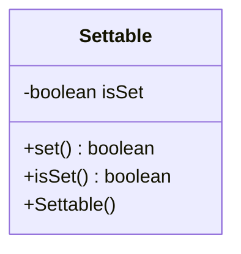

---
aliases:
  - Settable
tags:
  - java/class
  - module/forge-core
  - pkg/forge/util
fqn: forge.util.Settable
package: forge.util
module: forge-core
kind: Class
---

# Settable

**Package:** `forge.util`   **Module:** `forge-core`   **Kind:** Class



## Design Description

Settable is a minimal concurrency-safe latch utility in `forge.util` that wraps a single boolean flag enforcing a monotonic, one-way transition: the value begins `false` and can only ever move to `true`. It exposes no setter for reverting, deliberately guaranteeing that once set, the state is permanent. As a standalone class with no supertype or declared collaborators, it serves as a lightweight building block for callers that need a "has this happened yet?" marker—such as one-time initialization guards or first-occurrence detection. The synchronized `set()` method returns whether the call actually caused the transition, letting exactly one caller learn it "won" the first set even under concurrent access, while the unsynchronized `isSet()` offers a cheap read of the latched state.

## Source
`forge-core/src/main/java/forge/util/Settable.java`

```java
package forge.util;

/**
 * Object containing a boolean that can only be changed by setting it to
 * {@code true} via the {@link #set()} method. Once set, the value is guaranteed
 * to remain unchanged.
 */
public class Settable {
    private boolean isSet;

    /**
     * Construct a new, unset instance.
     */
    public Settable() {
    }

    /**
     * Set this instance. Any subsequent calls on {@link #isSet()} will return
     * {@code true}.
     *
     * @return whether the value changed as a result of this call.
     */
    public synchronized boolean set() {
        final boolean wasUnset = !isSet;
        isSet = true;
        return wasUnset;
    }

    /**
     * Check whether this instance has already been set. If {@link #set()} was
     * previously called, returns {@code true}; otherwise, returns
     * {@code false}.
     *
     * @return whether this instance was set.
     */
    public boolean isSet() {
        return isSet;
    }
}
```

## Python
`forge/util/Settable.py`

```python
import threading


class Settable:
    """
    Object containing a boolean that can only be changed by setting it to
    ``True`` via the :meth:`set` method. Once set, the value is guaranteed
    to remain unchanged.
    """

    def __init__(self):
        """
        Construct a new, unset instance.
        """
        self._isSet = False
        self._lock = threading.Lock()

    def set(self) -> bool:
        """
        Set this instance. Any subsequent calls on :meth:`isSet` will return
        ``True``.

        :return: whether the value changed as a result of this call.
        """
        with self._lock:
            wasUnset = not self._isSet
            self._isSet = True
            return wasUnset

    def isSet(self) -> bool:
        """
        Check whether this instance has already been set. If :meth:`set` was
        previously called, returns ``True``; otherwise, returns ``False``.

        :return: whether this instance was set.
        """
        return self._isSet
```
