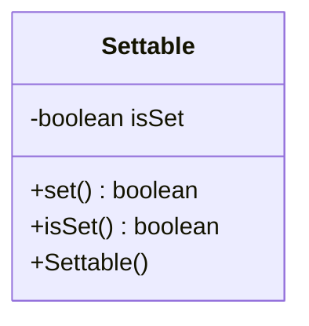

---
aliases:
  - Settable
tags:
  - java/class
  - module/forge-core
  - pkg/forge/util
fqn: forge.util.Settable
package: forge.util
module: forge-core
kind: Class
---

# Settable

**Package:** `forge.util` &nbsp; **Module:** `forge-core` &nbsp; **Kind:** Class



## Source
`forge-core/src/main/java/forge/util/Settable.java`

```java
package forge.util;

/**
 * Object containing a boolean that can only be changed by setting it to
 * {@code true} via the {@link #set()} method. Once set, the value is guaranteed
 * to remain unchanged.
 */
public class Settable {
    private boolean isSet;

    /**
     * Construct a new, unset instance.
     */
    public Settable() {
    }

    /**
     * Set this instance. Any subsequent calls on {@link #isSet()} will return
     * {@code true}.
     *
     * @return whether the value changed as a result of this call.
     */
    public synchronized boolean set() {
        final boolean wasUnset = !isSet;
        isSet = true;
        return wasUnset;
    }

    /**
     * Check whether this instance has already been set. If {@link #set()} was
     * previously called, returns {@code true}; otherwise, returns
     * {@code false}.
     *
     * @return whether this instance was set.
     */
    public boolean isSet() {
        return isSet;
    }
}
```
