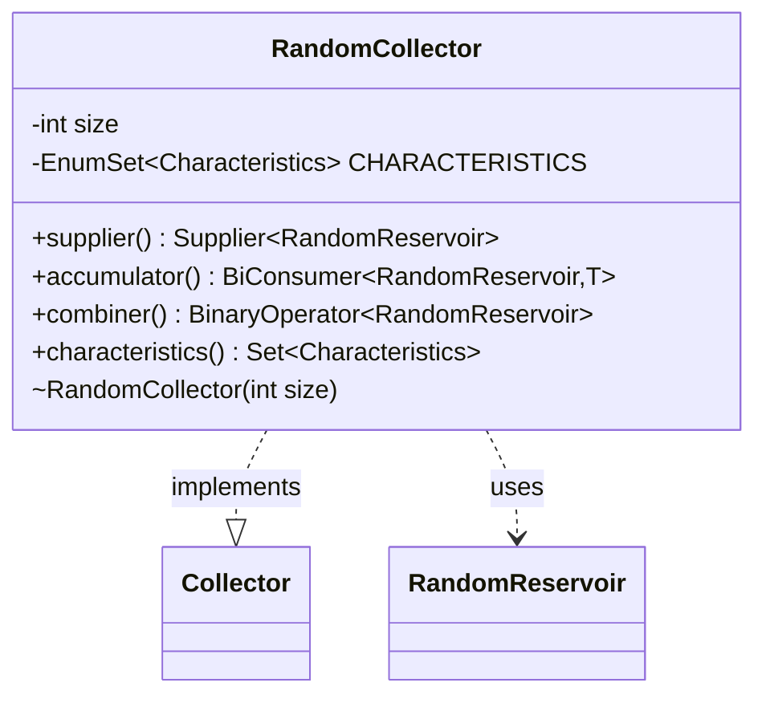

---
aliases:
  - RandomCollector
tags:
  - java/class
  - module/forge-core
  - pkg/forge/util
fqn: forge.util.StreamUtil.RandomCollector
package: forge.util
module: forge-core
kind: Class
---

# RandomCollector

**Package:** `forge.util` &nbsp; **Module:** `forge-core` &nbsp; **Kind:** Class



## Relationships
**Uses:**
- [[forge.util.StreamUtil.RandomReservoir|RandomReservoir]]

## Source
`forge-core/src/main/java/forge/util/StreamUtil.java` — declaration excerpt

```java
    private static abstract class RandomCollector<T, O> implements Collector<T, RandomReservoir<T>, O> {
        private final int size;
        RandomCollector(int size) {
            this.size = size;
        }

        @Override
        public Supplier<RandomReservoir<T>> supplier() {
            return () -> new RandomReservoir<>(size);
        }

        @Override
        public BiConsumer<RandomReservoir<T>, T> accumulator() {
            return RandomReservoir::accumulate;
        }

        @Override
        public BinaryOperator<RandomReservoir<T>> combiner() {
            return (first, second) -> {
                //There's probably a way to adapt the Random Reservoir method
                //so that two partially processed lists can be combined into one.
                //But I have no idea what that is.
                throw new UnsupportedOperationException("Parallel streams not supported.");
            };
        }

        private final EnumSet<Characteristics> CHARACTERISTICS = EnumSet.of(Characteristics.UNORDERED);
        @Override
        public Set<Characteristics> characteristics() {
            return CHARACTERISTICS;
        }
    }
```
