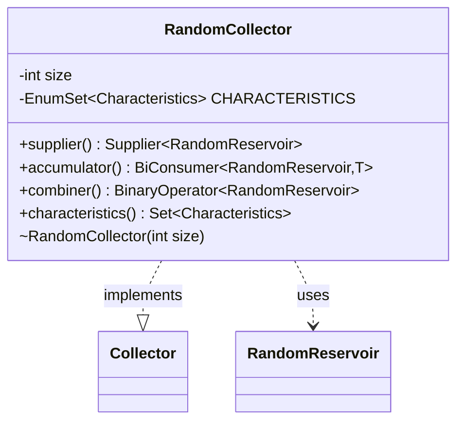

---
aliases:
  - RandomCollector
tags:
  - java/class
  - module/forge-core
  - pkg/forge/util
fqn: forge.util.StreamUtil.RandomCollector
package: forge.util
module: forge-core
kind: Class
---

# RandomCollector

**Package:** `forge.util`   **Module:** `forge-core`   **Kind:** Class



## Relationships
**Uses:**
- [[forge.util.StreamUtil.RandomReservoir|RandomReservoir]]

## Design Description

Implements the JDK `Collector` interface to perform reservoir sampling, randomly selecting a fixed number of elements from a stream in a single unordered pass. As an abstract base parameterized over the result type `O`, it defers final result production to subclasses while supplying the shared sampling machinery: each of the `supplier`, `accumulator`, and `combiner` factory methods delegates to a `RandomReservoir` of the configured `size`, which holds intermediate state and performs the actual random accumulation. The class advertises only the `UNORDERED` characteristic, reflecting that sampling order is irrelevant. Notably, the `combiner` deliberately throws `UnsupportedOperationException`, a candid design choice—documented in an inline comment—that forgoes parallel-stream support because merging two partially-filled reservoirs while preserving uniform randomness was non-trivial to implement.

## Source
`forge-core/src/main/java/forge/util/StreamUtil.java` — declaration excerpt

```java
    private static abstract class RandomCollector<T, O> implements Collector<T, RandomReservoir<T>, O> {
        private final int size;
        RandomCollector(int size) {
            this.size = size;
        }

        @Override
        public Supplier<RandomReservoir<T>> supplier() {
            return () -> new RandomReservoir<>(size);
        }

        @Override
        public BiConsumer<RandomReservoir<T>, T> accumulator() {
            return RandomReservoir::accumulate;
        }

        @Override
        public BinaryOperator<RandomReservoir<T>> combiner() {
            return (first, second) -> {
                //There's probably a way to adapt the Random Reservoir method
                //so that two partially processed lists can be combined into one.
                //But I have no idea what that is.
                throw new UnsupportedOperationException("Parallel streams not supported.");
            };
        }

        private final EnumSet<Characteristics> CHARACTERISTICS = EnumSet.of(Characteristics.UNORDERED);
        @Override
        public Set<Characteristics> characteristics() {
            return CHARACTERISTICS;
        }
    }
```

## Python
`forge/util/StreamUtil/RandomCollector.py`

```python
from forge.util.StreamUtil.RandomReservoir import RandomReservoir

import typing
from abc import ABC, abstractmethod
from enum import Enum
from typing import Callable, Set

T = typing.TypeVar("T")
O = typing.TypeVar("O")


class RandomCollector(typing.Generic[T, O], Collector[T, "RandomReservoir[T]", O], ABC):
    def __init__(self, size: int):
        self.size = size

    def supplier(self) -> Callable[[], "RandomReservoir[T]"]:
        return lambda: RandomReservoir(self.size)

    def accumulator(self) -> Callable[["RandomReservoir[T]", T], None]:
        return lambda reservoir, t: reservoir.accumulate(t)

    def combiner(self) -> Callable[["RandomReservoir[T]", "RandomReservoir[T]"], "RandomReservoir[T]"]:
        def _combine(first, second):
            # There's probably a way to adapt the Random Reservoir method
            # so that two partially processed lists can be combined into one.
            # But I have no idea what that is.
            raise NotImplementedError("Parallel streams not supported.")
        return _combine

    CHARACTERISTICS = {Collector.Characteristics.UNORDERED}

    def characteristics(self) -> Set["Collector.Characteristics"]:
        return self.CHARACTERISTICS
```
