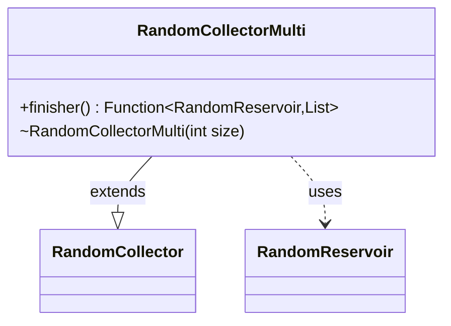

---
aliases:
  - RandomCollectorMulti
tags:
  - java/class
  - module/forge-core
  - pkg/forge/util
fqn: forge.util.StreamUtil.RandomCollectorMulti
package: forge.util
module: forge-core
kind: Class
---

# RandomCollectorMulti

**Package:** `forge.util`   **Module:** `forge-core`   **Kind:** Class



## Relationships
**Extends:**
- [[forge.util.StreamUtil.RandomCollector|RandomCollector]]
**Uses:**
- [[forge.util.StreamUtil.RandomReservoir|RandomReservoir]]

## Design Description

RandomCollectorMulti is a private, generic helper class within `StreamUtil` that implements the multi-sample reservoir-sampling collection strategy, gathering up to `size` randomly selected elements from a stream into a `List`. It specializes the abstract `RandomCollector` base by binding its result type to `List<T>` and supplying the terminal `finisher()` step, which simply unwraps the accumulated `RandomReservoir`'s `samples` list as the final result.

By extending `RandomCollector` it inherits the supplier, accumulator, and combiner logic for reservoir sampling, contributing only the finishing behavior—a focused application of the Template Method pattern. Its package-private constructor and `private` visibility signal that it is an internal implementation detail, instantiated solely through `StreamUtil`'s factory methods rather than used directly by clients.

## Source
`forge-core/src/main/java/forge/util/StreamUtil.java` — declaration excerpt

```java
    private static class RandomCollectorMulti<T> extends RandomCollector<T, List<T>> {
        RandomCollectorMulti(int size) {
            super(size);
        }

        @Override
        public Function<RandomReservoir<T>, List<T>> finisher() {
            return (chosen) -> chosen.samples;
        }
    }
```

## Python
`forge/util/StreamUtil/RandomCollectorMulti.py`

```python
from forge.util.StreamUtil.RandomCollector import RandomCollector
from forge.util.StreamUtil.RandomReservoir import RandomReservoir
from typing import Callable, List, TypeVar

T = TypeVar("T")


class RandomCollectorMulti(RandomCollector):
    def __init__(self, size: int):
        super().__init__(size)

    def finisher(self) -> Callable[[RandomReservoir], List[T]]:
        return lambda chosen: chosen.samples
```
