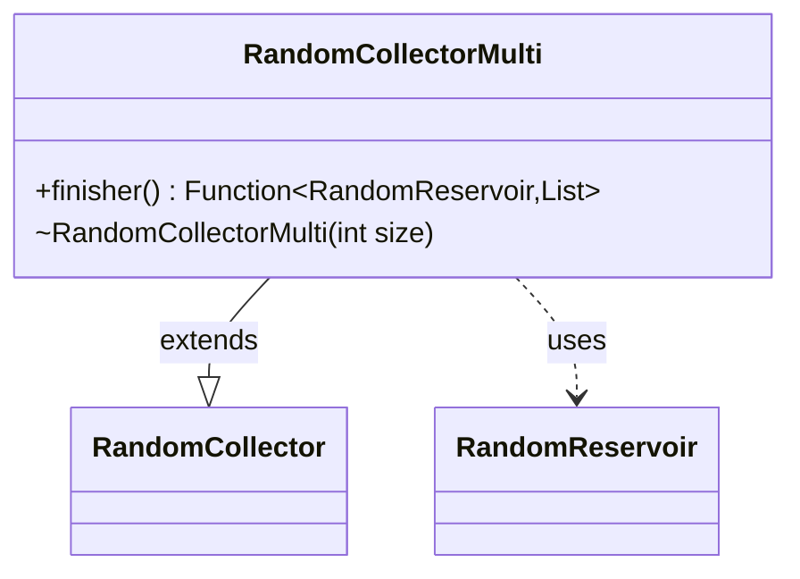

---
aliases:
  - RandomCollectorMulti
tags:
  - java/class
  - module/forge-core
  - pkg/forge/util
fqn: forge.util.StreamUtil.RandomCollectorMulti
package: forge.util
module: forge-core
kind: Class
---

# RandomCollectorMulti

**Package:** `forge.util` &nbsp; **Module:** `forge-core` &nbsp; **Kind:** Class



## Relationships
**Extends:**
- [[forge.util.StreamUtil.RandomCollector|RandomCollector]]
**Uses:**
- [[forge.util.StreamUtil.RandomReservoir|RandomReservoir]]

## Source
`forge-core/src/main/java/forge/util/StreamUtil.java` — declaration excerpt

```java
    private static class RandomCollectorMulti<T> extends RandomCollector<T, List<T>> {
        RandomCollectorMulti(int size) {
            super(size);
        }

        @Override
        public Function<RandomReservoir<T>, List<T>> finisher() {
            return (chosen) -> chosen.samples;
        }
    }
```
