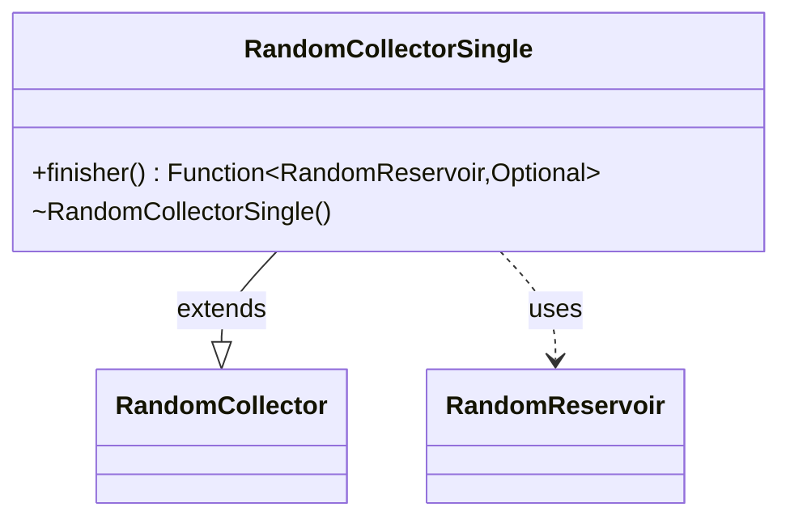

---
aliases:
  - RandomCollectorSingle
tags:
  - java/class
  - module/forge-core
  - pkg/forge/util
fqn: forge.util.StreamUtil.RandomCollectorSingle
package: forge.util
module: forge-core
kind: Class
---

# RandomCollectorSingle

**Package:** `forge.util`   **Module:** `forge-core`   **Kind:** Class



## Relationships
**Extends:**
- [[forge.util.StreamUtil.RandomCollector|RandomCollector]]
**Uses:**
- [[forge.util.StreamUtil.RandomReservoir|RandomReservoir]]

## Design Description

RandomCollectorSingle is a private static inner collector in `StreamUtil` that specializes the generic reservoir-sampling machinery to pick a single random element from a stream. It extends `RandomCollector<T, Optional<T>>`, fixing the reservoir size to one via its `super(1)` constructor, and yields an `Optional<T>` rather than a collection. Its sole overridden behavior is the `finisher()`, which inspects the populated `RandomReservoir` and returns `Optional.empty()` for an empty stream or wraps the single sampled element otherwise. The Optional return type encodes the design intent that single-element random selection may legitimately find nothing, sparing callers from null checks while reusing the shared `RandomCollector`/`RandomReservoir` sampling logic.

## Source
`forge-core/src/main/java/forge/util/StreamUtil.java` — declaration excerpt

```java
    private static class RandomCollectorSingle<T> extends RandomCollector<T, Optional<T>> {
        RandomCollectorSingle() {
            super(1);
        }

        @Override
        public Function<RandomReservoir<T>, Optional<T>> finisher() {
            return (chosen) -> chosen.samples.isEmpty() ? Optional.empty() : Optional.of(chosen.samples.get(0));
        }
    }
```

## Python
`forge/util/StreamUtil/RandomCollectorSingle.py`

```python
from typing import Callable, Optional, TypeVar

from forge.util.StreamUtil.RandomCollector import RandomCollector
from forge.util.StreamUtil.RandomReservoir import RandomReservoir

T = TypeVar("T")


class RandomCollectorSingle(RandomCollector[T, Optional[T]]):
    def __init__(self):
        super().__init__(1)

    def finisher(self) -> Callable[[RandomReservoir[T]], Optional[T]]:
        return lambda chosen: None if len(chosen.samples) == 0 else chosen.samples[0]
```
