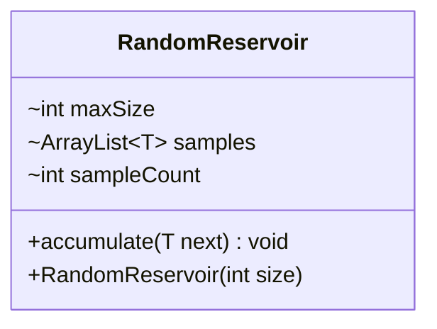

---
aliases:
  - RandomReservoir
tags:
  - java/class
  - module/forge-core
  - pkg/forge/util
fqn: forge.util.StreamUtil.RandomReservoir
package: forge.util
module: forge-core
kind: Class
---

# RandomReservoir

**Package:** `forge.util` &nbsp; **Module:** `forge-core` &nbsp; **Kind:** Class



## Source
`forge-core/src/main/java/forge/util/StreamUtil.java` — declaration excerpt

```java
    private static class RandomReservoir<T> {
        final int maxSize;
        ArrayList<T> samples;
        int sampleCount = 0;

        public RandomReservoir(int size) {
            this.maxSize = size;
            this.samples = new ArrayList<>(size);
        }

        public void accumulate(T next) {
            sampleCount++;
            if(sampleCount <= maxSize) {
                //Add the first [maxSize] items into the result list
                samples.add(next);
                return;
            }
            //Progressively reduce odds of adding an item into the reservoir
            int j = MyRandom.getRandom().nextInt(sampleCount);
            if(j < maxSize)
                samples.set(j, next);
        }
    }
```
