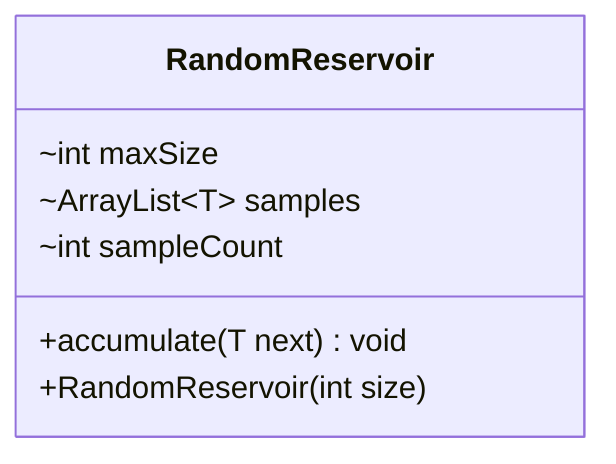

---
aliases:
  - RandomReservoir
tags:
  - java/class
  - module/forge-core
  - pkg/forge/util
fqn: forge.util.StreamUtil.RandomReservoir
package: forge.util
module: forge-core
kind: Class
---

# RandomReservoir

**Package:** `forge.util`   **Module:** `forge-core`   **Kind:** Class



## Design Description

RandomReservoir is a private static generic helper nested within `forge.util.StreamUtil` that implements reservoir sampling, maintaining a uniformly random fixed-size subset of an arbitrarily long stream of elements without buffering the whole stream. Each call to `accumulate` admits the first `maxSize` items directly, then for each subsequent item draws a random index over the running count and probabilistically overwrites an existing sample, ensuring every observed element retains an equal selection probability.

As a package-private implementation detail it has no supertype or interface obligations; it simply collaborates with `MyRandom` for its random source and backs its sample set with an `ArrayList<T>`. The generic type parameter keeps it element-agnostic, and tracking `sampleCount` separately from the list size is the key design choice that lets it decay insertion odds correctly across an unbounded input.

## Source
`forge-core/src/main/java/forge/util/StreamUtil.java` — declaration excerpt

```java
    private static class RandomReservoir<T> {
        final int maxSize;
        ArrayList<T> samples;
        int sampleCount = 0;

        public RandomReservoir(int size) {
            this.maxSize = size;
            this.samples = new ArrayList<>(size);
        }

        public void accumulate(T next) {
            sampleCount++;
            if(sampleCount <= maxSize) {
                //Add the first [maxSize] items into the result list
                samples.add(next);
                return;
            }
            //Progressively reduce odds of adding an item into the reservoir
            int j = MyRandom.getRandom().nextInt(sampleCount);
            if(j < maxSize)
                samples.set(j, next);
        }
    }
```

## Python
`forge/util/StreamUtil/RandomReservoir.py`

```python
from forge.util.MyRandom import MyRandom


class RandomReservoir:
    def __init__(self, size: int):
        self.maxSize = size
        self.samples = []
        self.sampleCount = 0

    def accumulate(self, next):
        self.sampleCount += 1
        if self.sampleCount <= self.maxSize:
            # Add the first [maxSize] items into the result list
            self.samples.append(next)
            return
        # Progressively reduce odds of adding an item into the reservoir
        j = MyRandom.getRandom().nextInt(self.sampleCount)
        if j < self.maxSize:
            self.samples[j] = next
```
