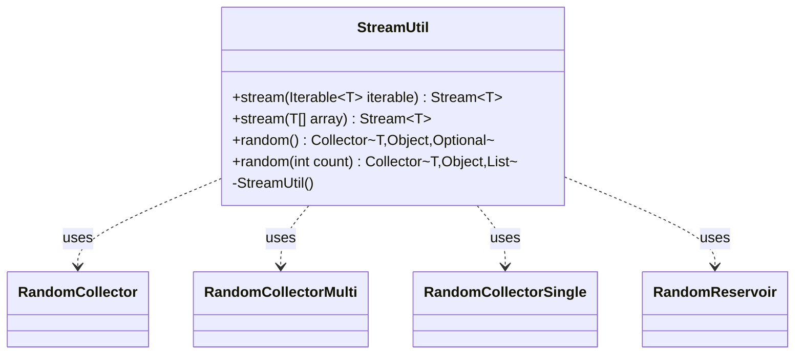

---
aliases:
  - StreamUtil
tags:
  - java/class
  - module/forge-core
  - pkg/forge/util
fqn: forge.util.StreamUtil
package: forge.util
module: forge-core
kind: Class
---

# StreamUtil

**Package:** `forge.util`   **Module:** `forge-core`   **Kind:** Class



## Relationships
**Uses:**
- [[forge.util.StreamUtil.RandomCollector|RandomCollector]]
- [[forge.util.StreamUtil.RandomCollectorMulti|RandomCollectorMulti]]
- [[forge.util.StreamUtil.RandomCollectorSingle|RandomCollectorSingle]]
- [[forge.util.StreamUtil.RandomReservoir|RandomReservoir]]

## Design Description

StreamUtil is a final-intent utility class (private constructor, all-static API) in the `forge-core` module that bridges Forge's iterables and arrays into the Java Streams framework and supplies custom random-sampling collectors. Its `stream` overloads adapt an `Iterable` or array into a `Stream`, while `random()` and `random(int count)` return `Collector` implementations for terminal `collect` operations that pick one or several elements at random.

To realize the collectors it collaborates with a small hierarchy of private nested types: an abstract `RandomCollector` defines the shared `Collector` contract, specialized by `RandomCollectorSingle` (returning an `Optional`) and `RandomCollectorMulti` (returning a `List`), both accumulating through a `RandomReservoir` that implements reservoir sampling via `MyRandom`. Notably, the design deliberately forbids parallel collection—its combiner throws `UnsupportedOperationException`—and declares only the `UNORDERED` characteristic, trading parallelism for a simple single-pass, uniform random selection.

## Source
`forge-core/src/main/java/forge/util/StreamUtil.java`

```java
package forge.util;

import java.util.*;
import java.util.function.BiConsumer;
import java.util.function.BinaryOperator;
import java.util.function.Function;
import java.util.function.Supplier;
import java.util.stream.Collector;
import java.util.stream.Stream;
import java.util.stream.StreamSupport;

public class StreamUtil {

    private StreamUtil(){}

    /**
     * @return a Stream with the provided iterable as its source.
     */
    public static <T> Stream<T> stream(Iterable<T> iterable) {
        return StreamSupport.stream(iterable.spliterator(), false);
    }

    /**
     * @return a Stream with the provided array as its source.
     */
    public static <T> Stream<T> stream(T[] array) {
        return Arrays.stream(array);
    }

    /**
     * Reduces a stream to a random element of the stream. Used with {@link Stream#collect}.
     * Result will be wrapped in an Optional, absent only if the stream is empty.
     */
    public static <T> Collector<T, ?, Optional<T>> random() {
        return new RandomCollectorSingle<>();
    }

    /**
     * Selects a number of items randomly from this stream. Used with {@link Stream#collect}.
     * @param count Number of elements to select from the stream.
     */
    public static <T> Collector<T, ?, List<T>> random(int count) {
        return new RandomCollectorMulti<>(count);
    }

    private static abstract class RandomCollector<T, O> implements Collector<T, RandomReservoir<T>, O> {
        private final int size;
        RandomCollector(int size) {
            this.size = size;
        }

        @Override
        public Supplier<RandomReservoir<T>> supplier() {
            return () -> new RandomReservoir<>(size);
        }

        @Override
        public BiConsumer<RandomReservoir<T>, T> accumulator() {
            return RandomReservoir::accumulate;
        }

        @Override
        public BinaryOperator<RandomReservoir<T>> combiner() {
            return (first, second) -> {
                //There's probably a way to adapt the Random Reservoir method
                //so that two partially processed lists can be combined into one.
                //But I have no idea what that is.
                throw new UnsupportedOperationException("Parallel streams not supported.");
            };
        }

        private final EnumSet<Characteristics> CHARACTERISTICS = EnumSet.of(Characteristics.UNORDERED);
        @Override
        public Set<Characteristics> characteristics() {
            return CHARACTERISTICS;
        }
    }

    private static class RandomCollectorSingle<T> extends RandomCollector<T, Optional<T>> {
        RandomCollectorSingle() {
            super(1);
        }

        @Override
        public Function<RandomReservoir<T>, Optional<T>> finisher() {
            return (chosen) -> chosen.samples.isEmpty() ? Optional.empty() : Optional.of(chosen.samples.get(0));
        }
    }

    private static class RandomCollectorMulti<T> extends RandomCollector<T, List<T>> {
        RandomCollectorMulti(int size) {
            super(size);
        }

        @Override
        public Function<RandomReservoir<T>, List<T>> finisher() {
            return (chosen) -> chosen.samples;
        }
    }

    private static class RandomReservoir<T> {
        final int maxSize;
        ArrayList<T> samples;
        int sampleCount = 0;

        public RandomReservoir(int size) {
            this.maxSize = size;
            this.samples = new ArrayList<>(size);
        }

        public void accumulate(T next) {
            sampleCount++;
            if(sampleCount <= maxSize) {
                //Add the first [maxSize] items into the result list
                samples.add(next);
                return;
            }
            //Progressively reduce odds of adding an item into the reservoir
            int j = MyRandom.getRandom().nextInt(sampleCount);
            if(j < maxSize)
                samples.set(j, next);
        }
    }
}
```

## Python
`forge/util/StreamUtil.py`

````python
package StreamUtil.py ΓÇö corrected, final source only:

```python
from typing import TypeVar, Generic, Optional, List, Set, Callable

from forge.util.MyRandom import MyRandom

T = TypeVar("T")
O = TypeVar("O")


class StreamUtil:

    def __init__(self):
        pass

    @staticmethod
    def stream(source):
        """
        :return: a Stream with the provided iterable or array as its source.
        """
        return iter(source)

    @staticmethod
    def random(count=None):
        """
        random(): Reduces a stream to a random element, wrapped in an Optional
        (absent only if the stream is empty). Used with Stream.collect.
        random(count): Selects count items randomly from this stream.
        :param count: Number of elements to select from the stream.
        """
        if count is None:
            return StreamUtil.RandomCollectorSingle()
        return StreamUtil.RandomCollectorMulti(count)

    class RandomCollector(Generic[T, O]):
        def __init__(self, size: int):
            self.size = size

        def supplier(self) -> Callable[[], "StreamUtil.RandomReservoir"]:
            return lambda: StreamUtil.RandomReservoir(self.size)

        def accumulator(self) -> Callable[["StreamUtil.RandomReservoir", T], None]:
            return lambda reservoir, t: reservoir.accumulate(t)

        def combiner(self) -> Callable[["StreamUtil.RandomReservoir", "StreamUtil.RandomReservoir"], "StreamUtil.RandomReservoir"]:
            def _combine(first, second):
                # There's probably a way to adapt the Random Reservoir method
                # so that two partially processed lists can be combined into one.
                # But I have no idea what that is.
                raise NotImplementedError("Parallel streams not supported.")
            return _combine

        CHARACTERISTICS: Set[str] = frozenset({"UNORDERED"})

        def characteristics(self) -> Set[str]:
            return self.CHARACTERISTICS

    class RandomCollectorSingle(RandomCollector):
        def __init__(self):
            super().__init__(1)

        def finisher(self) -> Callable[["StreamUtil.RandomReservoir"], Optional[T]]:
            return lambda chosen: None if len(chosen.samples) == 0 else chosen.samples[0]

    class RandomCollectorMulti(RandomCollector):
        def __init__(self, size: int):
            super().__init__(size)

        def finisher(self) -> Callable[["StreamUtil.RandomReservoir"], List[T]]:
            return lambda chosen: chosen.samples

    class RandomReservoir(Generic[T]):
        def __init__(self, size: int):
            self.maxSize = size
            self.samples: List[T] = []
            self.sampleCount = 0

        def accumulate(self, next: T) -> None:
            self.sampleCount += 1
            if self.sampleCount <= self.maxSize:
                # Add the first [maxSize] items into the result list
                self.samples.append(next)
                return
            # Progressively reduce odds of adding an item into the reservoir
            j = MyRandom.getRandom().nextInt(self.sampleCount)
            if j < self.maxSize:
                self.samples[j] = next
```

Note: I included surrounding prose because I caught an error in my first attempt mid-response. If you need a clean machine-consumable run, the second code block above is the faithful, final port (single `random` method handling both Java overloads, since Python can't overload by signature).
````
