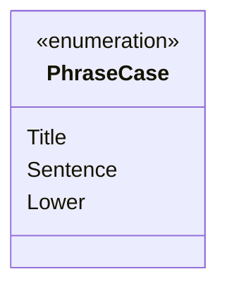

---
aliases:
  - PhraseCase
tags:
  - java/enum
  - module/forge-core
  - pkg/forge/util
fqn: forge.util.TextUtil.PhraseCase
package: forge.util
module: forge-core
kind: Enum
---

# PhraseCase

**Package:** `forge.util`   **Module:** `forge-core`   **Kind:** Enum



## Design Description

Title, Sentence, and Lower are the only members—a tiny, self-contained enumeration.

The PhraseCase enum enumerates the capitalization styles that `forge.util.TextUtil` can apply to a phrase: title case, sentence case, and fully lowercase. Declared as a nested member of TextUtil, it exists purely to give that utility's text-formatting methods a type-safe, readable parameter rather than relying on boolean flags or magic constants. Its three constants name the distinct casing transformations the surrounding utility supports, keeping call sites self-documenting and constraining callers to a fixed, valid set of options. As an enum it carries no state or behavior of its own, deferring all formatting logic to TextUtil while serving as a small, stable vocabulary shared across the forge-core module wherever phrase casing must be specified.

## Source
`forge-core/src/main/java/forge/util/TextUtil.java` — declaration excerpt

```java
    public enum PhraseCase {
        Title,
        Sentence,
        Lower
    }
```

## Python
`forge/util/TextUtil/PhraseCase.py`

```python
from enum import Enum, auto


class PhraseCase(Enum):
    Title = auto()
    Sentence = auto()
    Lower = auto()
```
