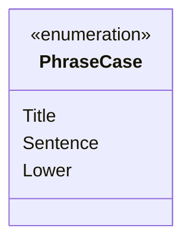

---
aliases:
  - PhraseCase
tags:
  - java/enum
  - module/forge-core
  - pkg/forge/util
fqn: forge.util.TextUtil.PhraseCase
package: forge.util
module: forge-core
kind: Enum
---

# PhraseCase

**Package:** `forge.util` &nbsp; **Module:** `forge-core` &nbsp; **Kind:** Enum



## Source
`forge-core/src/main/java/forge/util/TextUtil.java` — declaration excerpt

```java
    public enum PhraseCase {
        Title,
        Sentence,
        Lower
    }
```
