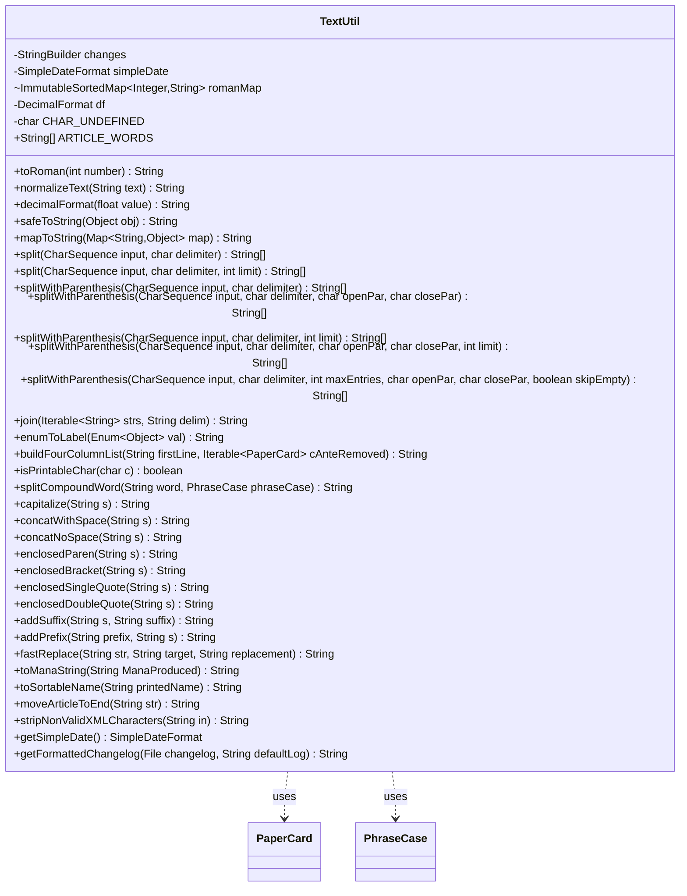

---
aliases:
  - TextUtil
tags:
  - java/class
  - module/forge-core
  - pkg/forge/util
fqn: forge.util.TextUtil
package: forge.util
module: forge-core
kind: Class
---

# TextUtil

**Package:** `forge.util`   **Module:** `forge-core`   **Kind:** Class



## Relationships
**Uses:**
- [[forge.item.PaperCard|PaperCard]]
- [[forge.util.TextUtil.PhraseCase|PhraseCase]]

## Design Description

TextUtil is a stateless, final-style utility class in `forge.util` providing a broad collection of static string-manipulation helpers for the forge-core module. Its responsibilities span text normalization, Roman-numeral conversion, fast custom splitting (including parenthesis-aware tokenization), joining, case and label formatting, enclosing/affixing helpers, mana-string and sortable-name construction, XML sanitization, and changelog formatting. It depends only on lightweight collaborators—holding no inheritance relationships and exposing functionality entirely through static methods over shared static state (cached date formatters, a Roman-numeral map, a changelog buffer).

As a leaf helper it collaborates with domain types `PaperCard` (formatting card lists) and `IPaperCard` (default artist constant), and defines the nested `PhraseCase` enum to drive compound-word splitting. The design favors performance—custom `split` and `fastReplace` implementations explicitly aim to outpace `String.split`—and localization, exposing the overridable `ARTICLE_WORDS` array for sort-name generation.

## Source
`forge-core/src/main/java/forge/util/TextUtil.java`

```java
package forge.util;

import com.google.common.collect.ImmutableSortedMap;
import forge.item.IPaperCard;
import forge.item.PaperCard;
import org.apache.commons.lang3.ArrayUtils;
import org.apache.commons.lang3.StringUtils;
import org.apache.commons.text.StringEscapeUtils;

import java.io.File;
import java.text.DecimalFormat;
import java.text.Normalizer;
import java.text.SimpleDateFormat;
import java.time.OffsetDateTime;
import java.util.ArrayList;
import java.util.Calendar;
import java.util.Date;
import java.util.List;
import java.util.Locale;
import java.util.Map;
import java.util.Map.Entry;
import java.util.TimeZone;

/** 
 * TODO: Write javadoc for this type.
 *
 */
public class TextUtil {
    private static final StringBuilder changes = new StringBuilder();
    private static SimpleDateFormat simpleDate;

    static ImmutableSortedMap<Integer,String> romanMap = ImmutableSortedMap.<Integer,String>naturalOrder()
    .put(1000, "M").put(900, "CM")
    .put(500, "D").put(400, "CD")
    .put(100, "C").put(90, "XC")
    .put(50, "L").put(40, "XL")
    .put(10, "X").put(9, "IX")
    .put(5, "V").put(4, "IV").put(1, "I").build();
    
    public static String toRoman(int number) {
        if (number <= 0) {
            return "";
        }
        int l = romanMap.floorKey(number);
        return romanMap.get(l) + toRoman(number-l);
    }
    public static String normalizeText(String text) {
        if (text == null)
            return IPaperCard.NO_ARTIST_NAME;
        return Normalizer.normalize(text, Normalizer.Form.NFD);

    }
    private static final DecimalFormat df = new DecimalFormat("#.##");
    public static String decimalFormat(float value) {
        return df.format(value);
    }
    /**
     * Safely converts an object to a String.
     * 
     * @param obj
     *            to convert; may be null
     * 
     * @return "null" if obj is null, obj.toString() otherwise
     */
    public static String safeToString(final Object obj) {
        return obj == null ? "null" : obj.toString();
    }

    public static String mapToString(Map<String, ?> map) {
        StringBuilder mapAsString = new StringBuilder();
        boolean isFirst = true;
        for (Entry<String, ?> p : map.entrySet()) {
            if (isFirst) {
                isFirst = false;
            } else {
                mapAsString.append("; ");
            }
            mapAsString.append(p.getKey()).append(" => ").append(p.getValue() == null ? "(null)" : p.getValue().toString());
        }
        return mapAsString.toString();
    }

    public static String[] split(CharSequence input, char delimiter) {
        return splitWithParenthesis(input, delimiter, Integer.MAX_VALUE, '\0', '\0', true);
    }

    public static String[] split(CharSequence input, char delimiter, int limit) {
        return splitWithParenthesis(input, delimiter, limit, '\0', '\0', true);
    }
    public static String[] splitWithParenthesis(CharSequence input, char delimiter) {
        return splitWithParenthesis(input, delimiter, Integer.MAX_VALUE, '(', ')', true);
    }

    public static String[] splitWithParenthesis(CharSequence input, char delimiter, char openPar, char closePar) {
        return splitWithParenthesis(input, delimiter, Integer.MAX_VALUE, openPar, closePar, true);
    }

    public static String[] splitWithParenthesis(CharSequence input, char delimiter, int limit) {
        return splitWithParenthesis(input, delimiter, limit, '(', ')', true);
    }

    public static String[] splitWithParenthesis(CharSequence input, char delimiter, char openPar, char closePar, int limit) {
        return splitWithParenthesis(input, delimiter, limit, openPar, closePar, true);
    }

    /** 
     * Split string separated by a single char delimiter, can take parenthesis in account
     * It's faster than String.split, and allows parenthesis
     */
    public static String[] splitWithParenthesis(CharSequence input, char delimiter, int maxEntries, char openPar, char closePar, boolean skipEmpty) {
        List<String> result = new ArrayList<>();
        // Assume that when equal non-zero parenthesis are passed, they need to be discarded
        boolean trimParenthesis = openPar == closePar && openPar > 0;
        int nPar = 0;
        int len = input.length();
        int start = 0;
        int idx = 1;
        for (int iC = 0; iC < len; iC++) {
            char c = input.charAt(iC);
            if (closePar > 0 && c == closePar && nPar > 0) { nPar--; }
            else if (openPar > 0 && c == openPar) nPar++;

            if (c == delimiter && nPar == 0 && idx < maxEntries) {
                if (iC > start || !skipEmpty) {
                    result.add(input.subSequence(start, iC).toString());
                    idx++;
                }
                start = iC + 1;
            }
        }

        if (len > start || !skipEmpty)
            result.add(input.subSequence(start, len).toString());

        String[] toReturn = result.toArray(ArrayUtils.EMPTY_STRING_ARRAY);
        return trimParenthesis ? StringUtils.stripAll(toReturn, String.valueOf(openPar)) : toReturn;
    }

    public static String join(Iterable<String> strs, String delim) {
    	StringBuilder sb = new StringBuilder();
    	for (String str : strs) {
    		if (sb.length() > 0) {
    			sb.append(delim);
    		}
    		sb.append(str);
    	}
    	return sb.toString();
    }

    /**
     * Converts an enum value to a printable label but upcasing the first letter
     * and lcasing all subsequent letters
     */
    public static String enumToLabel(Enum<?> val) {
        return val.toString().substring(0, 1).toUpperCase(Locale.ENGLISH) +
                val.toString().substring(1).toLowerCase(Locale.ENGLISH);
    }

    public static String buildFourColumnList(String firstLine, Iterable<PaperCard> cAnteRemoved) {
        StringBuilder sb = new StringBuilder(firstLine);
        int i = 0;
        for (PaperCard cp: cAnteRemoved) {
            if (i != 0) { sb.append(", "); }
            if (i % 4 == 0) { sb.append("\n"); }
            sb.append(cp);
            i++;
        }
        return sb.toString();
    }

    private static final char CHAR_UNDEFINED = (char)65535; //taken from KeyEvent.CHAR_UNDEFINED which can't live here since awt library can't be referenced

    public static boolean isPrintableChar(char c) {
        Character.UnicodeBlock block = Character.UnicodeBlock.of(c);
        return (!Character.isISOControl(c)) &&
                c != CHAR_UNDEFINED &&
                block != null &&
                block != Character.UnicodeBlock.SPECIALS;
    }

    public enum PhraseCase {
        Title,
        Sentence,
        Lower
    }

    public static String splitCompoundWord(String word, PhraseCase phraseCase) {
        StringBuilder builder = new StringBuilder();
        for (int i = 0; i < word.length(); i++) {
            char ch = word.charAt(i);
            if (Character.isUpperCase(ch)) {
                if (i > 0) {
                    builder.append(" ");
                }
                switch (phraseCase) {
                case Title:
                    builder.append(ch);
                    break;
                case Sentence:
                    if (i > 0) {
                        builder.append(ch);
                    }
                    else {
                        builder.append(Character.toLowerCase(ch));
                    }
                    break;
                case Lower:
                    builder.append(Character.toLowerCase(ch));
                    continue;
                }
            }
            else {
                builder.append(ch);
            }
        }
        return builder.toString();
    }

    public static String capitalize(final String s) {
        return s.substring(0, 1).toUpperCase()
                + s.substring(1);

    }

    //concatenate with spaces
    public static String concatWithSpace(String ... s) {
        StringBuilder sb = new StringBuilder();
        for (int i = 0; i < s.length; i++) {
            sb.append(s[i]);
            if (i < s.length - 1) {
                sb.append(" ");
            }
        }
        return sb.toString();
    }

    //concatenate no spaces
    public static String concatNoSpace(String ... s) {
        StringBuilder sb = new StringBuilder();
        for (String str : s) {
            sb.append(str);
        }
        return sb.toString();
    }

    //enclosed in Parentheses
    public static String enclosedParen(String s){
        StringBuilder sb = new StringBuilder();
        sb.append("(");
        sb.append(s);
        sb.append(")");
        return sb.toString();
    }

    //enclosed in Brackets
    public static String enclosedBracket(String s){
        StringBuilder sb = new StringBuilder();
        sb.append("[");
        sb.append(s);
        sb.append("]");
        return sb.toString();
    }

    //enclosed in Single Quote
    public static String enclosedSingleQuote(String s){
        StringBuilder sb = new StringBuilder();
        sb.append("'");
        sb.append(s);
        sb.append("'");
        return sb.toString();
    }

    //enclosed in Double Quote
    public static String enclosedDoubleQuote(String s){
        StringBuilder sb = new StringBuilder();
        sb.append("\"");
        sb.append(s);
        sb.append("\"");
        return sb.toString();
    }

    //suffix
    public static String addSuffix(String s, String suffix){
        StringBuilder sb = new StringBuilder();
        sb.append(s);
        sb.append(suffix);
        return sb.toString();
    }

    //prefix
    public static String addPrefix(String prefix, String s){
        StringBuilder sb = new StringBuilder();
        sb.append(prefix);
        sb.append(s);
        return sb.toString();
    }

    //fast Replace
    public static String fastReplace( String str, String target, String replacement ) {
        if (str == null) {
            return null;
        }
        int targetLength = target.length();
        if( targetLength == 0 ) {
            return str;
        }
        int idx2 = str.indexOf( target );
        if( idx2 < 0 ) {
            return str;
        }
        StringBuilder sb = new StringBuilder( targetLength > replacement.length() ? str.length() : str.length() * 2 );
        int idx1 = 0;
        do {
            sb.append( str, idx1, idx2 );
            sb.append( replacement );
            idx1 = idx2 + targetLength;
            idx2 = str.indexOf( target, idx1 );
        } while( idx2 > 0 );
        sb.append( str, idx1, str.length() );
        return sb.toString();
    }
    //Convert to Mana String
    public static String toManaString(String ManaProduced) {
        if ("mana".equals(ManaProduced) || ManaProduced.contains("Combo")|| ManaProduced.contains("Any"))
            return "mana";//fix manamorphose stack description and probably others..
        return "{"+TextUtil.fastReplace(ManaProduced," ","}{")+"}";
    }

    /**
     * Converts a card name to a sortable name.
     * Trim leading quotes, then move article last, then replace characters.
     * Because An-Havva Constable.
     * Capitals and lowercase sorted as one: "my deck" before "Myr Retribution"
     * Apostrophes matter, though: "D'Avenant" before "Danitha"
     * TO DO: Commas before apostrophes: "Rakdos, Lord of Riots" before "Rakdos's Return"
     *
     * @param printedName The name of the card.
     * @return A sortable name.
     */
    public static String toSortableName(String printedName) {
        if (printedName.startsWith("\"")) printedName = printedName.substring(1);
        return moveArticleToEnd(printedName).toLowerCase().replaceAll("[^\\s'0-9a-z]", "");
    }


    /**
     * Article words. These words get kicked to the end of a sortable name.
     * For localization, simply overwrite this array with appropriate words.
     * Words in this list are used by the method String moveArticleToEnd(String), useful
     * for alphabetizing phrases, in particular card or other inventory object names.
     */
    public static final String[] ARTICLE_WORDS = {
            "A",
            "An",
            "The"
    };

    /**
     * Detects whether a string begins with an article word
     *
     * @param str The name of the card.
     * @return The sort-friendly name of the card. Example: "The Hive" becomes "Hive The".
     */
    public static String moveArticleToEnd(String str) {
        for (String articleWord : ARTICLE_WORDS) {
            if (str.startsWith(articleWord + " ")) {
                str = str.substring(articleWord.length() + 1) + " " + articleWord;
                return str;
            }
        }
        return str;
    }
    /*
    * Strip non valid XML Characters
    */
    public static String stripNonValidXMLCharacters(String in) {
        StringBuffer out = new StringBuffer();
        char current;

        if (in == null || ("".equals(in))) {
            return "";
        }
        for (int i = 0; i < in.length(); i++) {
            current = in.charAt(i);
            if ((current == 0x9) || (current == 0xA) || (current == 0xD)
                    || ((current >= 0x20) && (current <= 0xD7FF))
                    || ((current >= 0xE000) && (current <= 0xFFFD))
                    || ((current >= 0x10000) && (current <= 0x10FFFF))) {
                out.append(current);
            }
        }
        return out.toString();
    }
    public static SimpleDateFormat getSimpleDate() {
        if (simpleDate == null)
            simpleDate = new SimpleDateFormat("E, MMM dd, yyyy - hh:mm:ss a");
        return simpleDate;
    }

    public static String getFormattedChangelog(File changelog, String defaultLog) {
        if (!changelog.exists())
            return defaultLog;
        if (changes == null || changes.toString().isEmpty()) {
            try {
                Calendar calendar = Calendar.getInstance();
                SimpleDateFormat original = new SimpleDateFormat("yyyy-MM-dd HH:mm:ss");
                SimpleDateFormat formatted = getSimpleDate();
                String offset = " GMT " + OffsetDateTime.now().getOffset();
                List<String> toformat = FileUtil.readAllLines(changelog, false);
                boolean skip = false;
                int count = 0;
                for (String line : toformat) {
                    if (line.isEmpty() || line.startsWith("#") || line.length() < 4)
                        continue;
                    if (line.contains("**Merge")) {
                        skip = true;
                        continue;
                    }
                    if (line.startsWith("[")) {
                        if (skip) {
                            skip = false;
                            continue;
                        }
                        count++;
                        String datestring = line.substring(line.lastIndexOf(" *")+1).replace("*", "");
                        try {
                            original.setTimeZone(TimeZone.getTimeZone("UTC"));
                            Date toDate = original.parse(datestring);
                            calendar.setTime(toDate);
                            formatted.setTimeZone(TimeZone.getDefault());
                            changes.append("\n(").append(formatted.format(calendar.getTime())).append(offset).append(")\n\n");
                        } catch (Exception e2) {
                            changes.append("\n(").append(datestring).append(")\n\n");
                        }
                        if (count > 20)
                            break;
                    } else {
                        if (skip)
                            continue;
                        if (line.startsWith(" * "))
                            changes.append("\n").append(StringEscapeUtils.unescapeXml(line));
                        else
                            changes.append(StringEscapeUtils.unescapeXml(line));
                    }
                }
            } catch (Exception e) {
                return defaultLog;
            }
        }
        return changes.toString();
    }
}
```

## Python
`forge/util/TextUtil.py`

````python
package forge.util ΓÇö Python port:

```python
import datetime
import re
import unicodedata
from enum import Enum

from forge.item.IPaperCard import IPaperCard
from forge.item.PaperCard import PaperCard
from forge.util.FileUtil import FileUtil


class PhraseCase(Enum):
    Title = "Title"
    Sentence = "Sentence"
    Lower = "Lower"


class TextUtil:
    """
    TODO: Write javadoc for this type.
    """

    changes = []  # acts as the shared StringBuilder buffer
    simpleDate = None

    romanMap = {
        1000: "M", 900: "CM",
        500: "D", 400: "CD",
        100: "C", 90: "XC",
        50: "L", 40: "XL",
        10: "X", 9: "IX",
        5: "V", 4: "IV", 1: "I",
    }

    @staticmethod
    def toRoman(number):
        if number <= 0:
            return ""
        l = max(k for k in TextUtil.romanMap if k <= number)
        return TextUtil.romanMap[l] + TextUtil.toRoman(number - l)

    @staticmethod
    def normalizeText(text):
        if text is None:
            return IPaperCard.NO_ARTIST_NAME
        return unicodedata.normalize("NFD", text)

    @staticmethod
    def decimalFormat(value):
        formatted = "{:.2f}".format(value)
        # mimic DecimalFormat("#.##") which strips trailing zeros and the dot
        if "." in formatted:
            formatted = formatted.rstrip("0").rstrip(".")
        return formatted

    @staticmethod
    def safeToString(obj):
        """
        Safely converts an object to a String.

        @param obj
                   to convert; may be null

        @return "null" if obj is null, obj.toString() otherwise
        """
        return "null" if obj is None else str(obj)

    @staticmethod
    def mapToString(map):
        mapAsString = []
        isFirst = True
        for key, value in map.items():
            if isFirst:
                isFirst = False
            else:
                mapAsString.append("; ")
            mapAsString.append(key)
            mapAsString.append(" => ")
            mapAsString.append("(null)" if value is None else str(value))
        return "".join(mapAsString)

    @staticmethod
    def split(input, delimiter, limit=None):
        if limit is None:
            limit = 2147483647
        return TextUtil.splitWithParenthesis(input, delimiter, limit, '\0', '\0', True)

    @staticmethod
    def splitWithParenthesis(input, delimiter, *args):
        # Resolve the various overloads:
        #   (input, delimiter)
        #   (input, delimiter, openPar, closePar)
        #   (input, delimiter, limit)
        #   (input, delimiter, openPar, closePar, limit)
        #   (input, delimiter, maxEntries, openPar, closePar, skipEmpty)
        if len(args) == 0:
            return TextUtil._splitWithParenthesis(input, delimiter, 2147483647, '(', ')', True)
        elif len(args) == 1:
            limit = args[0]
            return TextUtil._splitWithParenthesis(input, delimiter, limit, '(', ')', True)
        elif len(args) == 2:
            openPar, closePar = args
            return TextUtil._splitWithParenthesis(input, delimiter, 2147483647, openPar, closePar, True)
        elif len(args) == 3:
            openPar, closePar, limit = args
            return TextUtil._splitWithParenthesis(input, delimiter, limit, openPar, closePar, True)
        else:
            maxEntries, openPar, closePar, skipEmpty = args
            return TextUtil._splitWithParenthesis(input, delimiter, maxEntries, openPar, closePar, skipEmpty)

    @staticmethod
    def _splitWithParenthesis(input, delimiter, maxEntries, openPar, closePar, skipEmpty):
        """
        Split string separated by a single char delimiter, can take parenthesis in account
        It's faster than String.split, and allows parenthesis
        """
        result = []
        # Assume that when equal non-zero parenthesis are passed, they need to be discarded
        trimParenthesis = openPar == closePar and openPar > '\0'
        nPar = 0
        length = len(input)
        start = 0
        idx = 1
        for iC in range(length):
            c = input[iC]
            if closePar > '\0' and c == closePar and nPar > 0:
                nPar -= 1
            elif openPar > '\0' and c == openPar:
                nPar += 1

            if c == delimiter and nPar == 0 and idx < maxEntries:
                if iC > start or not skipEmpty:
                    result.append(str(input[start:iC]))
                    idx += 1
                start = iC + 1

        if length > start or not skipEmpty:
            result.append(str(input[start:length]))

        toReturn = result
        if trimParenthesis:
            toReturn = [s.strip(openPar) for s in toReturn]
        return toReturn

    @staticmethod
    def join(strs, delim):
        sb = []
        for str_ in strs:
            if len(sb) > 0:
                sb.append(delim)
            sb.append(str_)
        return "".join(sb)

    @staticmethod
    def enumToLabel(val):
        """
        Converts an enum value to a printable label but upcasing the first letter
        and lcasing all subsequent letters
        """
        s = str(val)
        return s[0:1].upper() + s[1:].lower()

    @staticmethod
    def buildFourColumnList(firstLine, cAnteRemoved):
        sb = [firstLine]
        i = 0
        for cp in cAnteRemoved:
            if i != 0:
                sb.append(", ")
            if i % 4 == 0:
                sb.append("\n")
            sb.append(str(cp))
            i += 1
        return "".join(sb)

    CHAR_UNDEFINED = chr(65535)  # taken from KeyEvent.CHAR_UNDEFINED which can't live here since awt library can't be referenced

    @staticmethod
    def isPrintableChar(c):
        category = unicodedata.category(c)
        isISOControl = (0 <= ord(c) <= 0x1F) or (0x7F <= ord(c) <= 0x9F)
        return (not isISOControl) and \
            c != TextUtil.CHAR_UNDEFINED and \
            category != "Cn" and \
            not (0xFFF0 <= ord(c) <= 0xFFFF)

    @staticmethod
    def splitCompoundWord(word, phraseCase):
        builder = []
        for i in range(len(word)):
            ch = word[i]
            if ch.isupper():
                if i > 0:
                    builder.append(" ")
                if phraseCase == PhraseCase.Title:
                    builder.append(ch)
                elif phraseCase == PhraseCase.Sentence:
                    if i > 0:
                        builder.append(ch)
                    else:
                        builder.append(ch.lower())
                elif phraseCase == PhraseCase.Lower:
                    builder.append(ch.lower())
                    continue
            else:
                builder.append(ch)
        return "".join(builder)

    @staticmethod
    def capitalize(s):
        return s[0:1].upper() + s[1:]

    @staticmethod
    def concatWithSpace(*s):
        """concatenate with spaces"""
        sb = []
        for i in range(len(s)):
            sb.append(s[i])
            if i < len(s) - 1:
                sb.append(" ")
        return "".join(sb)

    @staticmethod
    def concatNoSpace(*s):
        """concatenate no spaces"""
        sb = []
        for str_ in s:
            sb.append(str_)
        return "".join(sb)

    @staticmethod
    def enclosedParen(s):
        """enclosed in Parentheses"""
        sb = []
        sb.append("(")
        sb.append(s)
        sb.append(")")
        return "".join(sb)

    @staticmethod
    def enclosedBracket(s):
        """enclosed in Brackets"""
        sb = []
        sb.append("[")
        sb.append(s)
        sb.append("]")
        return "".join(sb)

    @staticmethod
    def enclosedSingleQuote(s):
        """enclosed in Single Quote"""
        sb = []
        sb.append("'")
        sb.append(s)
        sb.append("'")
        return "".join(sb)

    @staticmethod
    def enclosedDoubleQuote(s):
        """enclosed in Double Quote"""
        sb = []
        sb.append("\"")
        sb.append(s)
        sb.append("\"")
        return "".join(sb)

    @staticmethod
    def addSuffix(s, suffix):
        """suffix"""
        sb = []
        sb.append(s)
        sb.append(suffix)
        return "".join(sb)

    @staticmethod
    def addPrefix(prefix, s):
        """prefix"""
        sb = []
        sb.append(prefix)
        sb.append(s)
        return "".join(sb)

    @staticmethod
    def fastReplace(str, target, replacement):
        """fast Replace"""
        if str is None:
            return None
        targetLength = len(target)
        if targetLength == 0:
            return str
        idx2 = str.find(target)
        if idx2 < 0:
            return str
        sb = []
        idx1 = 0
        while True:
            sb.append(str[idx1:idx2])
            sb.append(replacement)
            idx1 = idx2 + targetLength
            idx2 = str.find(target, idx1)
            if not (idx2 > 0):
                break
        sb.append(str[idx1:len(str)])
        return "".join(sb)

    @staticmethod
    def toManaString(ManaProduced):
        """Convert to Mana String"""
        if "mana" == ManaProduced or "Combo" in ManaProduced or "Any" in ManaProduced:
            return "mana"  # fix manamorphose stack description and probably others..
        return "{" + TextUtil.fastReplace(ManaProduced, " ", "}{") + "}"

    @staticmethod
    def toSortableName(printedName):
        """
        Converts a card name to a sortable name.
        Trim leading quotes, then move article last, then replace characters.
        Because An-Havva Constable.
        Capitals and lowercase sorted as one: "my deck" before "Myr Retribution"
        Apostrophes matter, though: "D'Avenant" before "Danitha"
        TO DO: Commas before apostrophes: "Rakdos, Lord of Riots" before "Rakdos's Return"

        @param printedName The name of the card.
        @return A sortable name.
        """
        if printedName.startswith("\""):
            printedName = printedName[1:]
        return re.sub(r"[^\s'0-9a-z]", "", TextUtil.moveArticleToEnd(printedName).lower())

    ARTICLE_WORDS = [
        "A",
        "An",
        "The",
    ]
    """
    Article words. These words get kicked to the end of a sortable name.
    For localization, simply overwrite this array with appropriate words.
    Words in this list are used by the method String moveArticleToEnd(String), useful
    for alphabetizing phrases, in particular card or other inventory object names.
    """

    @staticmethod
    def moveArticleToEnd(str):
        """
        Detects whether a string begins with an article word

        @param str The name of the card.
        @return The sort-friendly name of the card. Example: "The Hive" becomes "Hive The".
        """
        for articleWord in TextUtil.ARTICLE_WORDS:
            if str.startswith(articleWord + " "):
                str = str[len(articleWord) + 1:] + " " + articleWord
                return str
        return str

    @staticmethod
    def stripNonValidXMLCharacters(in_):
        """
        Strip non valid XML Characters
        """
        out = []

        if in_ is None or ("" == in_):
            return ""
        for i in range(len(in_)):
            current = ord(in_[i])
            if (current == 0x9) or (current == 0xA) or (current == 0xD) \
                    or ((current >= 0x20) and (current <= 0xD7FF)) \
                    or ((current >= 0xE000) and (current <= 0xFFFD)) \
                    or ((current >= 0x10000) and (current <= 0x10FFFF)):
                out.append(chr(current))
        return "".join(out)

    @staticmethod
    def getSimpleDate():
        if TextUtil.simpleDate is None:
            TextUtil.simpleDate = "E, MMM dd, yyyy - hh:mm:ss a"
        return TextUtil.simpleDate

    @staticmethod
    def getFormattedChangelog(changelog, defaultLog):
        if not changelog.exists():
            return defaultLog
        if TextUtil.changes is None or "".join(TextUtil.changes) == "":
            try:
                original_fmt = "%Y-%m-%d %H:%M:%S"
                formatted_fmt = "%a, %b %d, %Y - %I:%M:%S %p"
                offset = " GMT " + str(datetime.datetime.now().astimezone().strftime("%z"))
                toformat = FileUtil.readAllLines(changelog, False)
                skip = False
                count = 0
                for line in toformat:
                    if line == "" or line.startswith("#") or len(line) < 4:
                        continue
                    if "**Merge" in line:
                        skip = True
                        continue
                    if line.startswith("["):
                        if skip:
                            skip = False
                            continue
                        count += 1
                        datestring = line[line.rfind(" *") + 1:].replace("*", "")
                        try:
                            toDate = datetime.datetime.strptime(datestring, original_fmt)
                            toDate = toDate.replace(tzinfo=datetime.timezone.utc)
                            localDate = toDate.astimezone()
                            TextUtil.changes.append("\n(" + localDate.strftime(formatted_fmt) + offset + ")\n\n")
                        except Exception:
                            TextUtil.changes.append("\n(" + datestring + ")\n\n")
                        if count > 20:
                            break
                    else:
                        if skip:
                            continue
                        if line.startswith(" * "):
                            TextUtil.changes.append("\n" + TextUtil._unescapeXml(line))
                        else:
                            TextUtil.changes.append(TextUtil._unescapeXml(line))
            except Exception:
                return defaultLog
        return "".join(TextUtil.changes)

    @staticmethod
    def _unescapeXml(s):
        return s.replace("&lt;", "<").replace("&gt;", ">") \
            .replace("&quot;", "\"").replace("&apos;", "'").replace("&amp;", "&")
````
