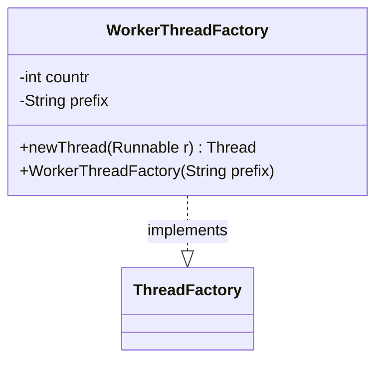

---
aliases:
  - WorkerThreadFactory
tags:
  - java/class
  - module/forge-core
  - pkg/forge/util
fqn: forge.util.ThreadUtil.WorkerThreadFactory
package: forge.util
module: forge-core
kind: Class
---

# WorkerThreadFactory

**Package:** `forge.util`   **Module:** `forge-core`   **Kind:** Class



## Design Description

WorkerThreadFactory is a private static helper nested within ThreadUtil that implements `java.util.concurrent.ThreadFactory` to supply named worker threads for the utility's executor pools. Its sole responsibility is to manufacture `Thread` instances on demand via `newThread(Runnable)`, stamping each with a human-readable name composed of a caller-supplied prefix and a monotonically increasing counter. The design intent is diagnostic clarity: by encapsulating thread-naming behind the standard ThreadFactory contract, it lets executor services produce identifiable, sequentially numbered threads (e.g. for logging and debugging) while keeping the naming policy isolated and the class scoped privately to its enclosing ThreadUtil collaborator.

## Source
`forge-core/src/main/java/forge/util/ThreadUtil.java` — declaration excerpt

```java
    private static class WorkerThreadFactory implements ThreadFactory {
        private int countr = 0;
        private String prefix = "";

        public WorkerThreadFactory(String prefix) {
            this.prefix = prefix;
        }

        public Thread newThread(Runnable r) {
            return new Thread(r, prefix + "-" + countr++);
        }
    }
```

## Python
`forge/util/ThreadUtil/WorkerThreadFactory.py`

```python
from forge.util.ThreadFactory import ThreadFactory


class WorkerThreadFactory(ThreadFactory):
    def __init__(self, prefix: str):
        self.countr = 0
        self.prefix = prefix

    def newThread(self, r) -> "Thread":
        thread = Thread(r, self.prefix + "-" + str(self.countr))
        self.countr += 1
        return thread
```
