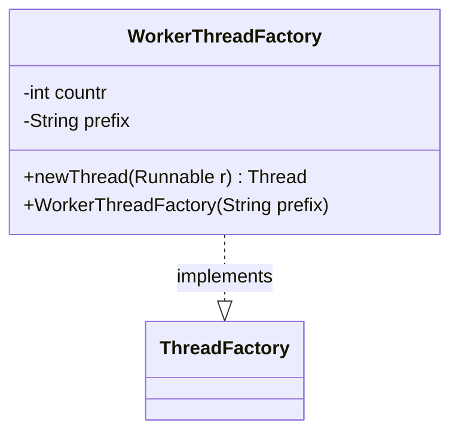

---
aliases:
  - WorkerThreadFactory
tags:
  - java/class
  - module/forge-core
  - pkg/forge/util
fqn: forge.util.ThreadUtil.WorkerThreadFactory
package: forge.util
module: forge-core
kind: Class
---

# WorkerThreadFactory

**Package:** `forge.util` &nbsp; **Module:** `forge-core` &nbsp; **Kind:** Class



## Source
`forge-core/src/main/java/forge/util/ThreadUtil.java` — declaration excerpt

```java
    private static class WorkerThreadFactory implements ThreadFactory {
        private int countr = 0;
        private String prefix = "";

        public WorkerThreadFactory(String prefix) {
            this.prefix = prefix;
        }

        public Thread newThread(Runnable r) {
            return new Thread(r, prefix + "-" + countr++);
        }
    }
```
