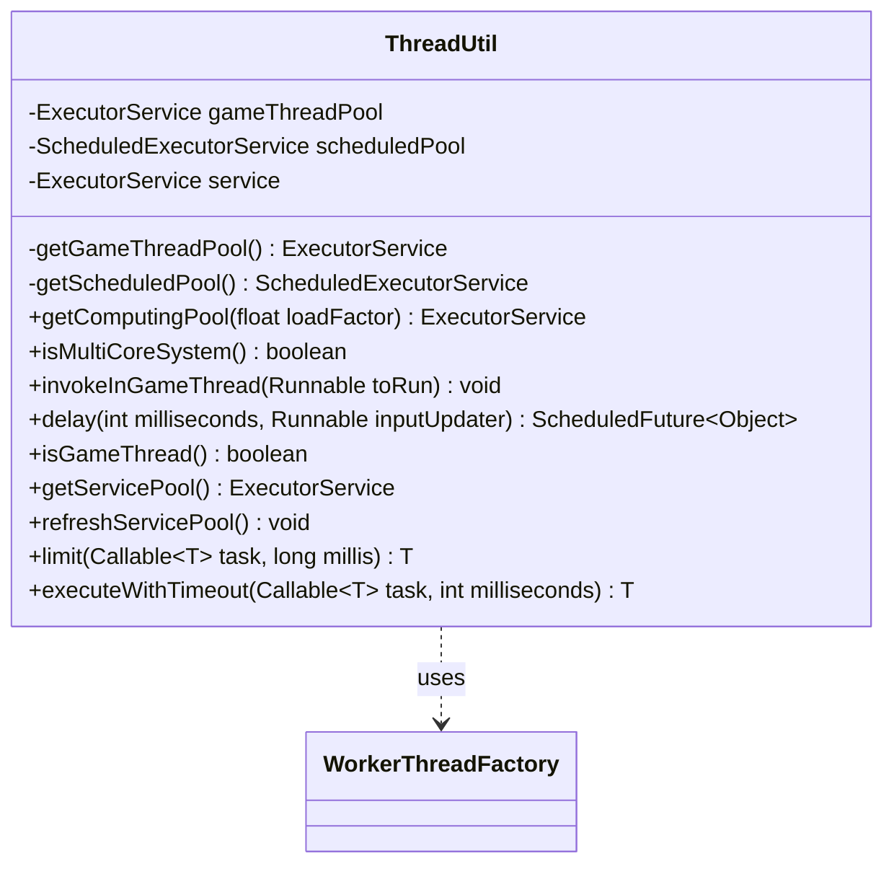

---
aliases:
  - ThreadUtil
tags:
  - java/class
  - module/forge-core
  - pkg/forge/util
fqn: forge.util.ThreadUtil
package: forge.util
module: forge-core
kind: Class
---

# ThreadUtil

**Package:** `forge.util`   **Module:** `forge-core`   **Kind:** Class



## Relationships
**Uses:**
- [[forge.util.ThreadUtil.WorkerThreadFactory|WorkerThreadFactory]]

## Design Description

ThreadUtil is a stateless utility class in the `forge-core` module that centralizes the engine's thread-management concerns behind a set of static helpers and shared executor pools. It maintains distinct pools for different workloads—a cached "Game" thread pool for game-logic tasks, a scheduled "Delayed" pool for time-deferred input updates, and a work-stealing service pool—and exposes factory and convenience methods such as `getComputingPool`, `invokeInGameThread`, `delay`, and `isGameThread`.

It collaborates with its private inner `WorkerThreadFactory`, which names threads by prefix so callers can identify game threads by inspection. Notable design intent includes sizing the computing pool to the available processor count and a load factor for CPU/IO-bound work like card parsing and image downloads, and providing `limit`/`executeWithTimeout` to run cancellable `Callable` tasks under a timeout, returning null on failure rather than propagating exceptions.

## Source
`forge-core/src/main/java/forge/util/ThreadUtil.java`

```java
package forge.util;

import java.util.concurrent.*;

public class ThreadUtil {
    static {
        System.out.printf("(ThreadUtil first call): Running with priority %d%n", Thread.currentThread().getPriority());
    }

    private static class WorkerThreadFactory implements ThreadFactory {
        private int countr = 0;
        private String prefix = "";

        public WorkerThreadFactory(String prefix) {
            this.prefix = prefix;
        }

        public Thread newThread(Runnable r) {
            return new Thread(r, prefix + "-" + countr++);
        }
    }

    private final static ExecutorService gameThreadPool = Executors.newCachedThreadPool(new WorkerThreadFactory("Game"));
    private static ExecutorService getGameThreadPool() { return gameThreadPool; }
    private final static ScheduledExecutorService scheduledPool = Executors.newScheduledThreadPool(2, new WorkerThreadFactory("Delayed"));
    private static ScheduledExecutorService getScheduledPool() { return scheduledPool; }

    // This pool is designed to parallel CPU or IO intensive tasks like parse cards or download images, assuming a load factor of 0.5
    public final static ExecutorService getComputingPool(float loadFactor) {
        return Executors.newFixedThreadPool((int)(Runtime.getRuntime().availableProcessors() / (1-loadFactor)));
    }

    public static boolean isMultiCoreSystem() {
        return Runtime.getRuntime().availableProcessors() > 1;
    }

    public static void invokeInGameThread(Runnable toRun) {
        getGameThreadPool().execute(toRun);
    }

    public static ScheduledFuture<?> delay(int milliseconds, Runnable inputUpdater) {
        return getScheduledPool().schedule(inputUpdater, milliseconds, TimeUnit.MILLISECONDS);
    }

    public static boolean isGameThread() {
        return Thread.currentThread().getName().startsWith("Game");
    }

    private static ExecutorService service = Executors.newWorkStealingPool();
    public static ExecutorService getServicePool() {
        return service;
    }
    public static void refreshServicePool() {
        service = Executors.newWorkStealingPool();
    }
    public static <T> T limit(Callable<T> task, long millis){
        Future<T> future = null;
        T result;
        try {
            future = service.submit(task);
            result = future.get(millis, TimeUnit.MILLISECONDS);
        } catch (Exception e) {
            result = null;
        } finally {
            if (future != null)
                future.cancel(true);
        }
        return result;
    }
    public static <T> T executeWithTimeout(Callable<T> task, int milliseconds) {
        ExecutorService executor = Executors.newCachedThreadPool();
        Future<T> future = executor.submit(task);
        T result;
        try {
            result = future.get(milliseconds, TimeUnit.MILLISECONDS); 
        }
        catch (Exception e) { //handle timeout and other exceptions
            e.printStackTrace();
            result = null;
        }
        finally {
           future.cancel(true);
        }
        return result;
    }
}
```

## Python
`forge/util/ThreadUtil.py`

```python
package forge.util ΓÇö translated to Python module forge/util/ThreadUtil.py

import os
import sys
import threading
import traceback
from concurrent.futures import (
    ThreadPoolExecutor,
    Future,
    TimeoutError as FuturesTimeoutError,
)


class ThreadUtil:
    # Static initializer block: Python threads have no priority concept, so we
    # report Java's default NORM_PRIORITY (5) to preserve the diagnostic intent.
    print("(ThreadUtil first call): Running with priority %d" % 5)

    class WorkerThreadFactory:
        def __init__(self, prefix):
            self.countr = 0
            self.prefix = prefix

        def newThread(self, r):
            name = self.prefix + "-" + str(self.countr)
            self.countr += 1
            return threading.Thread(target=r, name=name)

    gameThreadPool = ThreadPoolExecutor(thread_name_prefix="Game")

    @staticmethod
    def getGameThreadPool():
        return ThreadUtil.gameThreadPool

    scheduledPool = ThreadPoolExecutor(max_workers=2, thread_name_prefix="Delayed")

    @staticmethod
    def getScheduledPool():
        return ThreadUtil.scheduledPool

    # This pool is designed to parallel CPU or IO intensive tasks like parse cards or download images, assuming a load factor of 0.5
    @staticmethod
    def getComputingPool(loadFactor):
        return ThreadPoolExecutor(
            max_workers=int(os.cpu_count() / (1 - loadFactor))
        )

    @staticmethod
    def isMultiCoreSystem():
        return os.cpu_count() > 1

    @staticmethod
    def invokeInGameThread(toRun):
        ThreadUtil.getGameThreadPool().submit(toRun)

    @staticmethod
    def delay(milliseconds, inputUpdater):
        future = Future()

        def runner():
            if not future.set_running_or_notify_cancel():
                return
            try:
                result = inputUpdater()
                future.set_result(result)
            except Exception as e:
                future.set_exception(e)

        timer = threading.Timer(milliseconds / 1000.0, runner)
        timer.daemon = True
        timer.start()
        return future

    @staticmethod
    def isGameThread():
        return threading.current_thread().name.startswith("Game")

    service = ThreadPoolExecutor()

    @staticmethod
    def getServicePool():
        return ThreadUtil.service

    @staticmethod
    def refreshServicePool():
        ThreadUtil.service = ThreadPoolExecutor()

    @staticmethod
    def limit(task, millis):
        future = None
        try:
            future = ThreadUtil.service.submit(task)
            result = future.result(timeout=millis / 1000.0)
        except Exception:
            result = None
        finally:
            if future is not None:
                future.cancel()
        return result

    @staticmethod
    def executeWithTimeout(task, milliseconds):
        executor = ThreadPoolExecutor()
        future = executor.submit(task)
        try:
            result = future.result(timeout=milliseconds / 1000.0)
        except Exception:  # handle timeout and other exceptions
            traceback.print_exc()
            result = None
        finally:
            future.cancel()
        return result
```
