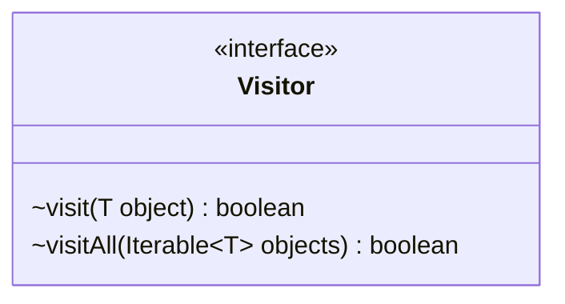

---
aliases:
  - Visitor
tags:
  - java/interface
  - module/forge-core
  - pkg/forge/util
fqn: forge.util.Visitor
package: forge.util
module: forge-core
kind: Interface
---

# Visitor

**Package:** `forge.util` &nbsp; **Module:** `forge-core` &nbsp; **Kind:** Interface



## Design Description

`Visitor<T>` is a generic functional interface in `forge-core` defining a single-method contract for traversing objects of type `T`, where each `visit(T)` returns a boolean signaling whether traversal should continue. It abstracts the visitor side of the visitor/iteration pattern, letting callers supply object-processing logic without coupling to the structures being walked.

The interface's notable design intent is its early-termination protocol: `visit` returns `false` to tell the enclosing traversal to stop. The default `visitAll(Iterable<? extends T>)` method codifies this convention, iterating a collection and short-circuiting on the first `false` result, so implementers need only define `visit` while inheriting consistent bulk-traversal behavior. The bounded wildcard (`? extends T`) keeps it covariant and broadly reusable across Forge's collection types.

## Source
`forge-core/src/main/java/forge/util/Visitor.java`

```java
package forge.util;

public interface Visitor<T> {
    /**
     * visit the object
     * the Visitor should return true it can be visit again
     * returning false means the outer function can stop
     *
     * @param object
     * @return boolean
     */
    boolean visit(T object);

    default boolean visitAll(Iterable<? extends T> objects) {
        for (T obj : objects) {
            if (!visit(obj)) {
                return false;
            }
        }
        return true;
    }
}
```

## Python
`forge/util/Visitor.py`

```python
from typing import Iterable, TypeVar, Generic

T = TypeVar("T")


class Visitor(Generic[T]):
    def visit(self, object: T) -> bool:
        """
        visit the object
        the Visitor should return true it can be visit again
        returning false means the outer function can stop

        :param object:
        :return: boolean
        """
        raise NotImplementedError

    def visitAll(self, objects: Iterable[T]) -> bool:
        for obj in objects:
            if not self.visit(obj):
                return False
        return True
```
